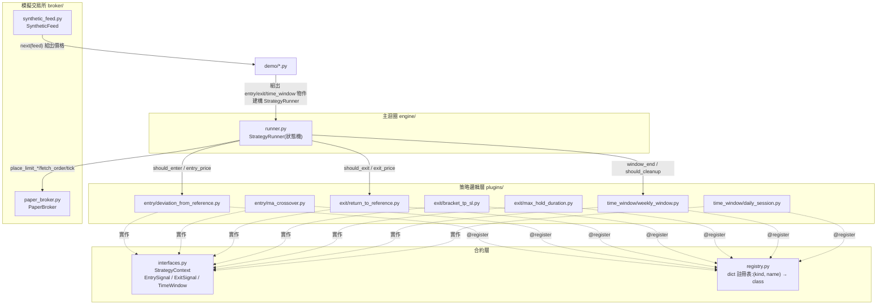
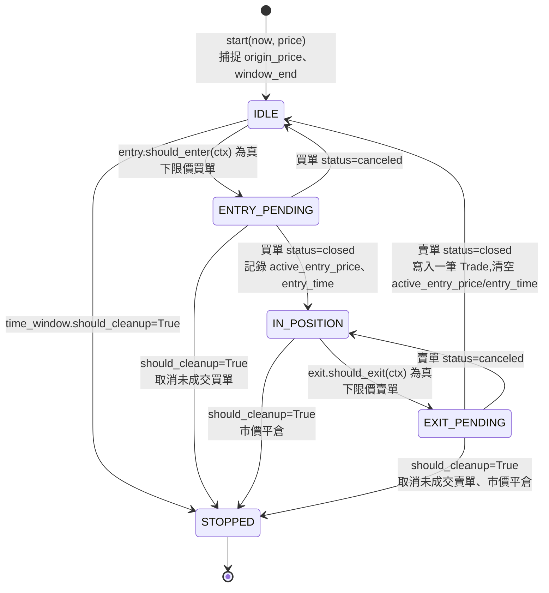

# strategy_lab 架構說明書

> 對應 Phase 1(Plugin 層)完成後的狀態。Phase 2(Rule Engine)、
> Phase 3(DSL)完成後,這份文件要跟著更新——尤其是「元件關係圖」跟
> 「已知限制」兩節。

## 1. 元件關係圖

**怎麼讀這張圖:**
- `Run`(`StrategyRunner`)只跟 `interfaces.py` 定義的三個 Protocol 打交道——圖上畫出的箭頭是「呼叫某個 entry/exit/time_window 實例」,但 `Run` 本身完全不 import 任何具體的 plugin class。它建構時被「注入」哪個物件,就用哪個物件的邏輯。
- `registry.py` 目前(Phase 1)只被各 plugin 檔案的 `@register` 裝飾器寫入,實際上**還沒有任何程式碼呼叫 `registry.get()`**——它是為 Phase 3 的 DSL loader 準備的,現在是「建好但沒人用」的狀態。
- `demo/*.py` 是唯一一個「知道要用哪個具體 plugin」的地方——它負責把 `entry`/`exit`/`time_window` 三個物件手動組出來,餵進 `StrategyRunner` 的建構子。

## 2. `engine/runner.py` 狀態機(這是專案的「trade engine」核心)

**對照原始碼:**每個狀態轉移都對應 [runner.py](../../strategy_lab/strategy_lab/engine/runner.py) 裡一個私有方法——`_try_enter`/`_check_entry_fill`/`_try_exit`/`_check_exit_fill`/`_cleanup`。`tick()` 只做兩件事:先讓 `broker.tick(price)` 有機會把上一輪掛的單成交,再依照目前 `self.state` 分派到對應的方法。**沒有任何策略專屬的 `if` 判斷**——這是整個 Phase 1 練習要證明的核心主張。

## 3. 一次 `tick()` 呼叫的資料流(具體追蹤)

以 `IDLE` 狀態、進場成功的那一次 tick 為例:

1. `tick(now, price)` 把 `price` 存進 `self.price_history`,呼叫 `self.broker.tick(price)`(讓上一輪的單有機會成交)
2. 呼叫 `self.time_window.should_cleanup(now, self.window_end)`——問時間窗「該收攤了嗎」,`False` 就繼續
3. 狀態是 `IDLE`,呼叫 `_try_enter(now, price)`:
   a. 組一個 `StrategyContext`(`_ctx()`,把 `self.origin_price`、`self.active_entry_price` 等 runner 自己的內部狀態塞進去)
   b. 呼叫 `self.entry.should_enter(ctx)`——這裡才第一次碰到具體的 plugin
   c. 為真的話,呼叫 `self.entry.entry_price(ctx)` 算出價位,呼叫 `self.broker.place_limit_buy(price=..., qty=...)`
   d. 狀態轉成 `ENTRY_PENDING`
4. 回傳。下一次 `tick()` 呼叫時,如果價格穿越了掛單價,`broker.tick()` 在步驟 1 就已經把單填成 `closed`,狀態機接著在 `_check_entry_fill()` 轉進 `IN_POSITION`。

## 4. 已知限制(截至 Phase 1)

- **`StrategyContext` 是全域共享合約,不是零成本擴充。** 新增一個 plugin 只要用到 context 裡「還沒有的欄位」(例如 `entry_time`),就必須同時改 `interfaces.py`(schema)跟 `runner.py`(內部狀態追蹤 + 在正確的生命週期時間點設值/清值)。詳見開發過程中 `MaxHoldDurationExit` 這個練習踩到的兩輪 bug。
- **`TimeWindow` 的 `window_end()` 假設是「單一固定 HH:MM + 簡單的 weekday 迴圈」。** 兩個示範策略(每週一次、每天一次)都滿足這個假設,但沒驗證過更複雜的週期規則(例如「每月第一個星期一」)是否還能套用同一種寫法。
- **`registry.py` 目前是死碼(dead code)路徑。** 只有 `@register` 這一側被執行,`get()` 從未被實際呼叫過——也因此,像 `max_hold_duration.py` 沒有被對應的 `plugins/exit/__init__.py` import 進去這種疏漏,不會被任何測試或執行路徑抓到,是靜默的。這是 Phase 3 DSL loader 真正開始呼叫 `registry.get()` 之後才會浮現的一類風險。
- **`PaperBroker` 沒有部分成交、滑價、手續費的模擬。** 一張限價單一旦被 `tick()` 判定「價格穿越」就是全部成交,跟真實交易所的行為有落差——這是刻意的簡化(教學用途),不是要拿來做真實回測。

## 5. Phase 進度與這份文件的維護

- [x] Phase 1 —— 上面描述的就是目前狀態
- [ ] Phase 2 —— Rule Engine 上線後,`plugins/` 那一層的 `should_enter`/`should_exit` 會改成宣告一棵 `Condition` 樹,§1 的圖要加一個 `rules/` 子圖,§3 的資料流追蹤要更新成「呼叫 `plugin.rule.evaluate(ctx)`」
- [ ] Phase 3 —— DSL 上線後,`registry.get()` 會真正被 `dsl/loader.py` 呼叫,§4 提到的「死碼路徑」限制要拿掉
- [ ] Phase 4 —— 完成後補一節「三個 YAML 策略熱切換」的實測記錄
