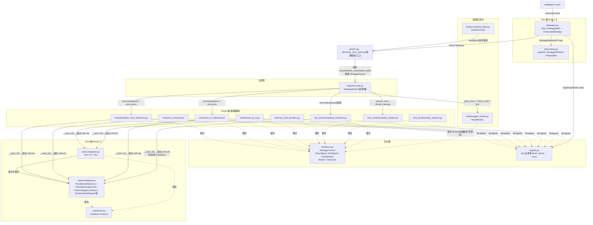
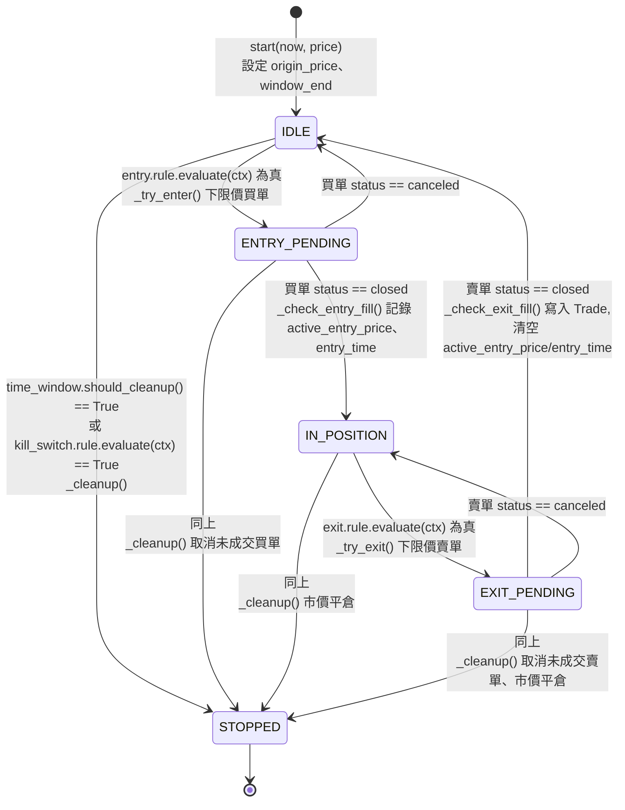

# strategy_lab 架構說明書

## 概述

strategy_lab 是一個以 Python `dataclass` 為基礎的交易策略回測框架,採
Plugin 化設計,將策略邏輯拆分為 entry(進場)、exit(出場)、
time_window(排程時間窗)、kill_switch(市場行為觸發的終止條件,選填)
四類獨立模組,並透過統一的狀態機驅動執行。系統不連接任何真實交易所,
僅對內建的模擬交易所(paper broker)與合成價格產生器運作。

本文件對應目前(Phase 3:DSL,加上 Live 遷移 Stage 1)完成後的架構
狀態,涵蓋元件關係、核心狀態機、單次執行流程、目前已知的設計限制,
以及往真實環境遷移的進度(§6)。

## 1. 元件關係圖

想仔細看 module 與 module 之間關係的,也可以直接看
[docs/module_relationship_diagram.svg](module_relationship_diagram.svg)
(同一份圖,畫成有分層底色、箭頭樣式區分「實作/呼叫/registry 查找/組裝」
四種關係的版本,比下面這張 Mermaid 更適合仔細追一條條依賴線)。

**元件職責:**

- **合約層(interfaces.py / registry.py)**:定義 plugin 必須實作的形狀
  (`Protocol`),以及一個名稱到類別的查找表。不含任何策略邏輯。
  `EntrySignal`/`ExitSignal` 自 Phase 2 起改為暴露 `rule: Condition`
  屬性,而非各自手寫的 `should_enter`/`should_exit` 方法。`KillSwitch`
  是第四種 plugin 合約,跟 `TimeWindow` 一樣代表「該不該收攤」,但觸發
  原因是市場行為(價格)而非排程時間,因此獨立成另一個合約,而不是把
  價格判斷塞進 `TimeWindow`。它比 `EntrySignal`/`ExitSignal` 更簡單:
  只有 `rule`,沒有價格方法,因為觸發後不需要算任何價格,只需要告訴
  runner「收攤」。
- **Rule 層(Phase 2 新增)**:`rules/base.py` 定義 `Condition` 這個最小
  合約(`evaluate(ctx) -> bool`);`rules/conditions.py` 是實際判斷市場
  事實的具體條件;`rules/composite.py` 的 `And`/`Or`/`Not` 只依賴
  `Condition` 合約,不知道被組合的是哪一種具體條件,因此可以任意疊代
  巢狀。此層不依賴 Plugin 層或 `engine/runner.py`。想看 Rule 層三個
  module(`base.py`/`conditions.py`/`composite.py`)跟每一個實際使用
  它們的 plugin 之間逐一的對應關係,見
  [docs/rule_layer_plugin_relationship.svg](rule_layer_plugin_relationship.svg)
  ——同時標出了哪些 condition/composite 目前沒有任何 plugin 用到
  (`And`/`Not`)、哪個 condition 是唯一有狀態的(`SustainedPriceBreakout`)、
  哪個 plugin 是唯一透過 composite.py 組合(而非直接用單一 leaf
  condition)的(`BracketTPSLExit`),以及 `time_window/` 完全不參與
  Rule 層這件事。上面這張圖是「靜態結構」——想看 rule 物件在**時間軸**
  上實際怎麼被 runner 呼叫(建構期 vs 每個 tick 都重跑一次的執行期、
  `self.rule` 為什麼會被同一個物件反覆呼叫 `evaluate()`),見
  [docs/rule_runner_sequence.svg](rule_runner_sequence.svg)(以
  `DeviationFromReferenceEntry` 為例的時序圖)。
- **Plugin 層**:每個檔案是一個獨立、可單元測試的策略邏輯單元,彼此不
  互相依賴,也不依賴 `engine/runner.py`。自 Phase 2 起,只負責兩件事:
  在 `__post_init__` 組出一棵 `Condition` 樹存進 `self.rule`,以及計算
  觸發後的價格(`entry_price`/`exit_price`)。「什麼時候觸發」完全交給
  Rule 層。
- **模擬交易所**:`PaperBroker` 模擬掛單/成交,`SyntheticFeed` 產生
  價格序列。兩者互不知曉對方存在,也不知曉「策略」的概念。
- **主迴圈(StrategyRunner)**:唯一同時依賴合約層與模擬交易所的元件,
  以組合(而非繼承或匯入具體 plugin)的方式接收 `entry`/`exit`/
  `time_window` 三個物件,驅動狀態機。它只呼叫 `rule.evaluate(ctx)`,
  完全不需要知道 Rule 層的存在——這是 Rule 層可以整層插入、runner.py
  幾乎不用改的原因(實際只改了兩行呼叫)。`kill_switch` 是選填欄位
  (預設 `None`),不傳就完全不影響既有行為;有傳的話,`tick()` 在
  `time_window.should_cleanup()` 之後、狀態分派之前檢查它,任一個
  成立就呼叫同一個 `_cleanup()`——不管當下處於哪個狀態(包含
  `IN_POSITION` 這種還沒等到正常出場訊號的當下),都會立刻取消未成交
  單、強制平倉、轉入 `STOPPED`。
- **`registry.py` 現況**:各 plugin 透過 `@register` 裝飾器完成登記。
  Phase 3 之前,`get()` 這一側是死碼——`demo/*.py` 全部以直接 `import`
  具體類別的方式組裝策略;Phase 3 起,`dsl/loader.py` 是第一個真正呼叫
  `registry.get(kind, type)` 的程式碼路徑,把 YAML 裡的字串轉成實際的
  plugin class。Rule 層的 `Condition` primitives(`PriceBelowReference`
  等)仍未註冊進 `registry.py`——目前的 YAML 形狀只需要 `{type, params}`
  就能組出完整的 plugin(見下方 DSL 層說明),不需要在 YAML 裡獨立描述
  一棵 Condition 樹,因此這件事還沒有用到的場景。
- **DSL 層(Phase 3 新增)**:`dsl/schema.py` 用 pydantic(v1)定義
  `StrategyDefinition`/`PluginSpec` 這兩個 schema,只負責「這個
  YAML/dict 合不合法」,完全不 import `registry`,也不知道有哪些
  plugin 真的存在。`dsl/loader.py` 的 `load_strategy(path)` 是唯一把
  三件事串起來的地方:讀檔 → `StrategyDefinition(**raw)` 驗證形狀 →
  對每個區塊呼叫 `registry.get(kind, spec.type)(**spec.params)`。刻意
  只支援 `{type, params}` 這個最簡單的形狀——每個 plugin 已經會在自己
  的 `__post_init__` 用 `params` 組出 `self.rule`,loader 不需要另外
  解析一棵獨立的 YAML Condition 樹;YAML 直接組合現有 Condition primitives
  (不透過寫新 plugin)這個更進階的能力,目前刻意不做,留待有實際需求
  再加。

## 2. `engine/runner.py` 狀態機

每個狀態轉移對應 `StrategyRunner` 上的一個私有方法。`tick()` 本身不含
任何策略專屬的分支邏輯,僅依據目前狀態值分派到對應方法。

## 3. `tick()` 呼叫的資料流追蹤

以 `IDLE` 狀態下成功觸發進場的一次 `tick()` 呼叫為例:

1. `tick(now, price)` 將 `price` 附加至 `self.price_history`,並呼叫
   `self.broker.tick(price)`,使前一輪已掛出的訂單有機會成交。
2. 呼叫 `self.time_window.should_cleanup(now, self.window_end)`,判斷
   是否已達收攤時間;若為 `False` 則繼續往下執行。
3. 目前狀態為 `IDLE`,呼叫 `_try_enter(now, price)`:
   1. 透過 `_ctx()` 組出一個 `StrategyContext`,其中的欄位(如
      `origin_price`、`active_entry_price`)取自 `StrategyRunner` 自身
      的內部狀態。
   2. 呼叫 `self.entry.rule.evaluate(ctx)` —— 此為本次呼叫中第一次觸及
      具體 plugin/Rule 層的邏輯。`rule` 可能是單一條件(如
      `PriceBelowReference`),也可能是 `And`/`Or`/`Not` 組成的巢狀樹;
      `_try_enter()` 不需要知道是哪一種。
   3. 若結果為真,呼叫 `self.entry.entry_price(ctx)` 計算掛單價位,並
      呼叫 `self.broker.place_limit_buy(price=..., qty=...)` 送出訂單。
   4. 狀態轉移為 `ENTRY_PENDING`。
4. 呼叫結束。若下一次 `tick()` 傳入的價格穿越了掛單價位,`broker.tick()`
   會在步驟 1 將該訂單標記為 `closed`,狀態機隨即在 `_check_entry_fill()`
   中轉移至 `IN_POSITION`。

出場流程(`IN_POSITION → EXIT_PENDING → IDLE`)遵循相同模式,差異僅在
於呼叫對象由 `entry` 換成 `exit`。

## 4. 已知限制與設計決策

### 4.1 Context 擴充成本

`StrategyContext` 是所有 plugin 共用的單一資料結構,而非各 plugin 私有
的資料。新增一個 plugin 若需要 context 中尚未存在的欄位,無法僅新增
該 plugin 的檔案完成,必須同步修改:

1. `interfaces.py` —— 新增欄位定義(schema 變更)。
2. `engine/runner.py` —— 新增對應的內部狀態欄位、在正確的生命週期時
   間點設值與清值(通常需同步修改 `_ctx()`、`_check_entry_fill()`、
   `_check_exit_fill()` 等多個方法),並可能牽動既有方法的參數簽名。

此設計是「共享 context 物件」模式的固有取捨:欄位清單固定、有限,換
取型別可預期、可讀性高,但代價是新增「context 中原本不存在的市場事實」
屬於跨檔案的破壞性變更,而非零成本擴充。`entry_time` 欄位的加入即為
此類變更的具體案例。

### 4.2 TimeWindow 的假設

現有兩個 `TimeWindow` 實作(`WeeklyWindow`、`DailySession`)的
`window_end()` 邏輯,皆建立在「單一固定 `HH:MM` 時刻 + 簡單的星期迴圈
比對」之上。此假設對「每週固定星期幾」與「每日固定時段」兩種週期規則
是足夠的,但尚未驗證是否適用於更複雜的週期規則(例如「每月第一個星期
一開始」)。導入新的週期類型時,應優先確認現有的日期查找邏輯是否可以
沿用,或需要另行設計。

### 4.3 Registry 死碼路徑(Phase 3 已解決)

Phase 1、2 期間,`registry.py` 只有 `register()` 這一側在運作
(透過各 `plugins/<kind>/__init__.py` 匯入對應模組觸發 `@register`
裝飾器);`get()` 沒有任何程式碼路徑呼叫。這曾經造成一個靜默失效:
`max_hold_duration.py` 建立時未被加入 `plugins/exit/__init__.py` 的
匯入清單,直接透過類別匯入使用時不受影響,但透過 registry 查詢時會找
不到對應項目——而且因為當時沒有任何路徑呼叫 `get()`,這個缺漏不會被
任何測試或執行流程偵測到。

**Phase 3 起,`dsl/loader.py` 的 `load_strategy()` 是第一個真正呼叫
`registry.get()` 的程式碼路徑**——YAML 裡的 `type: xxx` 字串,現在會
真的透過 `get()` 去查表。如果之後再發生「plugin 檔案忘記加進
`__init__.py` 匯入清單」這種缺漏,`tests/unit/test_dsl_loader.py` 或
`tests/unit/test_dsl_strategies_regression.py` 會直接失敗(`registry.UnknownPlugin`),
不會再靜默過關——這個限制到這裡才算真正解除,不是「文件上說已解決」
而已。

### 4.4 PaperBroker 的簡化設計

`PaperBroker` 採用簡化的成交模型:一張限價單只要在 `tick(price)` 呼叫
中被判定「價格穿越掛單價位」,即視為全數成交,不模擬部分成交、滑價
(slippage)或手續費。此簡化係為教學與架構驗證目的而設計,不適用於
需要精確還原真實交易所行為的回測場景。

### 4.5 Phase 2 對週末策略語意的調整

Phase 1 的 `DeviationFromReferenceEntry`/`ReturnToReferenceExit` 採用
「`should_enter`/`should_exit` 永遠回傳 `True`,實際的價格門檻交給限價
單本身的掛單價擋」的設計,與 MA 交叉策略「每個 tick 真的檢查訊號」的
設計不對稱。Phase 2 為了讓兩個示範策略在同一套 `Condition` 語言下描述,
將週末策略的進出場邏輯也改為真正的價格檢查
(`PriceBelowReference`/`PriceAtOrAboveReference`)。

此調整不影響最終成交價與交易筆數(兩個 demo 重跑後數字與 Phase 1 完全
一致),差異僅在於:訂單現在是「條件成立後才下單」,而非「窗口一開始
就掛著等」——在價格於窗口內反覆穿越門檻的情境下,理論上可能造成下單
時機的 1 個 tick 延遲,但不影響最終成交結果。

### 4.6 KillSwitch:`price_history` 沒有時間戳記,只能用有狀態的 Condition 繞過

`StrategyContext.price_history` 是 `Sequence[float]`,只有價格、沒有
對應的時間戳記,因此無法從外部把它切成「一段時間」的資料——這是實作
「連續一段時間價格超過門檻」這類跨 tick 條件時會直接撞到的限制,而且
屬於 §4.1 描述的「Context 擴充成本」的具體案例:要修就得幫
`StrategyContext`/`StrategyRunner` 新增一份帶時間戳記的歷史,牽動的
檔案跟修 `entry_time` 時一樣多。

`rules/conditions.py` 的 `SustainedPriceBreakout` 選擇繞開這個限制,
而不是去修 `StrategyContext`:讓這個 `Condition` 物件自己在
`evaluate()` 呼叫之間累積內部狀態(用 `ctx.now`/`ctx.price` 逐 tick
記錄觀察歷史),不依賴 `price_history`。本檔案裡其他的 `Condition`
(`PriceBelowReference`、`MovingAverageCross` 等)都是無狀態的純函式
——同一組 `ctx` 呼叫幾次結果都一樣;`SustainedPriceBreakout` 是目前
唯一的例外,呼叫結果會因為之前呼叫過幾次、傳過什麼 `ctx` 而改變。
`Condition` 合約本身(`evaluate(ctx) -> bool`)並沒有禁止這件事——只是
剛好在這個案例之前,沒有 primitive 需要用到而已。

#### 4.6.1 從「連續 N 個日曆日」改成「連續 N 小時」的滾動視窗(重構)

`SustainedPriceBreakout` 最初的設計是「連續 N 個日曆日」:內部用
`date` 分桶,只有觀察到新的日期時才把前一天「結算」進
`_finalized_closes`。這個設計在建立
[`strategies/mean_reversion_breakout_guard.yaml`](../strategies/mean_reversion_breakout_guard.yaml)
時暴露出一個真實的相容性 bug:這個策略沿用了 `weekly_window` 的
`TimeWindow`(週六 04:00 到週一 06:00,整個窗口只有約 50 小時),
kill switch 卻設成 `days=3`——用實際跑一遍 `StrategyRunner` 的狀態
軌跡驗證後發現,`days=3` **永遠不可能觸發**,因為窗口本身的
`should_cleanup()` 一定先在窗口自然結束時把迴圈停掉,3 個日曆日永遠
撐不到那個時間點。這不是理論上的邊界案例,是照著使用者原始需求(連續
3 天)直接套用時就會踩到的真實缺口。

修法(使用者明確指示:「不用 day,全部改用小時作時間單位作計算」):
把 `days: int` 整個改成 `hours: float`(預設 `72.0`,取代原本的
`days=3`),內部狀態也從「日曆日分桶」改成「滾動時間視窗」:
`_history: List[Tuple[datetime, float]]` 記錄每筆 `(觀察時間, 價格)`,
每次 `evaluate()` 都先用 `ctx.now - timedelta(hours=self.hours)` 當
cutoff,把過期的觀察值剪掉。好處是不再有「日曆日邊界」造成的隱性
下限——`hours` 可以設成任何比 `TimeWindow` 窗口長度短的數值(例如
`mean_reversion_breakout_guard.yaml` 用 `hours: 24.0`,明顯短於
`weekly_window` 的 ~50 小時),不需要再擔心它跟日曆日邊界對不齊。
`plugins/kill_switch/sustained_breakout.py` 的 `SustainedBreakoutKillSwitch`
同步把 `days` 欄位改名為 `hours`,兩者的預設值都是對齊的
`72.0`。所有既有測試(`test_rules_conditions.py`、
`test_plugins_kill_switch.py`、`test_dsl_strategies_regression.py`、
`test_runner_integration.py`、`test_live_broker_integration.py`、
`demo/demo_kill_switch_sandbox.py`)都已同步改用 `hours=`,並重新驗證
通過(185/185 測試,含新增的 `mean_reversion_breakout_guard.yaml`
DSL regression 測試與滾動視窗剪除邏輯的獨立測試)。

#### 4.6.2 支援 `minutes`/`days` 當 `hours` 的替代輸入單位,以及載入期的相容性檢查

4.6.1 解決了「hours 這個單位本身沒有 bug」的問題,但使用者接著問了
更根本的問題:如果 YAML 裡想直接寫 `minutes`/`days`(甚至更長的
`months`/`years`),要怎麼確保任何單位都不會重踩同一種 bug?這裡分兩層
處理:

**單位換算(方便輸入,不影響邏輯)**:`SustainedPriceBreakout`/
`SustainedBreakoutKillSwitch` 新增 `minutes: Optional[float]`、
`days: Optional[float]` 兩個欄位,跟 `hours` 互斥(恰好給一個,不給則
預設 `hours=72.0`——跟既有的 `margin_pct`/`margin_fixed` 互斥模式一致)。
`__post_init__` 換算後統一正規化寫回 `self.hours`,新增一個
`window_duration -> timedelta` property 方便外部讀取解析後的結果。內部
`evaluate()`/`_observe()` 完全不用改,因為 `self.hours` 之後一定是解析
完的小時數,不管輸入時用的是哪個單位。**刻意不支援 `months`/`years`**:
日曆月、年的長度不固定(28-31 天、閏年),直接支援就會把 4.6.1 剛解決的
「日曆邊界」問題重新引進來;這個策略類型本身也是短線工具
(`weekly_window` 整個窗口才 ~50 小時),真的需要月/年量級的 kill
switch,代表策略設計思路該重新考慮,不是加個參數能解決的。

**載入期相容性檢查(真正防住這整類 bug 的部分)**:不管用哪個單位,
`SustainedPriceBreakout` 換算出的「總時長」只要 `>=` 它所屬
`TimeWindow` 的跨度,就一定永遠不會觸發(4.6.1 那個 bug 的通式)。與其
靠人工檢查(這正是 `mean_reversion_breakout_guard.yaml` 一開始
`days=3` 沒被抓到的原因),改成在 `dsl/loader.py` 載入策略的當下就自動
驗證:

- `WeeklyWindow`/`DailySession` 新增 `max_span() -> timedelta`,回傳
  「假設策略確實在 `start_weekday`/`start_time` 當下啟動」時,到
  `end_weekday`/`end_time` 的跨度。這個方法被加進 `TimeWindow` Protocol
  (`interfaces.py`),兩個既有實作都需要提供。**要注意**:
  `window_end()` 本身其實完全不看 `start_weekday`/`start_time`(它只從
  呼叫當下的 `now` 找下一個 `end_weekday`/`end_time`)——`max_span()`
  算出來的是「照文件說明的用法」預期會有的跨度,不是程式碼結構上強制
  一定如此的上限;如果 `runner.start()` 在別的時間點被呼叫,實際觀察到
  的窗口可能更長。這個落差本身也記錄在這裡,不是隱藏起來的假設。
- `dsl/loader.py` 新增 `_validate_kill_switch_fits_time_window()`,在
  `load_strategy()` 組出 `kill_switch`/`time_window` 之後、回傳
  `ComposedStrategy` 之前呼叫:用 `getattr` 保守讀取
  `kill_switch.window_duration`/`time_window.max_span`,兩者都存在才
  比較;`window_duration >= max_span()` 就直接 `raise ValueError`,錯誤
  訊息帶出兩個具體數值,不是空泛地說「設定錯誤」。用 `getattr` 而不是
  強制所有 kill_switch/time_window 型別都要實作這個介面,因為目前只有
  一種 kill_switch 型別有這個概念,不想為了這一個檢查逼未來的型別都要
  背這個包袱。
- 這個檢查只在 `load_strategy()`(YAML 進入點)生效,不在
  `StrategyRunner.__init__` 裡——單元/整合測試裡有意用「roomy」的手動組
  `time_window`(例如 `WeeklyWindow(end_weekday=5, ...)` 讓窗口撐到快
  一週後)來測 kill switch 邏輯本身,這些不透過 YAML,也不代表真實策略
  設定,不應該被這個檢查卡住。

驗證:196/196 測試通過(新增 `test_plugins_time_window.py` 的
`max_span()` 測試、`test_rules_conditions.py`/`test_plugins_kill_switch.py`
的 `minutes`/`days`/互斥錯誤測試、`test_dsl_loader.py` 的載入期驗證
測試),既有的 `test_kill_switch_resolved_when_present` 也在這個過程中
被抓到踩了同一種 bug(用預設 `hours=72.0` 但沒指定 `time_window` 是否
撐得住)而修正——這是新增的載入期檢查本身抓到的真實案例,不是特地寫來
展示的。

### 4.7 `And`/`Or`/`Not` 原本沒有結構化的 `__eq__`(Phase 3 TDD 過程中發現並修正)

`rules/composite.py` 的 `And`/`Or`/`Not` 原本是純手寫的 `__init__`,
沒有 `@dataclass`,也沒有手寫 `__eq__`——兩個內容一模一樣的 `Or` 物件,
`==` 比較會退化成用記憶體位址比較(永遠是 `False`,除非是同一個物件)。
`rules/conditions.py` 裡的 leaf condition(`PriceBelowReference` 等)
因為都是 `@dataclass`,一直都有這個行為,只是沒人踩到——直到 Phase 3
寫 DSL 的 regression test(比較 YAML 組出來的 `BracketTPSLExit.rule`
跟手動組裝的版本是否 `==`)才第一次真的需要比較一棵**含 `Or` 的**
條件樹,測試因此失敗,才發現這個缺口。

修法:幫 `And`/`Or`/`Not` 手寫 `__eq__`(而不是改成 `@dataclass`,因為
建構子吃的是 `*conditions` 可變參數,`@dataclass` 沒辦法直接表達這種
形狀)。這是 TDD 流程本身抓到的真實缺口的例子——不是先規劃好才修的,
是寫一個原本只是想驗證別的東西的測試時,意外暴露出來的。

## 5. 文件維護提醒

每個 Phase 完成後,應檢視並更新以下對應章節:

| Phase | 內容變更 | 需更新的章節 | 狀態 |
|---|---|---|---|
| Phase 2(Rule Engine) | `plugins/` 的 `should_enter`/`should_exit` 改為宣告 `Condition` 樹 | §1 元件關係圖新增 `rules/` 子圖;§2 狀態圖標籤;§3 資料流追蹤改為 `plugin.rule.evaluate(ctx)`;新增 §4.5 | 已完成 |
| Phase 2 擴充(KillSwitch) | 新增第四種 plugin 類型,用市場行為(而非排程時間)終止整個策略迴圈 | §1 新增 `kill_switch/` 節點;§2 狀態圖收攤觸發條件;新增 §4.6 | 已完成 |
| Phase 3(DSL) | `registry.get()` 開始被 `dsl/loader.py` 實際呼叫;新增 `strategies/*.yaml`、`demo/run_from_yaml.py`;順帶修正 `rules/composite.py` 的 `__eq__` 缺口 | §1 補充 `dsl/` 元件與資料流;§4.3 更新為「已解決」;新增 §4.7 | 已完成 |
| Phase 4(Capstone) | 三個 YAML 策略熱切換驗證完成 | 新增一節記錄熱切換測試結果與計時演練結論 | 待進行 |
| Live 遷移 Stage 1 | port `account_feed.py`/`market_feed.py` | 新增 §6 | 已完成 |
| Live 遷移 Stage 2 | 新增 `live/bybit_client.py`(pybit 執行層,取代 ccxt) | §6 更新 Stage 2 狀態;新增 §6.2 | 已完成 |
| Live 遷移 Stage 3.1 | 泛化 `Broker`/`OrderLike` Protocol,`StrategyRunner.broker` 不再寫死 `PaperBroker` 型別 | §1 元件關係圖新增 Broker Protocol;§6 更新 Stage 3.1 狀態 | 已完成 |
| Live 遷移 Stage 3.2 | `LiveBroker` 包裝 `BybitClient`,滿足 `Broker` Protocol;新增 `OrderResult.price` 欄位;修正共用假伺服器不模擬市價單立即成交的缺口 | §6 更新 Stage 3.2 狀態;新增 §6.3 | 已完成 |
| Live 遷移 Stage 3.3 | `LiveBroker` 新增 `dry_run` 安全開關(預設 `True`) | §6 更新 Stage 3.3 狀態;新增 §6.4 | 已完成 |
| Live 遷移 Stage 3.4 | `live/config.py`(執行參數)+ `live/main.py`(真正的執行入口)+ `StrategyRunner.request_stop()`(第三種收攤觸發);新增 `.env.example`/`live_execution_config.example.yaml` 範本 | §1 補充 `request_stop()`;§6 更新 Stage 3.4 狀態;新增 §6.5 | 程式碼已完成,**實際連真實帳戶執行需要使用者自己填入 `.env` 真實憑證** |
| `mean_reversion_breakout_guard` 策略 | 新增 `strategies/mean_reversion_breakout_guard.yaml`;發現並修正 `SustainedPriceBreakout`/`SustainedBreakoutKillSwitch` 的 `days`(日曆日)跟 `weekly_window` 窗口長度不相容的缺口,改為 `hours`(滾動時間視窗) | 新增 §4.6.1;更新 §4.6 用語 | 已完成 |
| kill_switch 多單位 + 載入期相容性檢查 | `SustainedPriceBreakout`/`SustainedBreakoutKillSwitch` 新增 `minutes`/`days` 當 `hours` 的替代輸入單位(互斥,正規化回 `hours`);`WeeklyWindow`/`DailySession` 新增 `max_span()`(併入 `TimeWindow` Protocol);`dsl/loader.py` 新增載入期檢查,kill_switch 視窗 `>=` time_window 跨度就直接報錯 | §1 補充 Protocol 變更;新增 §4.6.2 | 已完成 |
| 互動式選策略 | 新增 `dsl/discovery.py`(`list_strategy_files()`/`prompt_strategy_choice()`,`input_fn`/`print_fn` 依賴注入);`demo/run_from_yaml.py` 的 `--strategy` 改為選填,不給就跳出互動選單;新增獨立小工具 `live/select_strategy.py`,選完把 `strategy_path` 寫回 `live_execution_config.yaml`(不動其他欄位)——刻意不放進 `live/main.py`,因為 `main()` 必須能無人值守啟動,`input()` 會讓它卡死在沒有人回應的輸入 | §6 新增 §6.6 | 已完成 |
| 執行參數改用 YAML | `live/config.py`/`live/select_strategy.py` 從 JSON 改吃/寫 YAML;`live_execution_config.example.json` → `.example.yaml`,可以加註解 | §1 附近的 §6.5 補充說明 | 已完成 |
| `order_qty` 移出策略層,改用 `position_sizing` | 新增 `dsl/order_config.py`(`OrderConfig`/`PositionSizing`/`compute_qty()`);`strategies/*.yaml` 移除 `order_qty` 欄位(`dsl/schema.py`/`dsl/loader.py` 同步移除,`extra="forbid"` 會強制兩邊一起改,忘改會直接報錯);新增 `demo/sandbox_order.yaml`(沙盒假資料,`PaperBroker` 本身不改);`live_execution_config.yaml` 新增 `order_type`/`position_sizing`/`account_value`;`account_percentage` 模式在 live 端因為還沒有查真實餘額的方法,沒給 `account_value` 會直接報錯 | 新增 §6.7 | 已完成(`account_percentage` 在 live 端待補真實餘額查詢) |
| 8 種下單方式 + `order_type` 真正接進 runner | `PaperBroker`/`LiveBroker` 新增 `limit_sell`/`market_buy`/`market_sell`/`limit_flat_buy`/`limit_flat_sell`/`market_flat_buy`/`market_flat_sell`(對稱於既有的 `place_limit_buy`/`place_limit_sell`);`interfaces.Broker` Protocol 擴充到 14 個方法;`reduce_only` 單不會讓部位穿越 0(`PaperBroker._fill()`/`LiveBroker` dry-run 都要處理);`StrategyRunner` 新增 `order_type` 欄位,`_try_enter()`/`_try_exit()` 依此選限價還是市價——這是真正修好「`order_type` 設定完全沒作用」缺口的地方 | 新增 §6.8 | 已完成(開空倉的 4 種方法目前沒有 entry/exit plugin 會呼叫,刻意先做成獨立可用的方法,不強行接進長倉專用狀態機) |

## 6. Live 遷移(進行中)——`strategy_lab/live/`

進度總覽見獨立的工程路線圖:
[docs/live_migration_roadmap.svg](live_migration_roadmap.svg)(直接看畫面,
綠=已完成、黃=程式碼完成但還沒真的碰過真實帳戶、橘=卡在等真實憑證、
灰=還沒開始),或它的可編輯來源
[docs/live_migration_roadmap.mmd](live_migration_roadmap.mmd)(Mermaid 純
文字版,改進度時先改這份,再手動同步 `.svg`)。下面文字版逐一展開每個
Stage 的細節。

**這是唯一會連真實服務、需要真實憑證的部分。** 跟本文件前五節描述的
「教學沙盒」核心(`broker/`、`plugins/`、`engine/`)刻意分開成獨立套件
`strategy_lab/live/`,不混在同一個命名空間裡——沙盒的承諾(不呼叫任何
真實交易所 API、不持有任何 API key)仍然對 `broker/`/`plugins/`/
`engine/` 成立,`live/` 是額外疊加、明確標示風險等級不同的一層。

目標是把 `sat_strategy`(目前正在真實 mainnet 帳戶上運行的機器人)移植
過來,採分階段進行,每階段獨立驗證:

- **Stage 1(已完成)**:`live/account_feed.py`、`live/market_feed.py`
  ——從 `sat_strategy/app/{account_feed,market_feed}.py` 移植,行為完全
  一致。訂閱 Fa_Successful_trade 透過 Redis 廣播的市場/帳戶資料
  (ticker 走 Pub/Sub、wallet/position/order 走 Streams + consumer
  group)。純邏輯(`_handle_entry`/`_handle_message`)獨立成
  unit test;真的驅動訂閱迴圈的部分,用 `fakeredis`(記憶體內的 Redis
  實作)寫 integration test,不需要真實 Redis server。
- **Stage 2(已完成)**:`live/bybit_client.py`——包裝 `pybit`(Bybit V5
  原生 SDK),取代 `sat_strategy` 目前用的 ccxt。方法對應 bot.py 原本
  呼叫 ccxt 的方法一對一改寫(`get_last_price`/`place_limit_order`/
  `place_market_order`/`get_order_status`/`cancel_order`/
  `get_position_qty`)。**還沒接上任何真實 API key**——建構子透過
  `http_client` 參數注入真正的 `pybit.unified_trading.HTTP` 或測試用
  的假 client,unit/integration test 全部用假 client,不會打真正的
  網路請求。見 §6.2。
- **Stage 3**(把 `BybitClient` 接成真正可執行的真實策略),拆成四個
  子步驟,每步都各自過 UT/IT 才進下一步:
  - **3.1(已完成)**:`interfaces.py` 新增 `Broker`/`OrderLike`
    Protocol,`StrategyRunner.broker` 的型別從寫死的 `PaperBroker`
    改成這個 Protocol。刻意設計成零行為變更——`PaperBroker` 現有的
    7 個方法結構上已經滿足這個 Protocol,不用改 `PaperBroker` 一行
    程式碼,全部既有測試(131 個)原封不動繼續通過,這就是這一步
    「泛化而不是重新設計」的驗收標準。`tick(price)` 留在合約裡:
    `PaperBroker` 用它模擬成交,真實 broker(`LiveBroker`,Stage 3.2)
    可以讓它是合法的 no-op,不需要 runner.py 為了不同 broker 種類
    分支處理。見 [interfaces.py](../strategy_lab/interfaces.py)。
  - **3.2(已完成)**:`live/broker.py` 的 `LiveBroker` 包裝
    `BybitClient`,滿足 `Broker` Protocol——把 `place_limit_buy(price, qty)`
    這種通用方法,翻譯成 `BybitClient.place_limit_order(symbol, "Buy",
    qty, price)` 這種需要 symbol/side 的呼叫;`symbol` 存在 `LiveBroker`
    自己身上(建構時決定),不是每次呼叫都要傳。`place_limit_sell`/
    `market_close` 的 `reduce_only` 寫死 `True`——整個系統只做多
    (entry=買、exit=賣),不能因為呼叫端忘記傳而意外開出新倉。
    `tick(price)` 是刻意的 no-op。qty/price 精度目前沒有另外處理
    (不是這一步的範圍,見 §6.3 的討論)。見 §6.3。
  - **3.3(已完成)**:`LiveBroker` 新增 `dry_run` 安全開關(預設
    `True`),呼應 `sat_strategy/app/bot.py` 每個下單方法前的
    `if self.config.dry_run: return ...`。放在 `LiveBroker` 而不是
    `BybitClient`——`BybitClient` 保持忠實、無條件包裝真實 API,「要不要
    真的下單」的決策屬於 `LiveBroker`。見 §6.4。
  - **3.4(程式碼已完成,實際執行需要真實 API key)**:`live/config.py`
    的 `ExecutionConfig`(執行參數,不重複放策略參數——那些在
    `strategies/*.yaml` 裡)+ `live/main.py` 的 `main()`(對應
    `sat_strategy/app/bot.py` 的 `main()`),真的用 `datetime.now()` +
    `time.sleep()` 驅動 `runner.tick()`,不是靠 `SyntheticFeed`。順帶
    幫 `StrategyRunner` 補上 `request_stop()`——第三種觸發 `_cleanup()`
    的方式(跟 `time_window`/`kill_switch` 平行),對應
    `bot.py` 的 `_stop_requested`,讓 SIGINT/SIGTERM 能優雅收攤而不是
    直接砍掉 process 留下沒人管的真實掛單或部位。見 §6.5。

### 6.1 測試心得:fakeredis 的 `block` 參數不是真的阻塞

寫 `account_feed.py` 的 integration test 時,原本想用「先啟動 feed、
背景 thread 進入阻塞讀取、再從另一個 client 發布新訊息,驗證背景
thread 會被喚醒接到」這種寫法(最貼近真實使用情境)。但 `fakeredis`
的 `XREADGROUP ... BLOCK 5000` 並不會真的阻塞等待——呼叫後幾乎立刻
(<1ms)回傳空結果,不會等新資料進來才回傳。這造成兩個後果:

1. 測試本身不穩定:訊息在背景 thread 「阻塞」期間才發布,常常來不及
   被下一輪迴圈撿到,或需要不合理長的等待時間。
2. 更嚴重的是,因為 `_consume_loop()` 的 `while` 迴圈中間沒有任何
   `sleep`(設計上依賴 `block=5000` 幫忙節流),`block` 一旦不是真的
   阻塞,這個迴圈在測試裡會變成完全不節流的忙迴圈,瘋狂搶 CPU/GIL,
   干擾到同一個測試 process 裡其他 thread(包含其他測試)的排程。

**這個限制只存在於 fakeredis,對著真實 Redis 跑完全沒有這個問題**
(真實 Redis 的 `BLOCK` 是真的阻塞)。對策不是硬跟 fakeredis 的限制
纏鬥,是換一種一樣有效、但不依賴「阻塞期間被喚醒」這個時序的測試
寫法:讓 consumer group 跟訊息都在呼叫 `feed.start()` **之前**就準備
好,這樣第一次 `xreadgroup(">")` 呼叫時資料已經存在,不需要任何跨
thread 的喚醒時序。`market_feed.py` 的 Pub/Sub 沒有這個問題——
fakeredis 的 `pubsub().listen()` 阻塞語意是正確的,新訊息發布後會
確實喚醒背景 thread,所以那邊維持「先啟動、再發布」的寫法。

### 6.2 `bybit_client.py`:用依賴注入避開「需要真實 API key 才能測試」

`BybitClient` 的建構子不會自己在內部寫死
`pybit.unified_trading.HTTP(...)`,而是透過 `http_client` 參數注入:
不傳的話,預設才真的去建一個連真實 Bybit API 的 client(需要真實
key/secret);測試時直接塞一個符合相同方法介面(`get_tickers`/
`place_order`/`get_open_orders`/`get_order_history`/`cancel_order`/
`get_positions`)的假物件進去。這是 Stage 2 完全不需要真實 API key
就能把 unit test + integration test 寫完、跑綠的原因——跟
`engine/runner.py` 的 `PaperBroker` 是同一種取捨:用一個滿足相同介面
的假實作,把「策略邏輯」跟「這個假/真實作是怎麼運作的」分開測試。

Unit test(`tests/unit/test_live_bybit_client.py`)用一個無狀態的假
client(`FakeHTTP`),每個方法各自獨立驗證單一次呼叫的參數/回傳值轉換
對不對。Integration test
(`tests/integration/test_live_bybit_client_integration.py`)用一個
**有狀態**的假 Bybit 伺服器(`StatefulFakeBybitServer`,角色類似
`broker/paper_broker.py` 的 `PaperBroker`),模擬「下單後查 open、
交易所端成交後再查變成 closed」這種跨多次呼叫的真實使用情境,包括
`_cancel_order()` 對一張其實已經成交的單重複送取消時,`InvalidRequestError`
要被吞掉、不能讓整個 cleanup 流程炸掉——對應 `sat_strategy/app/bot.py`
`_cancel_order()` 的 `except ccxt.OrderNotFound: return` 那段邏輯。

`get_order_status()` 的實作對應到 Bybit V5 API 一個跟 ccxt 不同的地方
值得記錄:ccxt 的 `fetch_open_order`/`fetch_closed_order` 是兩個分開的
方法,呼叫端(bot.py)自己判斷 `ccxt.OrderNotFound` 決定要不要 fallback
查歷史;Bybit V5 原生 API 沒有這種「找不到就丟例外」的機制,
`get_open_orders`/`get_order_history` 各自單純回傳空列表或有內容的
列表,`BybitClient.get_order_status()` 內部自己做「先查 open,空的話
查 history」的邏輯,把這個查詢順序的細節封裝起來,不讓呼叫端知道
底層是兩個分開的 API。

### 6.3 `live/broker.py`:接上 Step 1 才發現的真實缺口,以及一個假伺服器本身的 bug

**`OrderResult` 原本沒有 `price` 欄位。** Stage 2 完成當下沒發現這個
問題,因為 Stage 2 自己的測試從來沒有需要「把 `OrderResult` 轉成滿足
`OrderLike` Protocol 的物件」——直到 Step 2 寫 `LiveBroker`,要把
`BybitClient.OrderResult` 翻譯成 `interfaces.OrderLike`(需要
`.price`)時,才發現這個缺口。補法:`OrderResult` 新增 `price: float`
欄位;`place_limit_order()` 直接回傳呼叫端要求的限價;
`get_order_status()` 優先用 `avgPrice`(實際成交均價,算損益該用的
數字),`avgPrice` 是 `"0"`(訂單根本沒成交就被取消的情況)才退回用
`price`(掛單當初的限價)。

**命名不對齊,用一個小的翻譯物件解決,不改 `BybitClient` 的既有命名。**
`OrderLike` 要求 `.id`,但 `BybitClient.OrderResult` 用的是
`.order_id`(對應 Bybit API 自己的欄位名 `orderId`,對 `BybitClient`
自己的使用情境更清楚)。沒有為了遷就 `OrderLike` 去改 `OrderResult`
的命名(那樣反而讓 `BybitClient` 自己的意圖變模糊),而是讓
`LiveBroker` 內部用一個小的 `LiveOrder` dataclass 做翻譯——跟
`broker/paper_broker.py` 的 `Order` 是同一個角色,各自的具體型別不用
相同,只要結構上滿足 `OrderLike` 就好(Python 的 Protocol 是結構化
型別,不需要共用基底類別)。

**capstone integration test 抓到一個假伺服器本身的 bug,不是
`LiveBroker` 的 bug。** 寫
`tests/integration/test_live_broker_integration.py` 的 kill switch
情境時,`runner._cleanup()` 呼叫 `LiveBroker.market_close()` 之後,
`position_qty()` 應該要變成 0,但測試回報還是原本的部位量。追下去發現
問題出在 `tests/integration/_stateful_fake_bybit.py` 的
`StatefulFakeBybitServer.place_order()`:不管市價單還是限價單,一律
建立成 `"New"`(未成交),但市價單在真實交易所是**立即成交**的,不需要
像限價單那樣等外部呼叫 `fill_order()` 才會變成交。修法是讓
`place_order()` 檢查 `orderType == "Market"`,是的話立刻自動呼叫
`fill_order()`——這連帶讓 Stage 2 一個舊的 integration test
(`test_market_order_for_cleanup_closes_remaining_position`)要跟著
調整:那個測試原本手動呼叫 `fill_order()` 模擬市價單成交,現在市價單
會自動成交,變成重複扣了兩次部位,必須把那行手動呼叫刪掉。這是
capstone 測試(把多個元件真的接在一起跑一次完整循環)才抓得到的問題
——各自獨立的 unit test 跟第一版 integration test 都測不到,因為它們
從來沒有真的走過「用市價單平倉」這條路徑。

**qty/price 精度處理,目前刻意沒做。** Bybit 每個交易對有自己的最小
下單量、價格步進,真實下單若沒對齊會被拒單。這一步沒有加(不是這個
Step 的範圍),留到真的要接真實帳戶、真實 symbol 時再處理——可以是
`LiveBroker` 建構時傳入固定的精度設定,或呼叫 Bybit 的
`get_instruments_info` 動態查詢,兩者取捨留到那時候再決定。

### 6.4 `dry_run`:放在 `LiveBroker`,不是 `BybitClient`,而且「成交」的時機點刻意對齊 bot.py

`dry_run`(預設 `True`)決定要不要真的呼叫 `BybitClient`。刻意放在
`LiveBroker` 而不是 `BybitClient`:`BybitClient` 保持忠實、無條件包裝
真實 API——即使在模擬模式下,可能還是想用它查真實價格;「要不要真的
下單」這個決策,屬於策略執行邏輯這一層,對應到
`sat_strategy/app/bot.py` 的 `_place_entry_order`/`_place_exit_order`/
`_cancel_order`/`_get_open_position_qty`,不是 ccxt 那一層該管的事。

**dry-run 訂單「成交」的時機點,刻意對齊 bot.py 的假設,不是下單當下
就立即成交。** bot.py 的 dry-run 邏輯在 `_wait_until_filled_or_stop()`
輪詢迴圈裡:「dry-run 模式沒有真的交易所可以查,直接視為立即成交,
方便測試整體流程」——也就是說,是**第一次查詢訂單狀態時**才變成
已成交,不是下單那一刻。`LiveBroker` 照同樣邏輯設計:`place_limit_buy`/
`place_limit_sell` 回傳的訂單狀態是 `"open"`,要等**第一次
`fetch_order()` 被呼叫**才轉成 `"closed"`。這個時機點的選擇,對
`runner.py` 來說沒有可觀察的差異(它下單後一定會在下一次 tick 呼叫
`fetch_order()` 才會知道有沒有成交),純粹是為了讓 `LiveBroker` 的
dry-run 行為跟 bot.py 的既有假設完全對齊,而不是自己發明一套新的
語意。

**最強的安全驗證方式,不是斷言某個旗標,是斷言底層完全沒被呼叫過。**
`tests/integration/test_live_broker_dry_run_integration.py` 用一個
`RecordingBybitClient`——它不接受任何 `http_client`,任何方法被呼叫
就直接 `AssertionError`。整個 `StrategyRunner` 跑完一次完整的
進場→成交→出場→成交→收攤循環之後,斷言 `client.calls == []`——
不是「檢查程式碼裡有沒有寫 `if dry_run`」這種靜態檢查,是讓整條路徑
真的跑一次,用一個「只要被碰到就會炸」的假物件去證明底層真的完全
沒被觸碰過。

### 6.5 `live/main.py`:真正的執行入口,以及一個補回去的缺口(`request_stop`)

**執行參數(`live/config.py`)刻意不重複放策略參數。** `sat_strategy`
的 `StrategyConfig` 把「策略是什麼」(symbol、entry_deviation_pct、
時間窗)跟「怎麼執行」(dry_run、testnet、輪詢間隔)混在同一個
dataclass 裡;`strategy_lab` 因為 Phase 3 已經有 DSL 把「策略是什麼」
獨立成 `strategies/*.yaml`,`ExecutionConfig` 只放「怎麼執行」這一層,
不重複定義。`dry_run`/`testnet`/`use_live_ticker_feed` 的預設值逐項
對照 `sat_strategy/app/config.py` 自己的預設值,不是隨意選的。

**真的要上線的設定值,不是這個程式庫自己建立的。** `live_execution_config.yaml`
(`dry_run: false`、`testnet: false` 這種)故意沒有被這次工作建立或
提交進 git——只有一個安全範本 `live_execution_config.example.yaml`
(`dry_run: true`)。要不要把某個部署的設定改成正式上線,是使用者自己
複製範本、改值的動作,不是寫程式碼這件事本身該包含的一步。`.env`
同理,只留 `.env.example`,兩個檔案都已經加進 `.gitignore`。

**這份執行設定原本是 JSON,後來改成 YAML**(§6.6 新增互動選策略工具
的同一輪工作一併做的)。原因:①`strategies/*.yaml` 本來就已經在用
PyYAML,執行設定另外維護一套 JSON 語法沒有必要;②YAML 可以加註解
解釋每個欄位的意思,`live_execution_config.example.yaml` 現在每個欄位
旁邊都有一行說明,JSON 完全做不到這件事。`load_execution_config()`
內部只是把 `json.load()` 換成 `yaml.safe_load()`,其餘邏輯(先套用
`ExecutionConfig` 的安全預設值、檔案存在才覆蓋、環境變數最後覆蓋一次)
完全不變。

**`request_stop()`:寫 `main.py` 的即時迴圈時,發現 `StrategyRunner`
少了一種「該不該收攤」的觸發方式。** `time_window`(排程時間)、
`kill_switch`(市場行為)都已經有,但「收到 SIGINT/SIGTERM 外部訊號」
完全沒有對應機制——如果直接讓 `main.py` 收到訊號就砍掉 process,
一張真實掛單或一個真實部位可能就這樣被晾在那裡沒人管。補法是幫
`StrategyRunner` 加一個公開方法 `request_stop()`(對應
`sat_strategy/app/bot.py` 的 `_stop_requested`),`tick()` 裡新增
第三個檢查,三者(`time_window`/`kill_switch`/`request_stop`)都觸發
同一個 `_cleanup()`,`runner.py` 完全不需要分辨是哪一個觸發的——這跟
`kill_switch` 當初被加進來的方式一模一樣,是同一種「新增一種平行的
收攤觸發方式」的擴充模式,不是重新設計狀態機。

**`run_forever()` 的無限迴圈本身,用可注入的假時鐘測試,不用真的等待
牆上時間經過。** `now_fn` 參數預設是 `lambda: datetime.now(HKT)`,測試
時可以換成一個手動推進的假時鐘,配合 monkeypatch 掉 `time.sleep`
跟 `get_current_price`,讓迴圈在測試裡幾毫秒內跑完一次完整循環——跟
這整個專案一路下來的依賴注入取捨完全一致(`SyntheticFeed`、
`http_client`、`redis_url` 都是同一個模式)。

### 6.6 互動式選策略:`dsl/discovery.py` + `live/select_strategy.py`,以及一個刻意不做的地方

**動機**:`strategies/*.yaml` 一多,每次都要手動打完整路徑(或去改
`live_execution_config.yaml`)很煩。想要的體驗是:跑起來就列出編號選單,
輸入數字選一個。

**`dsl/discovery.py`**:`list_strategy_files(dir)`(掃描排序)+
`prompt_strategy_choice(files, input_fn=input, print_fn=print)`(印選單、
讀輸入、輸入不是數字或超出範圍就重問,不會崩潰或悄悄選錯)。`input_fn`/
`print_fn` 用依賴注入,測試時換成假函式,不用真的等鍵盤輸入——跟
`now_fn`/`http_client` 那套可測試性做法一致。這個模組放在 `dsl/` 不是
`live/`,因為 `demo/run_from_yaml.py`(沙盒)也要用同一套邏輯,不想讓
沙盒去依賴 `live/` 這個套件。

**`demo/run_from_yaml.py`**:`--strategy` 從必填改成選填,不給就呼叫
`list_strategy_files()` + `prompt_strategy_choice()`。

**`live/select_strategy.py`是獨立的新檔案,刻意不是 `live/main.py` 的
一部分。** 理由是 `main()` 的定位是要能被 launchd/systemd 這類排程器
無人值守叫起來——一旦裡面有任何 `input()`,排程器啟動它時沒有人在終端
機前輸入,程式會直接卡死在那一行等一個永遠不會來的輸入(或視情況直接
`EOFError`)。所以「互動選策略」被獨立成一個只做一件事、選完就結束的
小工具:列出策略 → 讀輸入 → 把選擇寫進 `live_execution_config.yaml` 的
`strategy_path` 欄位(`update_strategy_path_in_config()`,只改這一個
欄位,其餘 `dry_run`/`testnet` 等既有設定原封不動)→ 結束。之後
`main()` 開機時一如既往只讀 YAML,不需要任何人守著。這是刻意的分工,不
是漏做了「把選單整合進 main()」這一步。

### 6.7 `dsl/order_config.py`:「下多大單」跟「什麼時候該不該觸發」分開

**動機**:原本 `strategies/*.yaml` 每個策略都有一個寫死的
`order_qty: 1.0`(單位是幣本身,例如 1 顆 BTC)——這個數字只在
`PaperBroker`(沙盒,帳戶餘額無限大)上跑過,從來沒有跟真實、有限的帳戶
餘額對過。使用者指出:策略 YAML 該放的是「什麼時候該不該觸發」(進出場
邏輯、時間窗、kill switch),不該放「這次要下多大」——後者該跟帳戶規模
掛鉤,不是寫死在策略定義裡。`threshold_price`/`deviation_pct` 這些是
校準給特定 symbol/帳戶規模用的,混進「下單數量」這種該獨立配置的東西,
會讓策略檔案背負不屬於它的職責。

**`side`/`price` 不在這個範圍內**——這兩個是策略邏輯本身的產物
(entry plugin 永遠呼叫 `place_limit_buy`、exit 永遠呼叫
`place_limit_sell`;`price` 由 `entry_price(ctx)`/`exit_price(ctx)`
動態算),不是靜態設定值,不會出現在 `order_config.py` 或任何 YAML 的
欄位裡。目前整套系統是純多頭(只做多、不做空),`side` 因此永遠是隱含
在程式碼裡的,不是可配置資料。

**`OrderConfig`/`PositionSizing`(`dsl/order_config.py`)**:兩個
dataclass,`load_order_config(path)` 讀 YAML,`compute_qty(config,
current_price)` 換算成真正的 qty。三種 `position_sizing.mode`:

- `fixed_qty`——直接給數量,不需要知道價格,對應原本 `order_qty` 的語意。
- `fixed_quote_amount`——給報價貨幣金額(如 500 USDT),除以當時價格。
- `account_percentage`——給帳戶權益的百分比,除了要當時價格,還要知道
  帳戶權益(`account_value`)。**live 端目前不能真的用這個模式**——
  `BybitClient` 還沒有查真實帳戶餘額的方法,`account_value` 沒東西可以
  自動填;`compute_qty()` 在這個模式下沒拿到 `account_value` 會直接
  `raise ValueError`,不會靜默算出一個危險或錯誤的數字。

**sandbox 跟 live 各自一份設定檔,共用同一套 schema,`PaperBroker` 本身
完全不改**:

- `demo/sandbox_order.yaml`——獨立的假資料,`account_value: 10000.0`
  是假設值,不對應任何真實帳戶。`demo/run_from_yaml.py` 在建構
  `StrategyRunner` **之前**,先用 `SyntheticFeed` 的起始價算好 qty,
  傳給 `order_qty` 參數——`PaperBroker` 對這個數字從哪來完全無感,不需
  要幫它加任何帳戶餘額/權益追蹤邏輯。
- `live_execution_config.yaml` 新增 `order_type`/`position_sizing`/
  `account_value` 三個欄位,`ExecutionConfig` 的 `position_sizing`
  預設是 `PositionSizing(mode="fixed_qty", value=1.0)`,行為對齊拿掉
  `order_qty: 1.0` 之前的樣子,不是破壞性變更。`load_execution_config()`
  讀到 YAML 裡巢狀的 `position_sizing: {mode, value}` dict 時,要手動轉成
  `PositionSizing` 物件(不能直接 `setattr`,`asdict()`/`==` 比較才會正確)。

**`live/main.py` 的 `_resolve_order_qty()`**:`fixed_qty` 模式完全不呼叫
`BybitClient.get_last_price()`——這是刻意的,對應
`test_dry_run_false_still_builds_without_real_network_call` 那條「預設
設定下建構 runner 不該發任何真實網路請求」的既有規則;只有
`fixed_quote_amount`/`account_percentage` 才需要真的查一次當前價格。

**`order_type`(限價/市價)獨立於 `position_sizing`**:`kill_switch`/
收攤平倉的 `market_close()` 永遠是市價單,不受這個欄位影響——強制平倉
要的是「保證立刻成交」,不是「照使用者偏好」,混進同一個開關會很危險。

**這一節寫完當下,`order_type` 其實還沒有真的接進 `StrategyRunner`**
——只是被讀進 `ExecutionConfig`/`OrderConfig` 這個資料結構,`_try_enter()`/
`_try_exit()` 還是寫死呼叫限價單方法,設 `order_type: market` 會被完全
無視。這個缺口在 §6.8 補上。

### 6.8 8 種下單方式,以及把 `order_type`真正接進 `StrategyRunner`

**動機**:§6.7 完成後才發現 `order_type` 是個「看起來能設定、實際沒有
接線」的欄位——`LiveBroker.place_limit_buy`/`place_limit_sell` 寫死永遠
呼叫 `client.place_limit_order()`,從不呼叫 `place_market_order()`。
使用者接著提出更完整的需求:不是只修這一個 bug,而是把「方向
(buy/sell)× 單種類(limit/market)× 開倉/平倉」這三個維度的組合,
全部做成明確命名的方法,一次把底打完,之後真的要做空(見 §5 工作量
分佈表「做空及多倉位」)才不用回頭重挖 broker 這一層。

**8 種下單方式**(`broker/paper_broker.py` 的 `PaperBroker` 跟
`live/broker.py` 的 `LiveBroker` 都要有,對稱):

| 方法 | 方向 | 單種類 | reduce_only | 用途 |
|---|---|---|---|---|
| `place_limit_buy` | buy | limit | False | 開多倉 |
| `limit_sell` | sell | limit | False | 開空倉 |
| `market_buy` | buy | market | False | 開多倉 |
| `market_sell` | sell | market | False | 開空倉 |
| `place_limit_sell`(= `limit_flat_buy`) | sell | limit | True | 平多倉 |
| `limit_flat_sell` | buy | limit | True | 平空倉 |
| `market_flat_buy` | sell | market | True | 平多倉 |
| `market_flat_sell` | buy | market | True | 平空倉 |

`place_limit_buy`/`place_limit_sell` 是既有名字(runner.py 跟一堆既有
測試已經在用),保留不動;`limit_flat_buy` 是新命名規則下的別名,兩個
呼叫的是同一段邏輯。目前系統仍是純多頭(只有 entry/exit 會被
`StrategyRunner` 實際呼叫,対應 `place_limit_buy`/`place_limit_sell`/
`market_buy`/`market_flat_buy` 這 4 種),開空倉的 4 種
(`limit_sell`/`market_sell`/`limit_flat_sell`/`market_flat_sell`)目前
沒有任何 entry/exit plugin 會呼叫——刻意先做成可用、有測試的獨立方法,
不強行接進現在的長倉專用狀態機。

**`reduce_only=True` 的單不會讓模擬部位「穿越」0**:多倉最多平到 0、
空倉最多回補到 0,不會意外開出反方向的新倉——這是真實交易所
`reduceOnly` 參數的行為,`PaperBroker._fill()`/`LiveBroker` dry-run 的
`_dry_run_fill_if_pending()` 都要模擬一致,不然沙盒/dry-run 測出來的
部位軌跡會跟真實環境對不上。`PaperBroker` 為此新增 `_last_price`
(每次 `tick()` 更新),市價單下單當下(不用等價格穿越)就直接用這個
價格成交。

**`StrategyRunner` 新增 `order_type: str = "limit"` 欄位,`_try_enter()`/
`_try_exit()` 依這個值選擇呼叫限價還是市價方法**——這才是真正解決
`order_type` 沒作用那個缺口的地方。`live/main.py`
(`config.order_type`)、`demo/run_from_yaml.py`
(`order_config.order_type`)都把值傳進 `StrategyRunner`。`market_close()`
(kill_switch/收攤用)完全不受這個欄位影響,繼續維持前面說的「強制平倉
永遠市價」規則。

**`interfaces.Broker` Protocol 從 7 個方法擴充到 14 個**——多出來的 7 個
(`limit_sell`/`market_buy`/`market_sell`/`limit_flat_buy`/
`limit_flat_sell`/`market_flat_buy`/`market_flat_sell`)`PaperBroker`/
`LiveBroker` 都已經實作,結構上滿足,不需要額外繼承或註冊。
