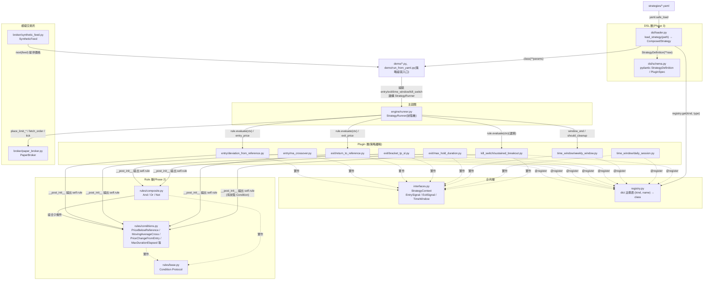
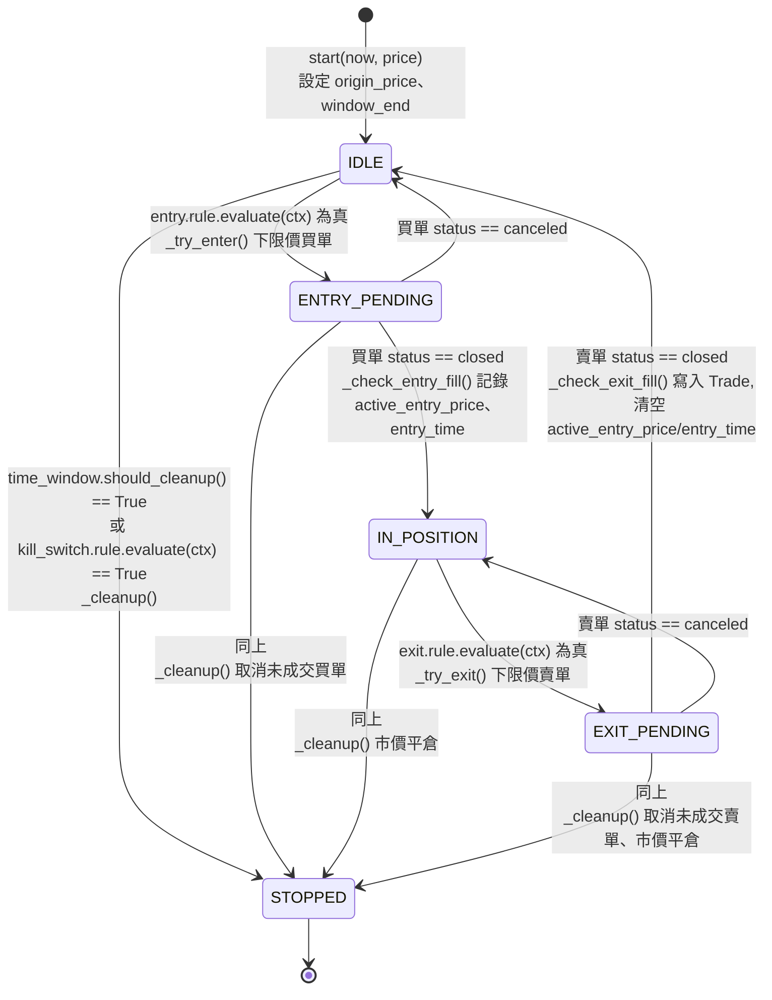

# strategy_lab 架構說明書

## 概述

strategy_lab 是一個以 Python `dataclass` 為基礎的交易策略回測框架,採
Plugin 化設計,將策略邏輯拆分為 entry(進場)、exit(出場)、
time_window(排程時間窗)、kill_switch(市場行為觸發的終止條件,選填)
四類獨立模組,並透過統一的狀態機驅動執行。系統不連接任何真實交易所,
僅對內建的模擬交易所(paper broker)與合成價格產生器運作。

本文件對應目前(Phase 3:DSL,加上 Live 遷移 Stage 1)完成後的架構
狀態,涵蓋元件關係、核心狀態機、單次執行流程、目前已知的設計限制,
以及往真實環境遷移的進度(§6)。

## 1. 元件關係圖

**元件職責:**

- **合約層(interfaces.py / registry.py)**:定義 plugin 必須實作的形狀
  (`Protocol`),以及一個名稱到類別的查找表。不含任何策略邏輯。
  `EntrySignal`/`ExitSignal` 自 Phase 2 起改為暴露 `rule: Condition`
  屬性,而非各自手寫的 `should_enter`/`should_exit` 方法。`KillSwitch`
  是第四種 plugin 合約,跟 `TimeWindow` 一樣代表「該不該收攤」,但觸發
  原因是市場行為(價格)而非排程時間,因此獨立成另一個合約,而不是把
  價格判斷塞進 `TimeWindow`。它比 `EntrySignal`/`ExitSignal` 更簡單:
  只有 `rule`,沒有價格方法,因為觸發後不需要算任何價格,只需要告訴
  runner「收攤」。
- **Rule 層(Phase 2 新增)**:`rules/base.py` 定義 `Condition` 這個最小
  合約(`evaluate(ctx) -> bool`);`rules/conditions.py` 是實際判斷市場
  事實的具體條件;`rules/composite.py` 的 `And`/`Or`/`Not` 只依賴
  `Condition` 合約,不知道被組合的是哪一種具體條件,因此可以任意疊代
  巢狀。此層不依賴 Plugin 層或 `engine/runner.py`。
- **Plugin 層**:每個檔案是一個獨立、可單元測試的策略邏輯單元,彼此不
  互相依賴,也不依賴 `engine/runner.py`。自 Phase 2 起,只負責兩件事:
  在 `__post_init__` 組出一棵 `Condition` 樹存進 `self.rule`,以及計算
  觸發後的價格(`entry_price`/`exit_price`)。「什麼時候觸發」完全交給
  Rule 層。
- **模擬交易所**:`PaperBroker` 模擬掛單/成交,`SyntheticFeed` 產生
  價格序列。兩者互不知曉對方存在,也不知曉「策略」的概念。
- **主迴圈(StrategyRunner)**:唯一同時依賴合約層與模擬交易所的元件,
  以組合(而非繼承或匯入具體 plugin)的方式接收 `entry`/`exit`/
  `time_window` 三個物件,驅動狀態機。它只呼叫 `rule.evaluate(ctx)`,
  完全不需要知道 Rule 層的存在——這是 Rule 層可以整層插入、runner.py
  幾乎不用改的原因(實際只改了兩行呼叫)。`kill_switch` 是選填欄位
  (預設 `None`),不傳就完全不影響既有行為;有傳的話,`tick()` 在
  `time_window.should_cleanup()` 之後、狀態分派之前檢查它,任一個
  成立就呼叫同一個 `_cleanup()`——不管當下處於哪個狀態(包含
  `IN_POSITION` 這種還沒等到正常出場訊號的當下),都會立刻取消未成交
  單、強制平倉、轉入 `STOPPED`。
- **`registry.py` 現況**:各 plugin 透過 `@register` 裝飾器完成登記。
  Phase 3 之前,`get()` 這一側是死碼——`demo/*.py` 全部以直接 `import`
  具體類別的方式組裝策略;Phase 3 起,`dsl/loader.py` 是第一個真正呼叫
  `registry.get(kind, type)` 的程式碼路徑,把 YAML 裡的字串轉成實際的
  plugin class。Rule 層的 `Condition` primitives(`PriceBelowReference`
  等)仍未註冊進 `registry.py`——目前的 YAML 形狀只需要 `{type, params}`
  就能組出完整的 plugin(見下方 DSL 層說明),不需要在 YAML 裡獨立描述
  一棵 Condition 樹,因此這件事還沒有用到的場景。
- **DSL 層(Phase 3 新增)**:`dsl/schema.py` 用 pydantic(v1)定義
  `StrategyDefinition`/`PluginSpec` 這兩個 schema,只負責「這個
  YAML/dict 合不合法」,完全不 import `registry`,也不知道有哪些
  plugin 真的存在。`dsl/loader.py` 的 `load_strategy(path)` 是唯一把
  三件事串起來的地方:讀檔 → `StrategyDefinition(**raw)` 驗證形狀 →
  對每個區塊呼叫 `registry.get(kind, spec.type)(**spec.params)`。刻意
  只支援 `{type, params}` 這個最簡單的形狀——每個 plugin 已經會在自己
  的 `__post_init__` 用 `params` 組出 `self.rule`,loader 不需要另外
  解析一棵獨立的 YAML Condition 樹;YAML 直接組合現有 Condition primitives
  (不透過寫新 plugin)這個更進階的能力,目前刻意不做,留待有實際需求
  再加。

## 2. `engine/runner.py` 狀態機

每個狀態轉移對應 `StrategyRunner` 上的一個私有方法。`tick()` 本身不含
任何策略專屬的分支邏輯,僅依據目前狀態值分派到對應方法。

## 3. `tick()` 呼叫的資料流追蹤

以 `IDLE` 狀態下成功觸發進場的一次 `tick()` 呼叫為例:

1. `tick(now, price)` 將 `price` 附加至 `self.price_history`,並呼叫
   `self.broker.tick(price)`,使前一輪已掛出的訂單有機會成交。
2. 呼叫 `self.time_window.should_cleanup(now, self.window_end)`,判斷
   是否已達收攤時間;若為 `False` 則繼續往下執行。
3. 目前狀態為 `IDLE`,呼叫 `_try_enter(now, price)`:
   1. 透過 `_ctx()` 組出一個 `StrategyContext`,其中的欄位(如
      `origin_price`、`active_entry_price`)取自 `StrategyRunner` 自身
      的內部狀態。
   2. 呼叫 `self.entry.rule.evaluate(ctx)` —— 此為本次呼叫中第一次觸及
      具體 plugin/Rule 層的邏輯。`rule` 可能是單一條件(如
      `PriceBelowReference`),也可能是 `And`/`Or`/`Not` 組成的巢狀樹;
      `_try_enter()` 不需要知道是哪一種。
   3. 若結果為真,呼叫 `self.entry.entry_price(ctx)` 計算掛單價位,並
      呼叫 `self.broker.place_limit_buy(price=..., qty=...)` 送出訂單。
   4. 狀態轉移為 `ENTRY_PENDING`。
4. 呼叫結束。若下一次 `tick()` 傳入的價格穿越了掛單價位,`broker.tick()`
   會在步驟 1 將該訂單標記為 `closed`,狀態機隨即在 `_check_entry_fill()`
   中轉移至 `IN_POSITION`。

出場流程(`IN_POSITION → EXIT_PENDING → IDLE`)遵循相同模式,差異僅在
於呼叫對象由 `entry` 換成 `exit`。

## 4. 已知限制與設計決策

### 4.1 Context 擴充成本

`StrategyContext` 是所有 plugin 共用的單一資料結構,而非各 plugin 私有
的資料。新增一個 plugin 若需要 context 中尚未存在的欄位,無法僅新增
該 plugin 的檔案完成,必須同步修改:

1. `interfaces.py` —— 新增欄位定義(schema 變更)。
2. `engine/runner.py` —— 新增對應的內部狀態欄位、在正確的生命週期時
   間點設值與清值(通常需同步修改 `_ctx()`、`_check_entry_fill()`、
   `_check_exit_fill()` 等多個方法),並可能牽動既有方法的參數簽名。

此設計是「共享 context 物件」模式的固有取捨:欄位清單固定、有限,換
取型別可預期、可讀性高,但代價是新增「context 中原本不存在的市場事實」
屬於跨檔案的破壞性變更,而非零成本擴充。`entry_time` 欄位的加入即為
此類變更的具體案例。

### 4.2 TimeWindow 的假設

現有兩個 `TimeWindow` 實作(`WeeklyWindow`、`DailySession`)的
`window_end()` 邏輯,皆建立在「單一固定 `HH:MM` 時刻 + 簡單的星期迴圈
比對」之上。此假設對「每週固定星期幾」與「每日固定時段」兩種週期規則
是足夠的,但尚未驗證是否適用於更複雜的週期規則(例如「每月第一個星期
一開始」)。導入新的週期類型時,應優先確認現有的日期查找邏輯是否可以
沿用,或需要另行設計。

### 4.3 Registry 死碼路徑(Phase 3 已解決)

Phase 1、2 期間,`registry.py` 只有 `register()` 這一側在運作
(透過各 `plugins/<kind>/__init__.py` 匯入對應模組觸發 `@register`
裝飾器);`get()` 沒有任何程式碼路徑呼叫。這曾經造成一個靜默失效:
`max_hold_duration.py` 建立時未被加入 `plugins/exit/__init__.py` 的
匯入清單,直接透過類別匯入使用時不受影響,但透過 registry 查詢時會找
不到對應項目——而且因為當時沒有任何路徑呼叫 `get()`,這個缺漏不會被
任何測試或執行流程偵測到。

**Phase 3 起,`dsl/loader.py` 的 `load_strategy()` 是第一個真正呼叫
`registry.get()` 的程式碼路徑**——YAML 裡的 `type: xxx` 字串,現在會
真的透過 `get()` 去查表。如果之後再發生「plugin 檔案忘記加進
`__init__.py` 匯入清單」這種缺漏,`tests/unit/test_dsl_loader.py` 或
`tests/unit/test_dsl_strategies_regression.py` 會直接失敗(`registry.UnknownPlugin`),
不會再靜默過關——這個限制到這裡才算真正解除,不是「文件上說已解決」
而已。

### 4.4 PaperBroker 的簡化設計

`PaperBroker` 採用簡化的成交模型:一張限價單只要在 `tick(price)` 呼叫
中被判定「價格穿越掛單價位」,即視為全數成交,不模擬部分成交、滑價
(slippage)或手續費。此簡化係為教學與架構驗證目的而設計,不適用於
需要精確還原真實交易所行為的回測場景。

### 4.5 Phase 2 對週末策略語意的調整

Phase 1 的 `DeviationFromReferenceEntry`/`ReturnToReferenceExit` 採用
「`should_enter`/`should_exit` 永遠回傳 `True`,實際的價格門檻交給限價
單本身的掛單價擋」的設計,與 MA 交叉策略「每個 tick 真的檢查訊號」的
設計不對稱。Phase 2 為了讓兩個示範策略在同一套 `Condition` 語言下描述,
將週末策略的進出場邏輯也改為真正的價格檢查
(`PriceBelowReference`/`PriceAtOrAboveReference`)。

此調整不影響最終成交價與交易筆數(兩個 demo 重跑後數字與 Phase 1 完全
一致),差異僅在於:訂單現在是「條件成立後才下單」,而非「窗口一開始
就掛著等」——在價格於窗口內反覆穿越門檻的情境下,理論上可能造成下單
時機的 1 個 tick 延遲,但不影響最終成交結果。

### 4.6 KillSwitch:`price_history` 沒有時間戳記,只能用有狀態的 Condition 繞過

`StrategyContext.price_history` 是 `Sequence[float]`,只有價格、沒有
對應的時間戳記,因此無法從外部把它切成「每一天」的資料——這是實作
「連續 N 天價格超過門檻」這類跨日條件時會直接撞到的限制,而且屬於
§4.1 描述的「Context 擴充成本」的具體案例:要修就得幫
`StrategyContext`/`StrategyRunner` 新增一份帶時間戳記的歷史,牽動的
檔案跟修 `entry_time` 時一樣多。

`rules/conditions.py` 的 `SustainedPriceBreakout` 選擇繞開這個限制,
而不是去修 `StrategyContext`:讓這個 `Condition` 物件自己在
`evaluate()` 呼叫之間累積內部狀態(用 `ctx.now`/`ctx.price` 逐 tick
捲出每日收盤),不依賴 `price_history`。本檔案裡其他的 `Condition`
(`PriceBelowReference`、`MovingAverageCross` 等)都是無狀態的純函式
——同一組 `ctx` 呼叫幾次結果都一樣;`SustainedPriceBreakout` 是目前
唯一的例外,呼叫結果會因為之前呼叫過幾次、傳過什麼 `ctx` 而改變。
`Condition` 合約本身(`evaluate(ctx) -> bool`)並沒有禁止這件事——只是
剛好在這個案例之前,沒有 primitive 需要用到而已。

### 4.7 `And`/`Or`/`Not` 原本沒有結構化的 `__eq__`(Phase 3 TDD 過程中發現並修正)

`rules/composite.py` 的 `And`/`Or`/`Not` 原本是純手寫的 `__init__`,
沒有 `@dataclass`,也沒有手寫 `__eq__`——兩個內容一模一樣的 `Or` 物件,
`==` 比較會退化成用記憶體位址比較(永遠是 `False`,除非是同一個物件)。
`rules/conditions.py` 裡的 leaf condition(`PriceBelowReference` 等)
因為都是 `@dataclass`,一直都有這個行為,只是沒人踩到——直到 Phase 3
寫 DSL 的 regression test(比較 YAML 組出來的 `BracketTPSLExit.rule`
跟手動組裝的版本是否 `==`)才第一次真的需要比較一棵**含 `Or` 的**
條件樹,測試因此失敗,才發現這個缺口。

修法:幫 `And`/`Or`/`Not` 手寫 `__eq__`(而不是改成 `@dataclass`,因為
建構子吃的是 `*conditions` 可變參數,`@dataclass` 沒辦法直接表達這種
形狀)。這是 TDD 流程本身抓到的真實缺口的例子——不是先規劃好才修的,
是寫一個原本只是想驗證別的東西的測試時,意外暴露出來的。

## 5. 文件維護提醒

每個 Phase 完成後,應檢視並更新以下對應章節:

| Phase | 內容變更 | 需更新的章節 | 狀態 |
|---|---|---|---|
| Phase 2(Rule Engine) | `plugins/` 的 `should_enter`/`should_exit` 改為宣告 `Condition` 樹 | §1 元件關係圖新增 `rules/` 子圖;§2 狀態圖標籤;§3 資料流追蹤改為 `plugin.rule.evaluate(ctx)`;新增 §4.5 | 已完成 |
| Phase 2 擴充(KillSwitch) | 新增第四種 plugin 類型,用市場行為(而非排程時間)終止整個策略迴圈 | §1 新增 `kill_switch/` 節點;§2 狀態圖收攤觸發條件;新增 §4.6 | 已完成 |
| Phase 3(DSL) | `registry.get()` 開始被 `dsl/loader.py` 實際呼叫;新增 `strategies/*.yaml`、`demo/run_from_yaml.py`;順帶修正 `rules/composite.py` 的 `__eq__` 缺口 | §1 補充 `dsl/` 元件與資料流;§4.3 更新為「已解決」;新增 §4.7 | 已完成 |
| Phase 4(Capstone) | 三個 YAML 策略熱切換驗證完成 | 新增一節記錄熱切換測試結果與計時演練結論 | 待進行 |
| Live 遷移 Stage 1 | port `account_feed.py`/`market_feed.py` | 新增 §6 | 已完成 |
| Live 遷移 Stage 2 | 新增 pybit 執行層,取代 ccxt | §6 更新 Stage 2 狀態 | 待進行 |
| Live 遷移 Stage 3 | `StrategyRunner` 泛化支援真實 broker | §6 更新 Stage 3 狀態;可能需要更新 §1 元件關係圖 | 待進行 |

## 6. Live 遷移(進行中)——`strategy_lab/live/`

**這是唯一會連真實服務、需要真實憑證的部分。** 跟本文件前五節描述的
「教學沙盒」核心(`broker/`、`plugins/`、`engine/`)刻意分開成獨立套件
`strategy_lab/live/`,不混在同一個命名空間裡——沙盒的承諾(不呼叫任何
真實交易所 API、不持有任何 API key)仍然對 `broker/`/`plugins/`/
`engine/` 成立,`live/` 是額外疊加、明確標示風險等級不同的一層。

目標是把 `sat_strategy`(目前正在真實 mainnet 帳戶上運行的機器人)移植
過來,採分階段進行,每階段獨立驗證:

- **Stage 1(已完成)**:`live/account_feed.py`、`live/market_feed.py`
  ——從 `sat_strategy/app/{account_feed,market_feed}.py` 移植,行為完全
  一致。訂閱 Fa_Successful_trade 透過 Redis 廣播的市場/帳戶資料
  (ticker 走 Pub/Sub、wallet/position/order 走 Streams + consumer
  group)。純邏輯(`_handle_entry`/`_handle_message`)獨立成
  unit test;真的驅動訂閱迴圈的部分,用 `fakeredis`(記憶體內的 Redis
  實作)寫 integration test,不需要真實 Redis server。
- **Stage 2(待進行)**:新的 Bybit 原生 API(`pybit`)執行層,取代
  `sat_strategy` 目前用的 ccxt。
- **Stage 3(待進行)**:把 `engine/runner.py` 的 `StrategyRunner`
  泛化成可以接真實 broker(目前 `broker` 欄位寫死是 `PaperBroker`
  型別),再組裝成完整可執行的真實策略。

### 6.1 測試心得:fakeredis 的 `block` 參數不是真的阻塞

寫 `account_feed.py` 的 integration test 時,原本想用「先啟動 feed、
背景 thread 進入阻塞讀取、再從另一個 client 發布新訊息,驗證背景
thread 會被喚醒接到」這種寫法(最貼近真實使用情境)。但 `fakeredis`
的 `XREADGROUP ... BLOCK 5000` 並不會真的阻塞等待——呼叫後幾乎立刻
(<1ms)回傳空結果,不會等新資料進來才回傳。這造成兩個後果:

1. 測試本身不穩定:訊息在背景 thread 「阻塞」期間才發布,常常來不及
   被下一輪迴圈撿到,或需要不合理長的等待時間。
2. 更嚴重的是,因為 `_consume_loop()` 的 `while` 迴圈中間沒有任何
   `sleep`(設計上依賴 `block=5000` 幫忙節流),`block` 一旦不是真的
   阻塞,這個迴圈在測試裡會變成完全不節流的忙迴圈,瘋狂搶 CPU/GIL,
   干擾到同一個測試 process 裡其他 thread(包含其他測試)的排程。

**這個限制只存在於 fakeredis,對著真實 Redis 跑完全沒有這個問題**
(真實 Redis 的 `BLOCK` 是真的阻塞)。對策不是硬跟 fakeredis 的限制
纏鬥,是換一種一樣有效、但不依賴「阻塞期間被喚醒」這個時序的測試
寫法:讓 consumer group 跟訊息都在呼叫 `feed.start()` **之前**就準備
好,這樣第一次 `xreadgroup(">")` 呼叫時資料已經存在,不需要任何跨
thread 的喚醒時序。`market_feed.py` 的 Pub/Sub 沒有這個問題——
fakeredis 的 `pubsub().listen()` 阻塞語意是正確的,新訊息發布後會
確實喚醒背景 thread,所以那邊維持「先啟動、再發布」的寫法。
