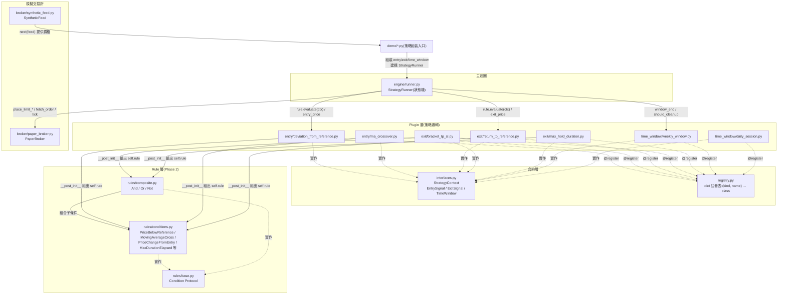
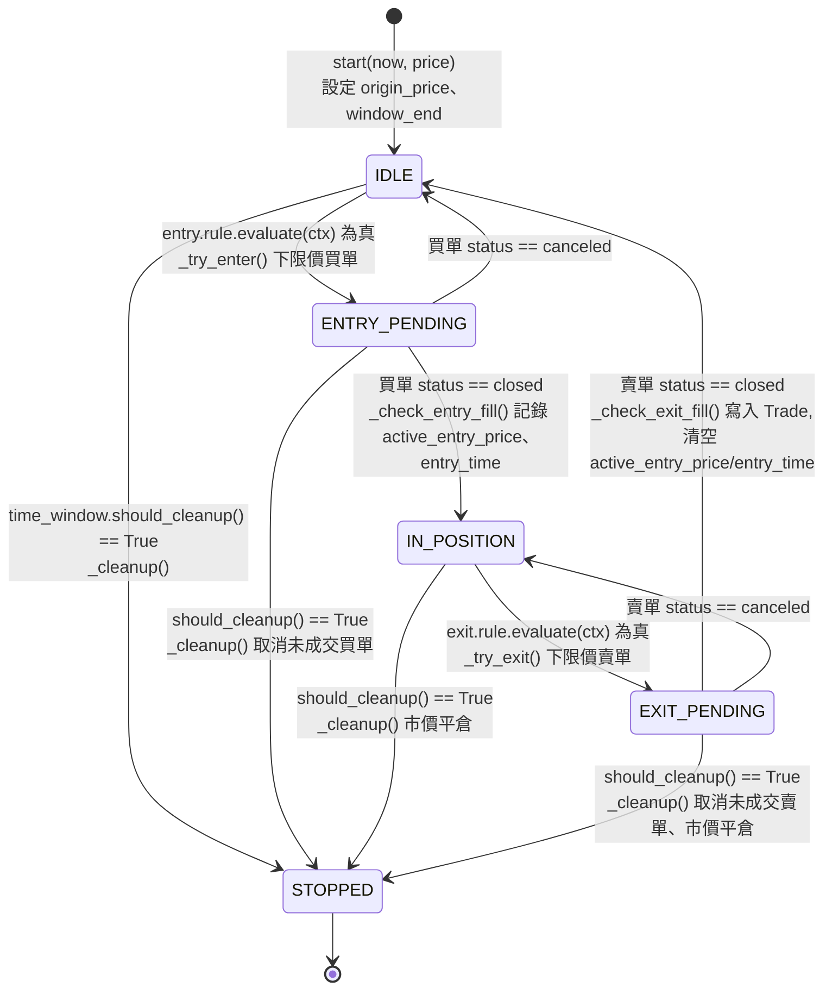

# strategy_lab 架構說明書

## 概述

strategy_lab 是一個以 Python `dataclass` 為基礎的交易策略回測框架,採
Plugin 化設計,將策略邏輯拆分為 entry(進場)、exit(出場)、
time_window(時間窗)三類獨立模組,並透過統一的狀態機驅動執行。系統
不連接任何真實交易所,僅對內建的模擬交易所(paper broker)與合成價格
產生器運作。

本文件對應目前(Phase 2:Rule Engine)完成後的架構狀態,涵蓋元件關係、
核心狀態機、單次執行流程,以及目前已知的設計限制。

## 1. 元件關係圖

**元件職責:**

- **合約層(interfaces.py / registry.py)**:定義 plugin 必須實作的形狀
  (`Protocol`),以及一個名稱到類別的查找表。不含任何策略邏輯。
  `EntrySignal`/`ExitSignal` 自 Phase 2 起改為暴露 `rule: Condition`
  屬性,而非各自手寫的 `should_enter`/`should_exit` 方法。
- **Rule 層(Phase 2 新增)**:`rules/base.py` 定義 `Condition` 這個最小
  合約(`evaluate(ctx) -> bool`);`rules/conditions.py` 是實際判斷市場
  事實的具體條件;`rules/composite.py` 的 `And`/`Or`/`Not` 只依賴
  `Condition` 合約,不知道被組合的是哪一種具體條件,因此可以任意疊代
  巢狀。此層不依賴 Plugin 層或 `engine/runner.py`。
- **Plugin 層**:每個檔案是一個獨立、可單元測試的策略邏輯單元,彼此不
  互相依賴,也不依賴 `engine/runner.py`。自 Phase 2 起,只負責兩件事:
  在 `__post_init__` 組出一棵 `Condition` 樹存進 `self.rule`,以及計算
  觸發後的價格(`entry_price`/`exit_price`)。「什麼時候觸發」完全交給
  Rule 層。
- **模擬交易所**:`PaperBroker` 模擬掛單/成交,`SyntheticFeed` 產生
  價格序列。兩者互不知曉對方存在,也不知曉「策略」的概念。
- **主迴圈(StrategyRunner)**:唯一同時依賴合約層與模擬交易所的元件,
  以組合(而非繼承或匯入具體 plugin)的方式接收 `entry`/`exit`/
  `time_window` 三個物件,驅動狀態機。它只呼叫 `rule.evaluate(ctx)`,
  完全不需要知道 Rule 層的存在——這是 Rule 層可以整層插入、runner.py
  幾乎不用改的原因(實際只改了兩行呼叫)。
- **`registry.py` 現況**:各 plugin 透過 `@register` 裝飾器完成登記,
  但目前尚無任何執行路徑呼叫 `registry.get()` ——`demo/*.py` 是以直接
  `import` 具體類別的方式組裝策略。此查找表是為未來的 DSL 載入器保留
  的介面。Rule 層的 `Condition` primitives 目前未註冊進 `registry.py`,
  屬於 Phase 3 待決事項。

## 2. `engine/runner.py` 狀態機

每個狀態轉移對應 `StrategyRunner` 上的一個私有方法。`tick()` 本身不含
任何策略專屬的分支邏輯,僅依據目前狀態值分派到對應方法。

## 3. `tick()` 呼叫的資料流追蹤

以 `IDLE` 狀態下成功觸發進場的一次 `tick()` 呼叫為例:

1. `tick(now, price)` 將 `price` 附加至 `self.price_history`,並呼叫
   `self.broker.tick(price)`,使前一輪已掛出的訂單有機會成交。
2. 呼叫 `self.time_window.should_cleanup(now, self.window_end)`,判斷
   是否已達收攤時間;若為 `False` 則繼續往下執行。
3. 目前狀態為 `IDLE`,呼叫 `_try_enter(now, price)`:
   1. 透過 `_ctx()` 組出一個 `StrategyContext`,其中的欄位(如
      `origin_price`、`active_entry_price`)取自 `StrategyRunner` 自身
      的內部狀態。
   2. 呼叫 `self.entry.rule.evaluate(ctx)` —— 此為本次呼叫中第一次觸及
      具體 plugin/Rule 層的邏輯。`rule` 可能是單一條件(如
      `PriceBelowReference`),也可能是 `And`/`Or`/`Not` 組成的巢狀樹;
      `_try_enter()` 不需要知道是哪一種。
   3. 若結果為真,呼叫 `self.entry.entry_price(ctx)` 計算掛單價位,並
      呼叫 `self.broker.place_limit_buy(price=..., qty=...)` 送出訂單。
   4. 狀態轉移為 `ENTRY_PENDING`。
4. 呼叫結束。若下一次 `tick()` 傳入的價格穿越了掛單價位,`broker.tick()`
   會在步驟 1 將該訂單標記為 `closed`,狀態機隨即在 `_check_entry_fill()`
   中轉移至 `IN_POSITION`。

出場流程(`IN_POSITION → EXIT_PENDING → IDLE`)遵循相同模式,差異僅在
於呼叫對象由 `entry` 換成 `exit`。

## 4. 已知限制與設計決策

### 4.1 Context 擴充成本

`StrategyContext` 是所有 plugin 共用的單一資料結構,而非各 plugin 私有
的資料。新增一個 plugin 若需要 context 中尚未存在的欄位,無法僅新增
該 plugin 的檔案完成,必須同步修改:

1. `interfaces.py` —— 新增欄位定義(schema 變更)。
2. `engine/runner.py` —— 新增對應的內部狀態欄位、在正確的生命週期時
   間點設值與清值(通常需同步修改 `_ctx()`、`_check_entry_fill()`、
   `_check_exit_fill()` 等多個方法),並可能牽動既有方法的參數簽名。

此設計是「共享 context 物件」模式的固有取捨:欄位清單固定、有限,換
取型別可預期、可讀性高,但代價是新增「context 中原本不存在的市場事實」
屬於跨檔案的破壞性變更,而非零成本擴充。`entry_time` 欄位的加入即為
此類變更的具體案例。

### 4.2 TimeWindow 的假設

現有兩個 `TimeWindow` 實作(`WeeklyWindow`、`DailySession`)的
`window_end()` 邏輯,皆建立在「單一固定 `HH:MM` 時刻 + 簡單的星期迴圈
比對」之上。此假設對「每週固定星期幾」與「每日固定時段」兩種週期規則
是足夠的,但尚未驗證是否適用於更複雜的週期規則(例如「每月第一個星期
一開始」)。導入新的週期類型時,應優先確認現有的日期查找邏輯是否可以
沿用,或需要另行設計。

### 4.3 Registry 死碼路徑

`registry.py` 提供 `register()`/`get()`/`list_plugins()` 三個函式,但
目前僅 `register()` 這一側在系統啟動時被實際執行(透過各
`plugins/<kind>/__init__.py` 匯入對應模組觸發 `@register` 裝飾器);
`get()` 尚未被任何執行路徑呼叫。

此現況隱含一個風險:若某個 plugin 檔案未被其所屬的
`plugins/<kind>/__init__.py` 匯入,則該 plugin 的 `@register` 裝飾器
不會執行,`registry.get()` 查詢時會找不到該 plugin ——但由於目前沒有
任何程式碼路徑呼叫 `get()`,這類缺漏不會被任何測試或執行流程偵測到,
屬於靜默失效。`max_hold_duration.py` 曾發生過此問題:該檔案建立時未
被加入 `plugins/exit/__init__.py` 的匯入清單,直接透過類別匯入使用時
不受影響,但透過 registry 查詢時會找不到對應項目。此問題已於現行版本
修正,但此類缺漏在新增 plugin 時仍可能重複發生,需仰賴 Phase 3 導入
DSL 載入器後、`get()` 路徑被實際使用時才會由錯誤訊息主動暴露。

### 4.4 PaperBroker 的簡化設計

`PaperBroker` 採用簡化的成交模型:一張限價單只要在 `tick(price)` 呼叫
中被判定「價格穿越掛單價位」,即視為全數成交,不模擬部分成交、滑價
(slippage)或手續費。此簡化係為教學與架構驗證目的而設計,不適用於
需要精確還原真實交易所行為的回測場景。

### 4.5 Phase 2 對週末策略語意的調整

Phase 1 的 `DeviationFromReferenceEntry`/`ReturnToReferenceExit` 採用
「`should_enter`/`should_exit` 永遠回傳 `True`,實際的價格門檻交給限價
單本身的掛單價擋」的設計,與 MA 交叉策略「每個 tick 真的檢查訊號」的
設計不對稱。Phase 2 為了讓兩個示範策略在同一套 `Condition` 語言下描述,
將週末策略的進出場邏輯也改為真正的價格檢查
(`PriceBelowReference`/`PriceAtOrAboveReference`)。

此調整不影響最終成交價與交易筆數(兩個 demo 重跑後數字與 Phase 1 完全
一致),差異僅在於:訂單現在是「條件成立後才下單」,而非「窗口一開始
就掛著等」——在價格於窗口內反覆穿越門檻的情境下,理論上可能造成下單
時機的 1 個 tick 延遲,但不影響最終成交結果。

## 5. 文件維護提醒

每個 Phase 完成後,應檢視並更新以下對應章節:

| Phase | 內容變更 | 需更新的章節 | 狀態 |
|---|---|---|---|
| Phase 2(Rule Engine) | `plugins/` 的 `should_enter`/`should_exit` 改為宣告 `Condition` 樹 | §1 元件關係圖新增 `rules/` 子圖;§2 狀態圖標籤;§3 資料流追蹤改為 `plugin.rule.evaluate(ctx)`;新增 §4.5 | 已完成 |
| Phase 3(DSL) | `registry.get()` 開始被 `dsl/loader.py` 實際呼叫 | §1 補充 `dsl/` 元件與資料流;§4.3 移除或修正「死碼路徑」描述 | 待進行 |
| Phase 4(Capstone) | 三個 YAML 策略熱切換驗證完成 | 新增一節記錄熱切換測試結果與計時演練結論 | 待進行 |
