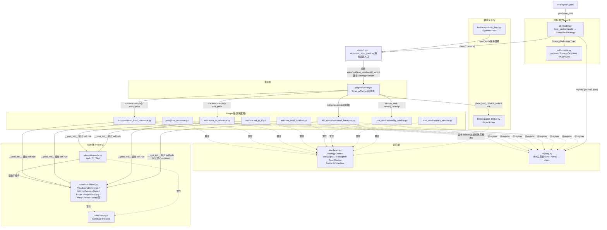
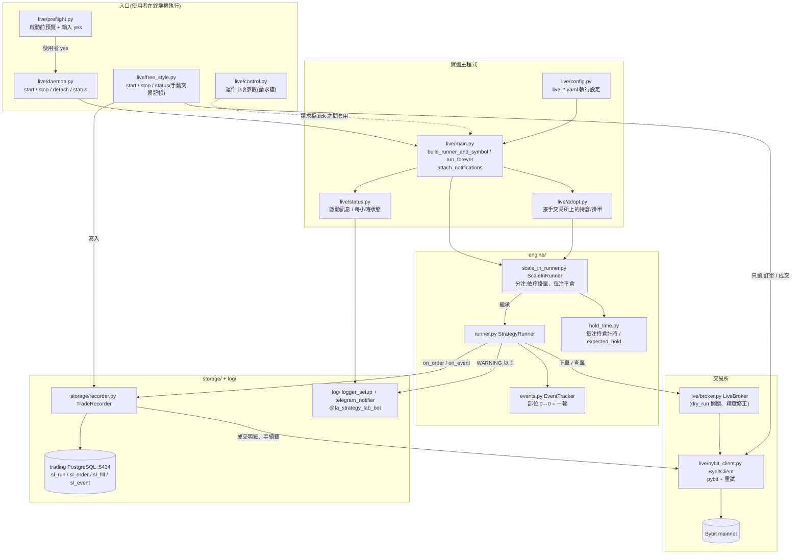
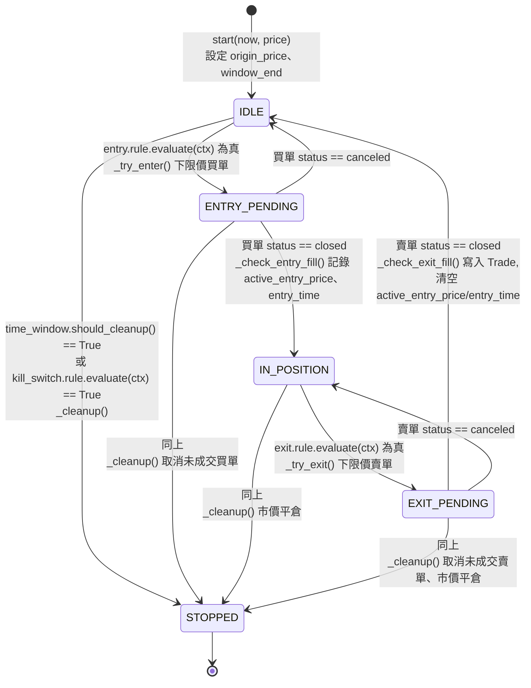

# strategy_lab 架構說明書

## 概述

strategy_lab 是一個以 Python `dataclass` 為基礎的交易策略回測框架,採
Plugin 化設計,將策略邏輯拆分為 entry(進場)、exit(出場)、
time_window(排程時間窗)、kill_switch(市場行為觸發的終止條件,選填)
四類獨立模組,並透過統一的狀態機驅動執行。核心(`broker/`、`plugins/`、
`rules/`、`dsl/`、`engine/`)只對內建的模擬交易所(paper broker)與合成
價格產生器運作,不連任何真實交易所。

**現況(2026-10-09)**:另外疊加的 `strategy_lab/live/` 已經在 Bybit
mainnet 小額帳戶實盤(分注策略 `scale_in_ladder`,preflight → 背景 daemon),
交易紀錄寫進共用的 `trading` PostgreSQL(§6.21),Telegram 通知(§6.24);
另有不用策略 YAML、只記帳的 free style(§6.27)與每注持倉計時(§6.28)。
Live 層的元件關係見 §1.1。

本文件涵蓋元件關係、核心狀態機、單次執行流程、目前已知的設計限制,
以及往真實環境遷移的過程與現況(§6)。

## 1. 元件關係圖

想仔細看 module 與 module 之間關係的,也可以直接看
[docs/module_relationship_diagram.svg](module_relationship_diagram.svg)
(同一份圖,畫成有分層底色、箭頭樣式區分「實作/呼叫/registry 查找/組裝」
四種關係的版本,比下面這張 Mermaid 更適合仔細追一條條依賴線)。


```mermaid
flowchart TD
    subgraph Contract["合約層"]
        I["interfaces.py<br/>StrategyContext<br/>EntrySignal / ExitSignal / TimeWindow<br/>Broker / OrderLike"]
        R["registry.py<br/>dict 註冊表:(kind, name) → class"]
    end

    subgraph DSL["DSL 層(Phase 3)"]
        DS["dsl/schema.py<br/>pydantic StrategyDefinition / PluginSpec"]
        DL["dsl/loader.py<br/>load_strategy(path) → ComposedStrategy"]
    end

    subgraph Rules["Rule 層(Phase 2)"]
        RB["rules/base.py<br/>Condition Protocol"]
        RC["rules/conditions.py<br/>PriceBelowReference / MovingAverageCross /<br/>PriceChangeFromEntry / MaxDurationElapsed 等"]
        RComp["rules/composite.py<br/>And / Or / Not"]
    end

    subgraph Plugins["Plugin 層(策略邏輯)"]
        E1["entry/deviation_from_reference.py"]
        E2["entry/ma_crossover.py"]
        X1["exit/return_to_reference.py"]
        X2["exit/bracket_tp_sl.py"]
        X3["exit/max_hold_duration.py"]
        T1["time_window/weekly_window.py"]
        T2["time_window/daily_session.py"]
        K1["kill_switch/sustained_breakout.py"]
    end

    subgraph Sim["模擬交易所"]
        B["broker/paper_broker.py<br/>PaperBroker"]
        F["broker/synthetic_feed.py<br/>SyntheticFeed"]
    end

    subgraph Core["主迴圈"]
        Run["engine/runner.py<br/>StrategyRunner(狀態機)"]
    end

    Demo["demo/*.py、demo/run_from_yaml.py(策略組裝入口)"]
    Yaml["strategies/*.yaml"]

    E1 & E2 -. 實作 .-> I
    X1 & X2 & X3 -. 實作 .-> I
    T1 & T2 -. 實作 .-> I
    K1 -. 實作 .-> I
    B -. "實作 Broker(結構相符,零修改)" .-> I
    E1 & E2 & X1 & X2 & X3 & T1 & T2 & K1 -. "@register" .-> R

    RC -. 實作 .-> RB
    RComp -. 實作 .-> RB
    RComp -->|"組合子條件"| RC

    E1 & E2 -->|"__post_init__ 組出 self.rule"| RC
    X1 -->|"__post_init__ 組出 self.rule"| RC
    X2 & X3 -->|"__post_init__ 組出 self.rule"| RComp
    K1 -->|"__post_init__ 組出 self.rule<br/>(有狀態 Condition)"| RC

    Yaml -->|"yaml.safe_load"| DL
    DL -->|"StrategyDefinition(**raw)"| DS
    DL -->|"registry.get(kind, type)"| R
    DL -->|"class(**params)"| Demo

    Run -->|"rule.evaluate(ctx) / entry_price"| E1
    Run -->|"rule.evaluate(ctx) / exit_price"| X1
    Run -->|"window_end / should_cleanup"| T1
    Run -->|"rule.evaluate(ctx)(選填)"| K1
    Run -->|"place_limit_* / fetch_order / tick"| B
    F -->|"next(feed) 提供價格"| Demo
    Demo -->|"組裝 entry/exit/time_window/kill_switch<br/>建構 StrategyRunner"| Run
```

### 1.1 Live 層(實盤)元件關係(2026-10-09)

上圖是教學沙盒核心;實盤是另外疊加的 `strategy_lab/live/` 加上 `engine/` 的分注 runner、
`storage/`(交易紀錄資料庫)與 `log/`(log + Telegram)。只有 `live/` 會連真實服務。


```mermaid
flowchart TD
    subgraph Entry["入口(使用者在終端機執行)"]
        PF["live/preflight.py<br/>啟動前預覽 + 輸入 yes"]
        DM["live/daemon.py<br/>start / stop / detach / status"]
        CT["live/control.py<br/>運作中改參數(請求檔)"]
        FS["live/free_style.py<br/>start / stop / status(手動交易記帳)"]
    end

    subgraph Run["實盤主程式"]
        MAIN["live/main.py<br/>build_runner_and_symbol / run_forever<br/>attach_notifications"]
        CFG["live/config.py<br/>live_*.yaml 執行設定"]
        ADOPT["live/adopt.py<br/>接手交易所上的持倉/掛單"]
        ST["live/status.py<br/>啟動訊息 / 每小時狀態"]
    end

    subgraph Engine["engine/"]
        SR["runner.py StrategyRunner"]
        SIR["scale_in_runner.py ScaleInRunner<br/>分注:依序掛單、每注平倉"]
        EV["events.py EventTracker<br/>部位 0→0 = 一輪"]
        HT["hold_time.py<br/>每注持倉計時 / expected_hold"]
    end

    subgraph Exchange["交易所"]
        LB["live/broker.py LiveBroker<br/>(dry_run 開關、精度修正)"]
        BC["live/bybit_client.py BybitClient<br/>pybit + 重試"]
        BY[("Bybit mainnet")]
    end

    subgraph Store["storage/ + log/"]
        REC["storage/recorder.py TradeRecorder"]
        DB[("trading PostgreSQL :5434<br/>sl_run / sl_order / sl_fill / sl_event")]
        TG["log/ logger_setup + telegram_notifier<br/>@fa_strategy_lab_bot"]
    end

    PF -->|"使用者 yes"| DM --> MAIN
    CT -.->|"請求檔,tick 之間套用"| MAIN
    CFG --> MAIN
    MAIN --> SIR
    SIR -->|繼承| SR
    SR --> EV
    SIR --> HT
    MAIN --> ADOPT --> SIR
    SR -->|下單 / 查單| LB --> BC --> BY
    SR -->|on_order / on_event| REC --> DB
    REC -->|成交明細、手續費| BC
    MAIN --> ST --> TG
    SR -->|WARNING 以上| TG
    FS -->|"只讀:訂單 / 成交"| BC
    FS -->|寫入| REC
```

**Live 層職責**:
- **preflight → daemon**:preflight 顯示估算、使用者自己輸入 yes 才啟動背景 daemon(Claude 不替使用者輸入)。
- **main.run_forever**:每 `poll_interval_seconds` 查價、跑一次 tick;tick 之間套用 `control.py` 的改參數請求;
  結束時寫 `sl_run` 總結、發 🟣 Telegram。Mac 睡眠時 process 被凍結,tick 會延後(見 TODO)。
- **ScaleInRunner**:分注策略,每注各自掛平倉單;每注持倉計時(§6.28)。
- **TradeRecorder**:每張單 / 每輪 / 每筆成交寫進 `trading` 資料庫;連不上改寫 `logs/db_pending/`,之後 backfill。
- **free_style**:不經過 runner;只讀 Bybit,stop 時用同一套 `EventTracker` 切輪,經 TradeRecorder 寫入(§6.27)。

**元件職責:**

- **合約層(interfaces.py / registry.py)**:定義 plugin 必須實作的形狀
  (`Protocol`),以及一個名稱到類別的查找表。不含任何策略邏輯。
  `EntrySignal`/`ExitSignal` 自 Phase 2 起改為暴露 `rule: Condition`
  屬性,而非各自手寫的 `should_enter`/`should_exit` 方法。`KillSwitch`
  是第四種 plugin 合約,跟 `TimeWindow` 一樣代表「該不該收攤」,但觸發
  原因是市場行為(價格)而非排程時間,因此獨立成另一個合約,而不是把
  價格判斷塞進 `TimeWindow`。它比 `EntrySignal`/`ExitSignal` 更簡單:
  只有 `rule`,沒有價格方法,因為觸發後不需要算任何價格,只需要告訴
  runner「收攤」。
- **Rule 層(Phase 2 新增)**:`rules/base.py` 定義 `Condition` 這個最小
  合約(`evaluate(ctx) -> bool`);`rules/conditions.py` 是實際判斷市場
  事實的具體條件;`rules/composite.py` 的 `And`/`Or`/`Not` 只依賴
  `Condition` 合約,不知道被組合的是哪一種具體條件,因此可以任意疊代
  巢狀。此層不依賴 Plugin 層或 `engine/runner.py`。想看 Rule 層三個
  module(`base.py`/`conditions.py`/`composite.py`)跟每一個實際使用
  它們的 plugin 之間逐一的對應關係,見
  [docs/rule_layer_plugin_relationship.svg](rule_layer_plugin_relationship.svg)
  ——同時標出了哪些 condition/composite 目前沒有任何 plugin 用到
  (`And`/`Not`)、哪個 condition 是唯一有狀態的(`SustainedPriceBreakout`)、
  哪個 plugin 是唯一透過 composite.py 組合(而非直接用單一 leaf
  condition)的(`BracketTPSLExit`),以及 `time_window/` 完全不參與
  Rule 層這件事。上面這張圖是「靜態結構」——想看 rule 物件在**時間軸**
  上實際怎麼被 runner 呼叫(建構期 vs 每個 tick 都重跑一次的執行期、
  `self.rule` 為什麼會被同一個物件反覆呼叫 `evaluate()`),見
  [docs/rule_runner_sequence.svg](rule_runner_sequence.svg)(以
  `DeviationFromReferenceEntry` 為例的時序圖)。
- **Plugin 層**:每個檔案是一個獨立、可單元測試的策略邏輯單元,彼此不
  互相依賴,也不依賴 `engine/runner.py`。自 Phase 2 起,只負責兩件事:
  在 `__post_init__` 組出一棵 `Condition` 樹存進 `self.rule`,以及計算
  觸發後的價格(`entry_price`/`exit_price`)。「什麼時候觸發」完全交給
  Rule 層。
- **模擬交易所**:`PaperBroker` 模擬掛單/成交,`SyntheticFeed` 產生
  價格序列。兩者互不知曉對方存在,也不知曉「策略」的概念。
- **主迴圈(StrategyRunner)**:唯一同時依賴合約層與模擬交易所的元件,
  以組合(而非繼承或匯入具體 plugin)的方式接收 `entry`/`exit`/
  `time_window` 三個物件,驅動狀態機。它只呼叫 `rule.evaluate(ctx)`,
  完全不需要知道 Rule 層的存在——這是 Rule 層可以整層插入、runner.py
  幾乎不用改的原因(實際只改了兩行呼叫)。`kill_switch` 是選填欄位
  (預設 `None`),不傳就完全不影響既有行為;有傳的話,`tick()` 在
  `time_window.should_cleanup()` 之後、狀態分派之前檢查它,任一個
  成立就呼叫同一個 `_cleanup()`——不管當下處於哪個狀態(包含
  `IN_POSITION` 這種還沒等到正常出場訊號的當下),都會立刻取消未成交
  單、強制平倉、轉入 `STOPPED`。
- **`registry.py` 現況**:各 plugin 透過 `@register` 裝飾器完成登記。
  Phase 3 之前,`get()` 這一側是死碼——`demo/*.py` 全部以直接 `import`
  具體類別的方式組裝策略;Phase 3 起,`dsl/loader.py` 是第一個真正呼叫
  `registry.get(kind, type)` 的程式碼路徑,把 YAML 裡的字串轉成實際的
  plugin class。Rule 層的 `Condition` primitives(`PriceBelowReference`
  等)仍未註冊進 `registry.py`——目前的 YAML 形狀只需要 `{type, params}`
  就能組出完整的 plugin(見下方 DSL 層說明),不需要在 YAML 裡獨立描述
  一棵 Condition 樹,因此這件事還沒有用到的場景。
- **DSL 層(Phase 3 新增)**:`dsl/schema.py` 用 pydantic(v1)定義
  `StrategyDefinition`/`PluginSpec` 這兩個 schema,只負責「這個
  YAML/dict 合不合法」,完全不 import `registry`,也不知道有哪些
  plugin 真的存在。`dsl/loader.py` 的 `load_strategy(path)` 是唯一把
  三件事串起來的地方:讀檔 → `StrategyDefinition(**raw)` 驗證形狀 →
  對每個區塊呼叫 `registry.get(kind, spec.type)(**spec.params)`。刻意
  只支援 `{type, params}` 這個最簡單的形狀——每個 plugin 已經會在自己
  的 `__post_init__` 用 `params` 組出 `self.rule`,loader 不需要另外
  解析一棵獨立的 YAML Condition 樹;YAML 直接組合現有 Condition primitives
  (不透過寫新 plugin)這個更進階的能力,目前刻意不做,留待有實際需求
  再加。

## 2. `engine/runner.py` 狀態機


```mermaid
stateDiagram-v2
    [*] --> IDLE: start(now, price)<br/>設定 origin_price、window_end

    IDLE --> ENTRY_PENDING: entry.rule.evaluate(ctx) 為真<br/>_try_enter() 下限價買單
    ENTRY_PENDING --> IN_POSITION: 買單 status == closed<br/>_check_entry_fill() 記錄 active_entry_price、entry_time
    ENTRY_PENDING --> IDLE: 買單 status == canceled

    IN_POSITION --> EXIT_PENDING: exit.rule.evaluate(ctx) 為真<br/>_try_exit() 下限價賣單
    EXIT_PENDING --> IDLE: 賣單 status == closed<br/>_check_exit_fill() 寫入 Trade,清空 active_entry_price/entry_time
    EXIT_PENDING --> IN_POSITION: 賣單 status == canceled

    IDLE --> STOPPED: time_window.should_cleanup() == True<br/>或 kill_switch.rule.evaluate(ctx) == True<br/>_cleanup()
    ENTRY_PENDING --> STOPPED: 同上<br/>_cleanup() 取消未成交買單
    IN_POSITION --> STOPPED: 同上<br/>_cleanup() 市價平倉
    EXIT_PENDING --> STOPPED: 同上<br/>_cleanup() 取消未成交賣單、市價平倉

    STOPPED --> [*]
```

每個狀態轉移對應 `StrategyRunner` 上的一個私有方法。`tick()` 本身不含
任何策略專屬的分支邏輯,僅依據目前狀態值分派到對應方法。

## 3. `tick()` 呼叫的資料流追蹤

以 `IDLE` 狀態下成功觸發進場的一次 `tick()` 呼叫為例:

1. `tick(now, price)` 將 `price` 附加至 `self.price_history`,並呼叫
   `self.broker.tick(price)`,使前一輪已掛出的訂單有機會成交。
2. 呼叫 `self.time_window.should_cleanup(now, self.window_end)`,判斷
   是否已達收攤時間;若為 `False` 則繼續往下執行。
3. 目前狀態為 `IDLE`,呼叫 `_try_enter(now, price)`:
   1. 透過 `_ctx()` 組出一個 `StrategyContext`,其中的欄位(如
      `origin_price`、`active_entry_price`)取自 `StrategyRunner` 自身
      的內部狀態。
   2. 呼叫 `self.entry.rule.evaluate(ctx)` —— 此為本次呼叫中第一次觸及
      具體 plugin/Rule 層的邏輯。`rule` 可能是單一條件(如
      `PriceBelowReference`),也可能是 `And`/`Or`/`Not` 組成的巢狀樹;
      `_try_enter()` 不需要知道是哪一種。
   3. 若結果為真,呼叫 `self.entry.entry_price(ctx)` 計算掛單價位,並
      呼叫 `self.broker.place_limit_buy(price=..., qty=...)` 送出訂單。
   4. 狀態轉移為 `ENTRY_PENDING`。
4. 呼叫結束。若下一次 `tick()` 傳入的價格穿越了掛單價位,`broker.tick()`
   會在步驟 1 將該訂單標記為 `closed`,狀態機隨即在 `_check_entry_fill()`
   中轉移至 `IN_POSITION`。

出場流程(`IN_POSITION → EXIT_PENDING → IDLE`)遵循相同模式,差異僅在
於呼叫對象由 `entry` 換成 `exit`。

## 4. 已知限制與設計決策

### 4.1 Context 擴充成本

`StrategyContext` 是所有 plugin 共用的單一資料結構,而非各 plugin 私有
的資料。新增一個 plugin 若需要 context 中尚未存在的欄位,無法僅新增
該 plugin 的檔案完成,必須同步修改:

1. `interfaces.py` —— 新增欄位定義(schema 變更)。
2. `engine/runner.py` —— 新增對應的內部狀態欄位、在正確的生命週期時
   間點設值與清值(通常需同步修改 `_ctx()`、`_check_entry_fill()`、
   `_check_exit_fill()` 等多個方法),並可能牽動既有方法的參數簽名。

此設計是「共享 context 物件」模式的固有取捨:欄位清單固定、有限,換
取型別可預期、可讀性高,但代價是新增「context 中原本不存在的市場事實」
屬於跨檔案的破壞性變更,而非零成本擴充。`entry_time` 欄位的加入即為
此類變更的具體案例。

### 4.2 TimeWindow 的假設

現有兩個 `TimeWindow` 實作(`WeeklyWindow`、`DailySession`)的
`window_end()` 邏輯,皆建立在「單一固定 `HH:MM` 時刻 + 簡單的星期迴圈
比對」之上。此假設對「每週固定星期幾」與「每日固定時段」兩種週期規則
是足夠的,但尚未驗證是否適用於更複雜的週期規則(例如「每月第一個星期
一開始」)。導入新的週期類型時,應優先確認現有的日期查找邏輯是否可以
沿用,或需要另行設計。

### 4.3 Registry 死碼路徑(Phase 3 已解決)

Phase 1、2 期間,`registry.py` 只有 `register()` 這一側在運作
(透過各 `plugins/<kind>/__init__.py` 匯入對應模組觸發 `@register`
裝飾器);`get()` 沒有任何程式碼路徑呼叫。這曾經造成一個靜默失效:
`max_hold_duration.py` 建立時未被加入 `plugins/exit/__init__.py` 的
匯入清單,直接透過類別匯入使用時不受影響,但透過 registry 查詢時會找
不到對應項目——而且因為當時沒有任何路徑呼叫 `get()`,這個缺漏不會被
任何測試或執行流程偵測到。

**Phase 3 起,`dsl/loader.py` 的 `load_strategy()` 是第一個真正呼叫
`registry.get()` 的程式碼路徑**——YAML 裡的 `type: xxx` 字串,現在會
真的透過 `get()` 去查表。如果之後再發生「plugin 檔案忘記加進
`__init__.py` 匯入清單」這種缺漏,`tests/unit/test_dsl_loader.py` 或
`tests/unit/test_dsl_strategies_regression.py` 會直接失敗(`registry.UnknownPlugin`),
不會再靜默過關——這個限制到這裡才算真正解除,不是「文件上說已解決」
而已。

### 4.4 PaperBroker 的簡化設計

`PaperBroker` 採用簡化的成交模型:一張限價單只要在 `tick(price)` 呼叫
中被判定「價格穿越掛單價位」,即視為全數成交,不模擬部分成交、滑價
(slippage)或手續費。此簡化係為教學與架構驗證目的而設計,不適用於
需要精確還原真實交易所行為的回測場景。

### 4.5 Phase 2 對週末策略語意的調整

Phase 1 的 `DeviationFromReferenceEntry`/`ReturnToReferenceExit` 採用
「`should_enter`/`should_exit` 永遠回傳 `True`,實際的價格門檻交給限價
單本身的掛單價擋」的設計,與 MA 交叉策略「每個 tick 真的檢查訊號」的
設計不對稱。Phase 2 為了讓兩個示範策略在同一套 `Condition` 語言下描述,
將週末策略的進出場邏輯也改為真正的價格檢查
(`PriceBelowReference`/`PriceAtOrAboveReference`)。

此調整不影響最終成交價與交易筆數(兩個 demo 重跑後數字與 Phase 1 完全
一致),差異僅在於:訂單現在是「條件成立後才下單」,而非「窗口一開始
就掛著等」——在價格於窗口內反覆穿越門檻的情境下,理論上可能造成下單
時機的 1 個 tick 延遲,但不影響最終成交結果。

### 4.6 KillSwitch:`price_history` 沒有時間戳記,只能用有狀態的 Condition 繞過

`StrategyContext.price_history` 是 `Sequence[float]`,只有價格、沒有
對應的時間戳記,因此無法從外部把它切成「一段時間」的資料——這是實作
「連續一段時間價格超過門檻」這類跨 tick 條件時會直接撞到的限制,而且
屬於 §4.1 描述的「Context 擴充成本」的具體案例:要修就得幫
`StrategyContext`/`StrategyRunner` 新增一份帶時間戳記的歷史,牽動的
檔案跟修 `entry_time` 時一樣多。

`rules/conditions.py` 的 `SustainedPriceBreakout` 選擇繞開這個限制,
而不是去修 `StrategyContext`:讓這個 `Condition` 物件自己在
`evaluate()` 呼叫之間累積內部狀態(用 `ctx.now`/`ctx.price` 逐 tick
記錄觀察歷史),不依賴 `price_history`。本檔案裡其他的 `Condition`
(`PriceBelowReference`、`MovingAverageCross` 等)都是無狀態的純函式
——同一組 `ctx` 呼叫幾次結果都一樣;`SustainedPriceBreakout` 是目前
唯一的例外,呼叫結果會因為之前呼叫過幾次、傳過什麼 `ctx` 而改變。
`Condition` 合約本身(`evaluate(ctx) -> bool`)並沒有禁止這件事——只是
剛好在這個案例之前,沒有 primitive 需要用到而已。

#### 4.6.1 從「連續 N 個日曆日」改成「連續 N 小時」的滾動視窗(重構)

`SustainedPriceBreakout` 最初的設計是「連續 N 個日曆日」:內部用
`date` 分桶,只有觀察到新的日期時才把前一天「結算」進
`_finalized_closes`。這個設計在建立
[`strategies/mean_reversion_breakout_guard.yaml`](../strategies/mean_reversion_breakout_guard.yaml)
時暴露出一個真實的相容性 bug:這個策略沿用了 `weekly_window` 的
`TimeWindow`(週六 04:00 到週一 06:00,整個窗口只有約 50 小時),
kill switch 卻設成 `days=3`——用實際跑一遍 `StrategyRunner` 的狀態
軌跡驗證後發現,`days=3` **永遠不可能觸發**,因為窗口本身的
`should_cleanup()` 一定先在窗口自然結束時把迴圈停掉,3 個日曆日永遠
撐不到那個時間點。這不是理論上的邊界案例,是照著使用者原始需求(連續
3 天)直接套用時就會踩到的真實缺口。

修法(使用者明確指示:「不用 day,全部改用小時作時間單位作計算」):
把 `days: int` 整個改成 `hours: float`(預設 `72.0`,取代原本的
`days=3`),內部狀態也從「日曆日分桶」改成「滾動時間視窗」:
`_history: List[Tuple[datetime, float]]` 記錄每筆 `(觀察時間, 價格)`,
每次 `evaluate()` 都先用 `ctx.now - timedelta(hours=self.hours)` 當
cutoff,把過期的觀察值剪掉。好處是不再有「日曆日邊界」造成的隱性
下限——`hours` 可以設成任何比 `TimeWindow` 窗口長度短的數值(例如
`mean_reversion_breakout_guard.yaml` 用 `hours: 24.0`,明顯短於
`weekly_window` 的 ~50 小時),不需要再擔心它跟日曆日邊界對不齊。
`plugins/kill_switch/sustained_breakout.py` 的 `SustainedBreakoutKillSwitch`
同步把 `days` 欄位改名為 `hours`,兩者的預設值都是對齊的
`72.0`。所有既有測試(`test_rules_conditions.py`、
`test_plugins_kill_switch.py`、`test_dsl_strategies_regression.py`、
`test_runner_integration.py`、`test_live_broker_integration.py`、
`demo/demo_kill_switch_sandbox.py`)都已同步改用 `hours=`,並重新驗證
通過(185/185 測試,含新增的 `mean_reversion_breakout_guard.yaml`
DSL regression 測試與滾動視窗剪除邏輯的獨立測試)。

#### 4.6.2 支援 `minutes`/`days` 當 `hours` 的替代輸入單位,以及載入期的相容性檢查

4.6.1 解決了「hours 這個單位本身沒有 bug」的問題,但使用者接著問了
更根本的問題:如果 YAML 裡想直接寫 `minutes`/`days`(甚至更長的
`months`/`years`),要怎麼確保任何單位都不會重踩同一種 bug?這裡分兩層
處理:

**單位換算(方便輸入,不影響邏輯)**:`SustainedPriceBreakout`/
`SustainedBreakoutKillSwitch` 新增 `minutes: Optional[float]`、
`days: Optional[float]` 兩個欄位,跟 `hours` 互斥(恰好給一個,不給則
預設 `hours=72.0`——跟既有的 `margin_pct`/`margin_fixed` 互斥模式一致)。
`__post_init__` 換算後統一正規化寫回 `self.hours`,新增一個
`window_duration -> timedelta` property 方便外部讀取解析後的結果。內部
`evaluate()`/`_observe()` 完全不用改,因為 `self.hours` 之後一定是解析
完的小時數,不管輸入時用的是哪個單位。**刻意不支援 `months`/`years`**:
日曆月、年的長度不固定(28-31 天、閏年),直接支援就會把 4.6.1 剛解決的
「日曆邊界」問題重新引進來;這個策略類型本身也是短線工具
(`weekly_window` 整個窗口才 ~50 小時),真的需要月/年量級的 kill
switch,代表策略設計思路該重新考慮,不是加個參數能解決的。

**載入期相容性檢查(真正防住這整類 bug 的部分)**:不管用哪個單位,
`SustainedPriceBreakout` 換算出的「總時長」只要 `>=` 它所屬
`TimeWindow` 的跨度,就一定永遠不會觸發(4.6.1 那個 bug 的通式)。與其
靠人工檢查(這正是 `mean_reversion_breakout_guard.yaml` 一開始
`days=3` 沒被抓到的原因),改成在 `dsl/loader.py` 載入策略的當下就自動
驗證:

- `WeeklyWindow`/`DailySession` 新增 `max_span() -> timedelta`,回傳
  「假設策略確實在 `start_weekday`/`start_time` 當下啟動」時,到
  `end_weekday`/`end_time` 的跨度。這個方法被加進 `TimeWindow` Protocol
  (`interfaces.py`),兩個既有實作都需要提供。**要注意**:
  `window_end()` 本身其實完全不看 `start_weekday`/`start_time`(它只從
  呼叫當下的 `now` 找下一個 `end_weekday`/`end_time`)——`max_span()`
  算出來的是「照文件說明的用法」預期會有的跨度,不是程式碼結構上強制
  一定如此的上限;如果 `runner.start()` 在別的時間點被呼叫,實際觀察到
  的窗口可能更長。這個落差本身也記錄在這裡,不是隱藏起來的假設。
- `dsl/loader.py` 新增 `_validate_kill_switch_fits_time_window()`,在
  `load_strategy()` 組出 `kill_switch`/`time_window` 之後、回傳
  `ComposedStrategy` 之前呼叫:用 `getattr` 保守讀取
  `kill_switch.window_duration`/`time_window.max_span`,兩者都存在才
  比較;`window_duration >= max_span()` 就直接 `raise ValueError`,錯誤
  訊息帶出兩個具體數值,不是空泛地說「設定錯誤」。用 `getattr` 而不是
  強制所有 kill_switch/time_window 型別都要實作這個介面,因為目前只有
  一種 kill_switch 型別有這個概念,不想為了這一個檢查逼未來的型別都要
  背這個包袱。
- 這個檢查只在 `load_strategy()`(YAML 進入點)生效,不在
  `StrategyRunner.__init__` 裡——單元/整合測試裡有意用「roomy」的手動組
  `time_window`(例如 `WeeklyWindow(end_weekday=5, ...)` 讓窗口撐到快
  一週後)來測 kill switch 邏輯本身,這些不透過 YAML,也不代表真實策略
  設定,不應該被這個檢查卡住。

驗證:196/196 測試通過(新增 `test_plugins_time_window.py` 的
`max_span()` 測試、`test_rules_conditions.py`/`test_plugins_kill_switch.py`
的 `minutes`/`days`/互斥錯誤測試、`test_dsl_loader.py` 的載入期驗證
測試),既有的 `test_kill_switch_resolved_when_present` 也在這個過程中
被抓到踩了同一種 bug(用預設 `hours=72.0` 但沒指定 `time_window` 是否
撐得住)而修正——這是新增的載入期檢查本身抓到的真實案例,不是特地寫來
展示的。

### 4.7 `And`/`Or`/`Not` 原本沒有結構化的 `__eq__`(Phase 3 TDD 過程中發現並修正)

`rules/composite.py` 的 `And`/`Or`/`Not` 原本是純手寫的 `__init__`,
沒有 `@dataclass`,也沒有手寫 `__eq__`——兩個內容一模一樣的 `Or` 物件,
`==` 比較會退化成用記憶體位址比較(永遠是 `False`,除非是同一個物件)。
`rules/conditions.py` 裡的 leaf condition(`PriceBelowReference` 等)
因為都是 `@dataclass`,一直都有這個行為,只是沒人踩到——直到 Phase 3
寫 DSL 的 regression test(比較 YAML 組出來的 `BracketTPSLExit.rule`
跟手動組裝的版本是否 `==`)才第一次真的需要比較一棵**含 `Or` 的**
條件樹,測試因此失敗,才發現這個缺口。

修法:幫 `And`/`Or`/`Not` 手寫 `__eq__`(而不是改成 `@dataclass`,因為
建構子吃的是 `*conditions` 可變參數,`@dataclass` 沒辦法直接表達這種
形狀)。這是 TDD 流程本身抓到的真實缺口的例子——不是先規劃好才修的,
是寫一個原本只是想驗證別的東西的測試時,意外暴露出來的。

## 5. 文件維護提醒

每個 Phase 完成後,應檢視並更新以下對應章節:

| Phase | 內容變更 | 需更新的章節 | 狀態 |
|---|---|---|---|
| Phase 2(Rule Engine) | `plugins/` 的 `should_enter`/`should_exit` 改為宣告 `Condition` 樹 | §1 元件關係圖新增 `rules/` 子圖;§2 狀態圖標籤;§3 資料流追蹤改為 `plugin.rule.evaluate(ctx)`;新增 §4.5 | 已完成 |
| Phase 2 擴充(KillSwitch) | 新增第四種 plugin 類型,用市場行為(而非排程時間)終止整個策略迴圈 | §1 新增 `kill_switch/` 節點;§2 狀態圖收攤觸發條件;新增 §4.6 | 已完成 |
| Phase 3(DSL) | `registry.get()` 開始被 `dsl/loader.py` 實際呼叫;新增 `strategies/*.yaml`、`demo/run_from_yaml.py`;順帶修正 `rules/composite.py` 的 `__eq__` 缺口 | §1 補充 `dsl/` 元件與資料流;§4.3 更新為「已解決」;新增 §4.7 | 已完成 |
| Phase 4(Capstone) | 三個 YAML 策略熱切換驗證完成 | 新增一節記錄熱切換測試結果與計時演練結論 | 待進行 |
| Live 遷移 Stage 1 | port `account_feed.py`/`market_feed.py` | 新增 §6 | 已完成 |
| Live 遷移 Stage 2 | 新增 `live/bybit_client.py`(pybit 執行層,取代 ccxt) | §6 更新 Stage 2 狀態;新增 §6.2 | 已完成 |
| Live 遷移 Stage 3.1 | 泛化 `Broker`/`OrderLike` Protocol,`StrategyRunner.broker` 不再寫死 `PaperBroker` 型別 | §1 元件關係圖新增 Broker Protocol;§6 更新 Stage 3.1 狀態 | 已完成 |
| Live 遷移 Stage 3.2 | `LiveBroker` 包裝 `BybitClient`,滿足 `Broker` Protocol;新增 `OrderResult.price` 欄位;修正共用假伺服器不模擬市價單立即成交的缺口 | §6 更新 Stage 3.2 狀態;新增 §6.3 | 已完成 |
| Live 遷移 Stage 3.3 | `LiveBroker` 新增 `dry_run` 安全開關(預設 `True`) | §6 更新 Stage 3.3 狀態;新增 §6.4 | 已完成 |
| Live 遷移 Stage 3.4 | `live/config.py`(執行參數)+ `live/main.py`(真正的執行入口)+ `StrategyRunner.request_stop()`(第三種收攤觸發);新增 `.env.example`/`live_execution_config.example.yaml` 範本 | §1 補充 `request_stop()`;§6 更新 Stage 3.4 狀態;新增 §6.5 | 程式碼已完成,**實際連真實帳戶執行需要使用者自己填入 `.env` 真實憑證** |
| `mean_reversion_breakout_guard` 策略 | 新增 `strategies/mean_reversion_breakout_guard.yaml`;發現並修正 `SustainedPriceBreakout`/`SustainedBreakoutKillSwitch` 的 `days`(日曆日)跟 `weekly_window` 窗口長度不相容的缺口,改為 `hours`(滾動時間視窗) | 新增 §4.6.1;更新 §4.6 用語 | 已完成 |
| kill_switch 多單位 + 載入期相容性檢查 | `SustainedPriceBreakout`/`SustainedBreakoutKillSwitch` 新增 `minutes`/`days` 當 `hours` 的替代輸入單位(互斥,正規化回 `hours`);`WeeklyWindow`/`DailySession` 新增 `max_span()`(併入 `TimeWindow` Protocol);`dsl/loader.py` 新增載入期檢查,kill_switch 視窗 `>=` time_window 跨度就直接報錯 | §1 補充 Protocol 變更;新增 §4.6.2 | 已完成 |
| 互動式選策略 | 新增 `dsl/discovery.py`(`list_strategy_files()`/`prompt_strategy_choice()`,`input_fn`/`print_fn` 依賴注入);`demo/run_from_yaml.py` 的 `--strategy` 改為選填,不給就跳出互動選單;新增獨立小工具 `live/select_strategy.py`,選完把 `strategy_path` 寫回 `live_execution_config.yaml`(不動其他欄位)——刻意不放進 `live/main.py`,因為 `main()` 必須能無人值守啟動,`input()` 會讓它卡死在沒有人回應的輸入 | §6 新增 §6.6 | 已完成 |
| 執行參數改用 YAML | `live/config.py`/`live/select_strategy.py` 從 JSON 改吃/寫 YAML;`live_execution_config.example.json` → `.example.yaml`,可以加註解 | §1 附近的 §6.5 補充說明 | 已完成 |
| `order_qty` 移出策略層,改用 `position_sizing` | 新增 `dsl/order_config.py`(`OrderConfig`/`PositionSizing`/`compute_qty()`);`strategies/*.yaml` 移除 `order_qty` 欄位(`dsl/schema.py`/`dsl/loader.py` 同步移除,`extra="forbid"` 會強制兩邊一起改,忘改會直接報錯);新增 `demo/sandbox_order.yaml`(沙盒假資料,`PaperBroker` 本身不改);`live_execution_config.yaml` 新增 `order_type`/`position_sizing`/`account_value`;`account_percentage` 模式在 live 端因為還沒有查真實餘額的方法,沒給 `account_value` 會直接報錯 | 新增 §6.7 | 已完成(`account_percentage` 在 live 端待補真實餘額查詢) |
| 8 種下單方式 + `order_type` 真正接進 runner | `PaperBroker`/`LiveBroker` 新增 `limit_sell`/`market_buy`/`market_sell`/`limit_flat_buy`/`limit_flat_sell`/`market_flat_buy`/`market_flat_sell`(對稱於既有的 `place_limit_buy`/`place_limit_sell`);`interfaces.Broker` Protocol 擴充到 14 個方法;`reduce_only` 單不會讓部位穿越 0(`PaperBroker._fill()`/`LiveBroker` dry-run 都要處理);`StrategyRunner` 新增 `order_type` 欄位,`_try_enter()`/`_try_exit()` 依此選限價還是市價——這是真正修好「`order_type` 設定完全沒作用」缺口的地方 | 新增 §6.8 | 已完成(開空倉的 4 種方法目前沒有 entry/exit plugin 會呼叫,刻意先做成獨立可用的方法,不強行接進長倉專用狀態機) |
| 下單前用真實精度限制修正 qty/price | 新增 `live/instrument_limits.py`(`fix_qty()`/`fix_price()`,永遠捨去 qty、依 side 決定 price 修正方向);新增 `live/fetch_instrument_limits.py`(下載腳本,公開端點);`BybitClient` 新增 `get_instrument_info()`;新增並 commit `instrument_limits.json`(公開市場資料,目前只有 BTCUSDT);`LiveBroker` 8 種下單方式送出前都先修正(dry-run 也修正,保證預覽準確),找不到資料就跳過、不會擋下下單;`LiveBroker` dry-run 的市價單額外接上 `get_last_price()` 查真實市價當模擬成交價(唯讀,不算真的下單) | 新增 §6.9 | 已完成(`PaperBroker`/沙盒刻意不套用這一層) |
| `account_percentage` 補上真實帳戶權益查詢 | `BybitClient` 新增 `get_account_equity()`(包裝 `get_wallet_balance`,需要驗證的端點);`live/main.py` 的 `_resolve_order_qty()` 不設 `account_value` 就自動查真實權益,有明確設就用那個值覆蓋 | 新增 §6.10 | 已完成,並用真實 mainnet 帳戶端到端驗證過(算出的 qty 太小被 §6.9 的 `fix_qty()` 正確擋下) |
| 空倉支援(`direction`) | `rules/conditions.py` 新增 `PriceAboveReference`/`PriceAtOrBelowReference`;新增 plugin `ShortDeviationFromReferenceEntry`/`ShortReturnToReferenceExit`;`StrategyRunner` 新增 `direction`,`_try_enter()`/`_try_exit()` 依此分派開多/開空/平多/平空;`dsl/schema.py`/`dsl/loader.py` 新增 `direction` 欄位(屬於策略定義,不是執行參數);`Trade` 新增 `direction`/`pnl`(long/short 公式互為鏡像);新增示範 `strategies/weekend_short_breakout.yaml`。**過程中發現並修正真實 bug**:`_cleanup()` 原本 `remaining > 0` 才平倉,空倉的 `position_qty()` 是負數,永遠不會被強制平倉——改用 `market_flat_buy`/`market_flat_sell` 依正負號分派,不再呼叫 `market_close()` | 新增 §6.11 | 已完成(做空的 kill switch 偵測——偵測向下突破——未做,留待 §6.12) |
| 做空用的 kill switch | `rules/conditions.py` 新增 `SustainedPriceBreakdown`(鏡像 `SustainedPriceBreakout`,偵測連續向下突破);新增 plugin `plugins/kill_switch/sustained_breakdown.py` 的 `SustainedBreakdownKillSwitch`,註冊為 `("kill_switch", "sustained_breakdown")`——不用碰 `dsl/loader.py`/`schema.py`,原本就是透過 registry 動態查找;新增示範 `strategies/weekend_short_breakout_guard.yaml`(鏡像 `mean_reversion_breakout_guard.yaml`) | 新增 §6.12 | 已完成,補上 §6.11 留下的缺口 |
| `category`(Bybit V5 商品類型)從寫死改成可設定 | `BybitClient` 原本模組常數 `CATEGORY = "linear"` 改成建構子參數 `category`,存進 `self._category`,7 處 API 呼叫都換掉;`ExecutionConfig` 新增 `category: Literal["linear","spot","inverse","option"] = "linear"`;`live/main.py` 建構 `BybitClient` 時多傳 `category=config.category` | 新增 §6.13 | 已完成,預設值不變,對既有部署零行為影響 |
| `weekend_mean_reversion` 改回 sat_strategy 機制(一啟動就掛單)+ 雙向 + 手動 origin | 新增 `AlwaysTrue` 條件;新增 plugin `resting_deviation_from_reference`/`resting_return_to_reference`(rule 永遠成立,掛單價就是觸發條件,方向讀 `ctx.direction`,不再 `round(…, 2)`);`StrategyContext` 新增 `direction`;`StrategyRunner` 拒絕 resting plugin + `order_type=market`;`ExecutionConfig.origin_price`(手動起點)+ `live/main.py` 的 `resolve_origin_price()`;`LiveBroker` dry-run 限價單改成價格碰到才成交;`weekend_mean_reversion.yaml`/`mean_reversion_breakout_guard.yaml`/`demo_weekend_phase1.py` 改用新 plugin | 新增 §6.14 | 已完成;舊的 `deviation_from_reference`(先看價格越過門檻才下單)保留給其他策略 |
| `--config` + 啟動殘留檢查 + 空單正負號修正 | `live/main.py`/`live/select_strategy.py` 新增 `--config`(每個策略一份設定檔,檔案不存在直接報錯);`live_*.yaml` gitignore;`ensure_clean_start()`:非 dry-run 時交易所上該 symbol 有掛單或持倉就拒絕啟動;`BybitClient.get_open_orders()`;`get_position_qty()` 依 `side` 回傳正負號(原本空單是正數) | 新增 §6.15 | 已完成,啟動檢查已對真實 mainnet 掛單驗證 |
| `weekend_band_reversion` 策略 | 新增平倉 plugin `resting_offset_from_reference`(`offset_pct`,long 在 origin 上方、short 在下方平倉,0 = 回到 origin);新增 `strategies/weekend_band_reversion.yaml` | 新增 §6.16 | 已完成 |
| 修正:已成交的單被當成未成交(真實 mainnet 事故) | `BybitClient.get_order_status()` 改看 `orderStatus`,不再把 `/v5/order/realtime` 回傳的單一律當 open | 新增 §6.17 | 已完成,用真實已成交單驗證 |
| 修正:關掉 PyCharm 時程式沒收尾(真實 mainnet 事故) | `install_stop_signal_handlers()` 加處理 SIGHUP;`setup_file_logging()` log 寫檔 + 異常結束寫 traceback;新增 `live/daemon.py`(背景 start/stop/status,`start_new_session`) | 新增 §6.18 | 已完成 |
| 啟動前確認(preflight)+ 估算元件化 | `interfaces.PlannedExit` + 出場 plugin 的 `planned_exit()`(各自描述止盈/停損);新增 `estimates/`(`OrderPlan`/`MarketSnapshot`/`build_order_plan()`,計算元件以 `@register("metric", ...)` 註冊:`order_plan`/`cycle_pnl`/`risk`/`time_window`);`BybitClient` 新增 `get_fee_rates()`/`get_leverage()`/`get_margin_mode()`;新增 `live/preflight.py`(顯示估算,實盤要輸入 `yes` 才用 daemon 啟動) | 新增 §6.19 | 已完成,用真實設定唯讀預覽過 |
| event + loop | 新增 `engine/events.py`(`EventTracker`:由成交自動切出 event=部位 0→0,帶正負號部位會計、加碼更新均價、每 tick 量期間最大回撤;`summarize()`:跨 event 權益曲線的最大回撤);runner 新增 `loop`/`on_event`/`events`,強制平倉也記成 event(`forced=True`);策略 YAML 新增 `loop`(重複次數,總 event = loop+1,預設 0,null 不限),既有策略都明確寫 `loop: null`;main 每個 event 寫 log、結束時寫總結;preflight 顯示 event 次數 | 新增 §6.20 | 已完成 |
| 交易紀錄資料庫 | 新增 `storage/`(`models.py` 四張表 `sl_run`/`sl_order`/`sl_fill`/`sl_event`、`recorder.py` `TradeRecorder`、`backfill.py`、`setup_db.py`);runner 新增 `OrderRecord`/`on_order`/`stop_reason`;`BybitClient.get_executions()`(翻頁);`live/main.py` 實盤才建 recorder(dry-run 不存),run 開始/結束/被擋/當掉都有紀錄;preflight 確認時存估算給 `sl_run.preflight` | 新增 §6.21 | 已完成;用 09-27 真實成交重播,淨損益與 Bybit closedPnl 完全一致 |
| 網路錯誤韌性 + 實盤 log | `BybitClient` 補接 requests 例外、預設 10 次/60 秒、下單帶 `orderLinkId` 防重複、取消不放棄;`run_forever` 網路失敗這一輪放棄下一輪再試;runner 收尾中斷後續做、分注只補掛缺的單;每張單下單/成交/取消寫 log;`select_strategy.py` 改成只替換 `strategy_path` 那一行(保留註解) | 新增 §6.23 | 已完成;521 passed |
| Telegram 通知 + log 大小限制 | 新增 `strategy_lab/log/`(`logger_setup.py` 照 Fa_Successful_trade 結構:console/檔案/Telegram;`telegram_notifier.py` 背景發送、冷卻、不自我觸發;`log_limit.py` 總大小上限);`live/main.py` 新增 `mode_label()`、`attach_notifications()`、啟動/結束事件;runner 的「開始收尾」不發 Telegram;檔案輪替後壓縮 `.log.gz`;`tests/conftest.py` 擋住真 token 與真 logs/ | 新增 §6.24 | 已完成 |
| 分注依序掛單 | `ScaleInRunner._ready()`:loop 開始只掛第一注,第 k 注建倉成交才在同一個 tick 掛第 k+1 注(連同第 k 注的平倉單);斷網補掛同樣要前一注已成交;新 loop 從第一注重新開始。`scale_in_ladder.yaml` 註解、preflight 掛單計畫文字同步 | §6.22 規格表新增「掛單順序」列、「loop 結束」列 | 已完成 |
| Telegram 看得懂的狀態 | 新增 `live/status.py`(`start_message`、`status_message`、`StatusReporter`):啟動訊息帶策略參數/各注→平倉價/最大部位/收尾時間;每小時狀態回報(⚪ #狀態,`STATUS_INTERVAL_MINUTES`);用語統一成 loop(第 k 個 loop/共 N、這輪與累計損益);訊息分類樣式(彩色圓點 + hashtag,HTML) | §6.24 新增「看得懂現在在幹嘛」與類別樣式表 | 已完成 |
| 淨利與手續費比率 | `TradeRecorder.event_costs()`(Bybit 真實手續費/資金費);`live/status.py` 新增 `cost_totals`/`fee_ratio`/`net_summary`/`px`/`usd`;loop 結算、累計、每小時狀態、結束總結改成淨利 + 手續費佔利益(虧損)比率;價格 4 位、金額 2 位;「收尾還有」改成「距強制收尾還有」 | §6.24 新增「損益一律顯示淨利」「數字格式」「強制收尾」 | 已完成 |
| 運作中改參數 | 新增 `live/control.py`(`set entry_prices/distance/loop`:預覽 + yes、請求檔/結果檔、等 90 秒、逾時撤回、超過 10 分鐘的請求不套用);`StrategyRunner`/`ScaleInRunner.apply_changes()`(先全部驗證、取消重掛、取消前已成交不重掛、越過現價拒絕);`ExecutionConfig.strategy_overrides` + `apply_strategy_overrides()`(啟動與 preflight 套用);`run_forever` 在 tick 之間 `process_control()` | 新增 §6.25 | 已完成 |
| 接手現有持倉與脫離 | 新增 `live/adopt.py`(`plan_adoption`/`apply_adoption`,對不上就 `AdoptionError`);`ExecutionConfig.adopt_existing_position`;`ensure_clean_start(adopt=)`、`adopt_existing()`;SIGUSR1 → `runner.request_detach()`、`run_forever` 不收尾結束;`daemon detach`;`BybitClient.get_position_avg_price()`;preflight 預覽接手內容 | 新增 §6.26 | 已完成 |
| free style + 資料表中文說明 | 新增 `live/free_style.py`(`start`/`stop`/`status`;只讀 Bybit,stop 時用 `EventTracker` 重播成交切出每一輪,`purpose = manual`、`end_reason = free_style_stop`;7 天分段查詢);`BybitClient.list_order_history()`;`storage/models.py` 每張表/欄位加 `comment`,`setup_db` 用 COMMENT ON 寫進 Postgres | 新增 §6.27 | 已完成 |
| 持倉計時(時間暴露)+ 預估持倉時間 | 新增 `engine/hold_time.py`(`LotHold`、`format_hold`、`parse_expected_hold`、`hold_summary`);策略 YAML `expected_hold`(只限分注);`Lot.filled_at`/`hold_warned`、`ScaleInRunner.lot_holds`/`expected_hold`、超時 WARNING 一次、收尾強制平倉也計時;`OrderRecord.hold_seconds` → `sl_order.hold_seconds`;🟢 平倉成交、⚪ 狀態、🟣 結束總結顯示 | 新增 §6.28 | 已完成 |

## 6. Live 遷移(進行中)——`strategy_lab/live/`

進度總覽見獨立的工程路線圖:
[docs/live_migration_roadmap.svg](live_migration_roadmap.svg)(直接看畫面,
綠=已完成、黃=程式碼完成但還沒真的碰過真實帳戶、橘=卡在等真實憑證、
灰=還沒開始),或它的可編輯來源
[docs/live_migration_roadmap.mmd](live_migration_roadmap.mmd)(Mermaid 純
文字版,改進度時先改這份,再手動同步 `.svg`)。下面文字版逐一展開每個
Stage 的細節。

**這是唯一會連真實服務、需要真實憑證的部分。** 跟本文件前五節描述的
「教學沙盒」核心(`broker/`、`plugins/`、`engine/`)刻意分開成獨立套件
`strategy_lab/live/`,不混在同一個命名空間裡——沙盒的承諾(不呼叫任何
真實交易所 API、不持有任何 API key)仍然對 `broker/`/`plugins/`/
`engine/` 成立,`live/` 是額外疊加、明確標示風險等級不同的一層。

目標是把 `sat_strategy`(目前正在真實 mainnet 帳戶上運行的機器人)移植
過來,採分階段進行,每階段獨立驗證:

- **Stage 1(已完成)**:`live/account_feed.py`、`live/market_feed.py`
  ——從 `sat_strategy/app/{account_feed,market_feed}.py` 移植,行為完全
  一致。訂閱 Fa_Successful_trade 透過 Redis 廣播的市場/帳戶資料
  (ticker 走 Pub/Sub、wallet/position/order 走 Streams + consumer
  group)。純邏輯(`_handle_entry`/`_handle_message`)獨立成
  unit test;真的驅動訂閱迴圈的部分,用 `fakeredis`(記憶體內的 Redis
  實作)寫 integration test,不需要真實 Redis server。
- **Stage 2(已完成)**:`live/bybit_client.py`——包裝 `pybit`(Bybit V5
  原生 SDK),取代 `sat_strategy` 目前用的 ccxt。方法對應 bot.py 原本
  呼叫 ccxt 的方法一對一改寫(`get_last_price`/`place_limit_order`/
  `place_market_order`/`get_order_status`/`cancel_order`/
  `get_position_qty`)。**還沒接上任何真實 API key**——建構子透過
  `http_client` 參數注入真正的 `pybit.unified_trading.HTTP` 或測試用
  的假 client,unit/integration test 全部用假 client,不會打真正的
  網路請求。見 §6.2。
- **Stage 3**(把 `BybitClient` 接成真正可執行的真實策略),拆成四個
  子步驟,每步都各自過 UT/IT 才進下一步:
  - **3.1(已完成)**:`interfaces.py` 新增 `Broker`/`OrderLike`
    Protocol,`StrategyRunner.broker` 的型別從寫死的 `PaperBroker`
    改成這個 Protocol。刻意設計成零行為變更——`PaperBroker` 現有的
    7 個方法結構上已經滿足這個 Protocol,不用改 `PaperBroker` 一行
    程式碼,全部既有測試(131 個)原封不動繼續通過,這就是這一步
    「泛化而不是重新設計」的驗收標準。`tick(price)` 留在合約裡:
    `PaperBroker` 用它模擬成交,真實 broker(`LiveBroker`,Stage 3.2)
    可以讓它是合法的 no-op,不需要 runner.py 為了不同 broker 種類
    分支處理。見 [interfaces.py](../strategy_lab/interfaces.py)。
  - **3.2(已完成)**:`live/broker.py` 的 `LiveBroker` 包裝
    `BybitClient`,滿足 `Broker` Protocol——把 `place_limit_buy(price, qty)`
    這種通用方法,翻譯成 `BybitClient.place_limit_order(symbol, "Buy",
    qty, price)` 這種需要 symbol/side 的呼叫;`symbol` 存在 `LiveBroker`
    自己身上(建構時決定),不是每次呼叫都要傳。`place_limit_sell`/
    `market_close` 的 `reduce_only` 寫死 `True`——整個系統只做多
    (entry=買、exit=賣),不能因為呼叫端忘記傳而意外開出新倉。
    `tick(price)` 是刻意的 no-op。qty/price 精度目前沒有另外處理
    (不是這一步的範圍,見 §6.3 的討論)。見 §6.3。
  - **3.3(已完成)**:`LiveBroker` 新增 `dry_run` 安全開關(預設
    `True`),呼應 `sat_strategy/app/bot.py` 每個下單方法前的
    `if self.config.dry_run: return ...`。放在 `LiveBroker` 而不是
    `BybitClient`——`BybitClient` 保持忠實、無條件包裝真實 API,「要不要
    真的下單」的決策屬於 `LiveBroker`。見 §6.4。
  - **3.4(程式碼已完成,實際執行需要真實 API key)**:`live/config.py`
    的 `ExecutionConfig`(執行參數,不重複放策略參數——那些在
    `strategies/*.yaml` 裡)+ `live/main.py` 的 `main()`(對應
    `sat_strategy/app/bot.py` 的 `main()`),真的用 `datetime.now()` +
    `time.sleep()` 驅動 `runner.tick()`,不是靠 `SyntheticFeed`。順帶
    幫 `StrategyRunner` 補上 `request_stop()`——第三種觸發 `_cleanup()`
    的方式(跟 `time_window`/`kill_switch` 平行),對應
    `bot.py` 的 `_stop_requested`,讓 SIGINT/SIGTERM 能優雅收攤而不是
    直接砍掉 process 留下沒人管的真實掛單或部位。見 §6.5。

### 6.1 測試心得:fakeredis 的 `block` 參數不是真的阻塞

寫 `account_feed.py` 的 integration test 時,原本想用「先啟動 feed、
背景 thread 進入阻塞讀取、再從另一個 client 發布新訊息,驗證背景
thread 會被喚醒接到」這種寫法(最貼近真實使用情境)。但 `fakeredis`
的 `XREADGROUP ... BLOCK 5000` 並不會真的阻塞等待——呼叫後幾乎立刻
(<1ms)回傳空結果,不會等新資料進來才回傳。這造成兩個後果:

1. 測試本身不穩定:訊息在背景 thread 「阻塞」期間才發布,常常來不及
   被下一輪迴圈撿到,或需要不合理長的等待時間。
2. 更嚴重的是,因為 `_consume_loop()` 的 `while` 迴圈中間沒有任何
   `sleep`(設計上依賴 `block=5000` 幫忙節流),`block` 一旦不是真的
   阻塞,這個迴圈在測試裡會變成完全不節流的忙迴圈,瘋狂搶 CPU/GIL,
   干擾到同一個測試 process 裡其他 thread(包含其他測試)的排程。

**這個限制只存在於 fakeredis,對著真實 Redis 跑完全沒有這個問題**
(真實 Redis 的 `BLOCK` 是真的阻塞)。對策不是硬跟 fakeredis 的限制
纏鬥,是換一種一樣有效、但不依賴「阻塞期間被喚醒」這個時序的測試
寫法:讓 consumer group 跟訊息都在呼叫 `feed.start()` **之前**就準備
好,這樣第一次 `xreadgroup(">")` 呼叫時資料已經存在,不需要任何跨
thread 的喚醒時序。`market_feed.py` 的 Pub/Sub 沒有這個問題——
fakeredis 的 `pubsub().listen()` 阻塞語意是正確的,新訊息發布後會
確實喚醒背景 thread,所以那邊維持「先啟動、再發布」的寫法。

### 6.2 `bybit_client.py`:用依賴注入避開「需要真實 API key 才能測試」

`BybitClient` 的建構子不會自己在內部寫死
`pybit.unified_trading.HTTP(...)`,而是透過 `http_client` 參數注入:
不傳的話,預設才真的去建一個連真實 Bybit API 的 client(需要真實
key/secret);測試時直接塞一個符合相同方法介面(`get_tickers`/
`place_order`/`get_open_orders`/`get_order_history`/`cancel_order`/
`get_positions`)的假物件進去。這是 Stage 2 完全不需要真實 API key
就能把 unit test + integration test 寫完、跑綠的原因——跟
`engine/runner.py` 的 `PaperBroker` 是同一種取捨:用一個滿足相同介面
的假實作,把「策略邏輯」跟「這個假/真實作是怎麼運作的」分開測試。

Unit test(`tests/unit/test_live_bybit_client.py`)用一個無狀態的假
client(`FakeHTTP`),每個方法各自獨立驗證單一次呼叫的參數/回傳值轉換
對不對。Integration test
(`tests/integration/test_live_bybit_client_integration.py`)用一個
**有狀態**的假 Bybit 伺服器(`StatefulFakeBybitServer`,角色類似
`broker/paper_broker.py` 的 `PaperBroker`),模擬「下單後查 open、
交易所端成交後再查變成 closed」這種跨多次呼叫的真實使用情境,包括
`_cancel_order()` 對一張其實已經成交的單重複送取消時,`InvalidRequestError`
要被吞掉、不能讓整個 cleanup 流程炸掉——對應 `sat_strategy/app/bot.py`
`_cancel_order()` 的 `except ccxt.OrderNotFound: return` 那段邏輯。

`get_order_status()` 的實作對應到 Bybit V5 API 一個跟 ccxt 不同的地方
值得記錄:ccxt 的 `fetch_open_order`/`fetch_closed_order` 是兩個分開的
方法,呼叫端(bot.py)自己判斷 `ccxt.OrderNotFound` 決定要不要 fallback
查歷史;Bybit V5 原生 API 沒有這種「找不到就丟例外」的機制,
`get_open_orders`/`get_order_history` 各自單純回傳空列表或有內容的
列表,`BybitClient.get_order_status()` 內部自己做「先查 open,空的話
查 history」的邏輯,把這個查詢順序的細節封裝起來,不讓呼叫端知道
底層是兩個分開的 API。

### 6.3 `live/broker.py`:接上 Step 1 才發現的真實缺口,以及一個假伺服器本身的 bug

**`OrderResult` 原本沒有 `price` 欄位。** Stage 2 完成當下沒發現這個
問題,因為 Stage 2 自己的測試從來沒有需要「把 `OrderResult` 轉成滿足
`OrderLike` Protocol 的物件」——直到 Step 2 寫 `LiveBroker`,要把
`BybitClient.OrderResult` 翻譯成 `interfaces.OrderLike`(需要
`.price`)時,才發現這個缺口。補法:`OrderResult` 新增 `price: float`
欄位;`place_limit_order()` 直接回傳呼叫端要求的限價;
`get_order_status()` 優先用 `avgPrice`(實際成交均價,算損益該用的
數字),`avgPrice` 是 `"0"`(訂單根本沒成交就被取消的情況)才退回用
`price`(掛單當初的限價)。

**命名不對齊,用一個小的翻譯物件解決,不改 `BybitClient` 的既有命名。**
`OrderLike` 要求 `.id`,但 `BybitClient.OrderResult` 用的是
`.order_id`(對應 Bybit API 自己的欄位名 `orderId`,對 `BybitClient`
自己的使用情境更清楚)。沒有為了遷就 `OrderLike` 去改 `OrderResult`
的命名(那樣反而讓 `BybitClient` 自己的意圖變模糊),而是讓
`LiveBroker` 內部用一個小的 `LiveOrder` dataclass 做翻譯——跟
`broker/paper_broker.py` 的 `Order` 是同一個角色,各自的具體型別不用
相同,只要結構上滿足 `OrderLike` 就好(Python 的 Protocol 是結構化
型別,不需要共用基底類別)。

**capstone integration test 抓到一個假伺服器本身的 bug,不是
`LiveBroker` 的 bug。** 寫
`tests/integration/test_live_broker_integration.py` 的 kill switch
情境時,`runner._cleanup()` 呼叫 `LiveBroker.market_close()` 之後,
`position_qty()` 應該要變成 0,但測試回報還是原本的部位量。追下去發現
問題出在 `tests/integration/_stateful_fake_bybit.py` 的
`StatefulFakeBybitServer.place_order()`:不管市價單還是限價單,一律
建立成 `"New"`(未成交),但市價單在真實交易所是**立即成交**的,不需要
像限價單那樣等外部呼叫 `fill_order()` 才會變成交。修法是讓
`place_order()` 檢查 `orderType == "Market"`,是的話立刻自動呼叫
`fill_order()`——這連帶讓 Stage 2 一個舊的 integration test
(`test_market_order_for_cleanup_closes_remaining_position`)要跟著
調整:那個測試原本手動呼叫 `fill_order()` 模擬市價單成交,現在市價單
會自動成交,變成重複扣了兩次部位,必須把那行手動呼叫刪掉。這是
capstone 測試(把多個元件真的接在一起跑一次完整循環)才抓得到的問題
——各自獨立的 unit test 跟第一版 integration test 都測不到,因為它們
從來沒有真的走過「用市價單平倉」這條路徑。

**qty/price 精度處理,目前刻意沒做。** Bybit 每個交易對有自己的最小
下單量、價格步進,真實下單若沒對齊會被拒單。這一步沒有加(不是這個
Step 的範圍),留到真的要接真實帳戶、真實 symbol 時再處理——可以是
`LiveBroker` 建構時傳入固定的精度設定,或呼叫 Bybit 的
`get_instruments_info` 動態查詢,兩者取捨留到那時候再決定。

### 6.4 `dry_run`:放在 `LiveBroker`,不是 `BybitClient`,而且「成交」的時機點刻意對齊 bot.py

`dry_run`(預設 `True`)決定要不要真的呼叫 `BybitClient`。刻意放在
`LiveBroker` 而不是 `BybitClient`:`BybitClient` 保持忠實、無條件包裝
真實 API——即使在模擬模式下,可能還是想用它查真實價格;「要不要真的
下單」這個決策,屬於策略執行邏輯這一層,對應到
`sat_strategy/app/bot.py` 的 `_place_entry_order`/`_place_exit_order`/
`_cancel_order`/`_get_open_position_qty`,不是 ccxt 那一層該管的事。

**dry-run 訂單「成交」的時機點,刻意對齊 bot.py 的假設,不是下單當下
就立即成交。** bot.py 的 dry-run 邏輯在 `_wait_until_filled_or_stop()`
輪詢迴圈裡:「dry-run 模式沒有真的交易所可以查,直接視為立即成交,
方便測試整體流程」——也就是說,是**第一次查詢訂單狀態時**才變成
已成交,不是下單那一刻。`LiveBroker` 照同樣邏輯設計:`place_limit_buy`/
`place_limit_sell` 回傳的訂單狀態是 `"open"`,要等**第一次
`fetch_order()` 被呼叫**才轉成 `"closed"`。這個時機點的選擇,對
`runner.py` 來說沒有可觀察的差異(它下單後一定會在下一次 tick 呼叫
`fetch_order()` 才會知道有沒有成交),純粹是為了讓 `LiveBroker` 的
dry-run 行為跟 bot.py 的既有假設完全對齊,而不是自己發明一套新的
語意。

**最強的安全驗證方式,不是斷言某個旗標,是斷言底層完全沒被呼叫過。**
`tests/integration/test_live_broker_dry_run_integration.py` 用一個
`RecordingBybitClient`——它不接受任何 `http_client`,任何方法被呼叫
就直接 `AssertionError`。整個 `StrategyRunner` 跑完一次完整的
進場→成交→出場→成交→收攤循環之後,斷言 `client.calls == []`——
不是「檢查程式碼裡有沒有寫 `if dry_run`」這種靜態檢查,是讓整條路徑
真的跑一次,用一個「只要被碰到就會炸」的假物件去證明底層真的完全
沒被觸碰過。

### 6.5 `live/main.py`:真正的執行入口,以及一個補回去的缺口(`request_stop`)

**執行參數(`live/config.py`)刻意不重複放策略參數。** `sat_strategy`
的 `StrategyConfig` 把「策略是什麼」(symbol、entry_deviation_pct、
時間窗)跟「怎麼執行」(dry_run、testnet、輪詢間隔)混在同一個
dataclass 裡;`strategy_lab` 因為 Phase 3 已經有 DSL 把「策略是什麼」
獨立成 `strategies/*.yaml`,`ExecutionConfig` 只放「怎麼執行」這一層,
不重複定義。`dry_run`/`testnet`/`use_live_ticker_feed` 的預設值逐項
對照 `sat_strategy/app/config.py` 自己的預設值,不是隨意選的。

**真的要上線的設定值,不是這個程式庫自己建立的。** `live_execution_config.yaml`
(`dry_run: false`、`testnet: false` 這種)故意沒有被這次工作建立或
提交進 git——只有一個安全範本 `live_execution_config.example.yaml`
(`dry_run: true`)。要不要把某個部署的設定改成正式上線,是使用者自己
複製範本、改值的動作,不是寫程式碼這件事本身該包含的一步。`.env`
同理,只留 `.env.example`,兩個檔案都已經加進 `.gitignore`。

**這份執行設定原本是 JSON,後來改成 YAML**(§6.6 新增互動選策略工具
的同一輪工作一併做的)。原因:①`strategies/*.yaml` 本來就已經在用
PyYAML,執行設定另外維護一套 JSON 語法沒有必要;②YAML 可以加註解
解釋每個欄位的意思,`live_execution_config.example.yaml` 現在每個欄位
旁邊都有一行說明,JSON 完全做不到這件事。`load_execution_config()`
內部只是把 `json.load()` 換成 `yaml.safe_load()`,其餘邏輯(先套用
`ExecutionConfig` 的安全預設值、檔案存在才覆蓋、環境變數最後覆蓋一次)
完全不變。

**`request_stop()`:寫 `main.py` 的即時迴圈時,發現 `StrategyRunner`
少了一種「該不該收攤」的觸發方式。** `time_window`(排程時間)、
`kill_switch`(市場行為)都已經有,但「收到 SIGINT/SIGTERM 外部訊號」
完全沒有對應機制——如果直接讓 `main.py` 收到訊號就砍掉 process,
一張真實掛單或一個真實部位可能就這樣被晾在那裡沒人管。補法是幫
`StrategyRunner` 加一個公開方法 `request_stop()`(對應
`sat_strategy/app/bot.py` 的 `_stop_requested`),`tick()` 裡新增
第三個檢查,三者(`time_window`/`kill_switch`/`request_stop`)都觸發
同一個 `_cleanup()`,`runner.py` 完全不需要分辨是哪一個觸發的——這跟
`kill_switch` 當初被加進來的方式一模一樣,是同一種「新增一種平行的
收攤觸發方式」的擴充模式,不是重新設計狀態機。

**`run_forever()` 的無限迴圈本身,用可注入的假時鐘測試,不用真的等待
牆上時間經過。** `now_fn` 參數預設是 `lambda: datetime.now(HKT)`,測試
時可以換成一個手動推進的假時鐘,配合 monkeypatch 掉 `time.sleep`
跟 `get_current_price`,讓迴圈在測試裡幾毫秒內跑完一次完整循環——跟
這整個專案一路下來的依賴注入取捨完全一致(`SyntheticFeed`、
`http_client`、`redis_url` 都是同一個模式)。

### 6.6 互動式選策略:`dsl/discovery.py` + `live/select_strategy.py`,以及一個刻意不做的地方

**動機**:`strategies/*.yaml` 一多,每次都要手動打完整路徑(或去改
`live_execution_config.yaml`)很煩。想要的體驗是:跑起來就列出編號選單,
輸入數字選一個。

**`dsl/discovery.py`**:`list_strategy_files(dir)`(掃描排序)+
`prompt_strategy_choice(files, input_fn=input, print_fn=print)`(印選單、
讀輸入、輸入不是數字或超出範圍就重問,不會崩潰或悄悄選錯)。`input_fn`/
`print_fn` 用依賴注入,測試時換成假函式,不用真的等鍵盤輸入——跟
`now_fn`/`http_client` 那套可測試性做法一致。這個模組放在 `dsl/` 不是
`live/`,因為 `demo/run_from_yaml.py`(沙盒)也要用同一套邏輯,不想讓
沙盒去依賴 `live/` 這個套件。

**`demo/run_from_yaml.py`**:`--strategy` 從必填改成選填,不給就呼叫
`list_strategy_files()` + `prompt_strategy_choice()`。

**`live/select_strategy.py`是獨立的新檔案,刻意不是 `live/main.py` 的
一部分。** 理由是 `main()` 的定位是要能被 launchd/systemd 這類排程器
無人值守叫起來——一旦裡面有任何 `input()`,排程器啟動它時沒有人在終端
機前輸入,程式會直接卡死在那一行等一個永遠不會來的輸入(或視情況直接
`EOFError`)。所以「互動選策略」被獨立成一個只做一件事、選完就結束的
小工具:列出策略 → 讀輸入 → 把選擇寫進 `live_execution_config.yaml` 的
`strategy_path` 欄位(`update_strategy_path_in_config()`,只改這一個
欄位,其餘 `dry_run`/`testnet` 等既有設定原封不動)→ 結束。之後
`main()` 開機時一如既往只讀 YAML,不需要任何人守著。這是刻意的分工,不
是漏做了「把選單整合進 main()」這一步。

### 6.7 `dsl/order_config.py`:「下多大單」跟「什麼時候該不該觸發」分開

**動機**:原本 `strategies/*.yaml` 每個策略都有一個寫死的
`order_qty: 1.0`(單位是幣本身,例如 1 顆 BTC)——這個數字只在
`PaperBroker`(沙盒,帳戶餘額無限大)上跑過,從來沒有跟真實、有限的帳戶
餘額對過。使用者指出:策略 YAML 該放的是「什麼時候該不該觸發」(進出場
邏輯、時間窗、kill switch),不該放「這次要下多大」——後者該跟帳戶規模
掛鉤,不是寫死在策略定義裡。`threshold_price`/`deviation_pct` 這些是
校準給特定 symbol/帳戶規模用的,混進「下單數量」這種該獨立配置的東西,
會讓策略檔案背負不屬於它的職責。

**`side`/`price` 不在這個範圍內**——這兩個是策略邏輯本身的產物
(entry plugin 永遠呼叫 `place_limit_buy`、exit 永遠呼叫
`place_limit_sell`;`price` 由 `entry_price(ctx)`/`exit_price(ctx)`
動態算),不是靜態設定值,不會出現在 `order_config.py` 或任何 YAML 的
欄位裡。目前整套系統是純多頭(只做多、不做空),`side` 因此永遠是隱含
在程式碼裡的,不是可配置資料。

**`OrderConfig`/`PositionSizing`(`dsl/order_config.py`)**:兩個
dataclass,`load_order_config(path)` 讀 YAML,`compute_qty(config,
current_price)` 換算成真正的 qty。三種 `position_sizing.mode`:

- `fixed_qty`——直接給數量,不需要知道價格,對應原本 `order_qty` 的語意。
- `fixed_quote_amount`——給報價貨幣金額(如 500 USDT),除以當時價格。
- `account_percentage`——給帳戶權益的百分比,除了要當時價格,還要知道
  帳戶權益(`account_value`)。**live 端目前不能真的用這個模式**——
  `BybitClient` 還沒有查真實帳戶餘額的方法,`account_value` 沒東西可以
  自動填;`compute_qty()` 在這個模式下沒拿到 `account_value` 會直接
  `raise ValueError`,不會靜默算出一個危險或錯誤的數字。

**sandbox 跟 live 各自一份設定檔,共用同一套 schema,`PaperBroker` 本身
完全不改**:

- `demo/sandbox_order.yaml`——獨立的假資料,`account_value: 10000.0`
  是假設值,不對應任何真實帳戶。`demo/run_from_yaml.py` 在建構
  `StrategyRunner` **之前**,先用 `SyntheticFeed` 的起始價算好 qty,
  傳給 `order_qty` 參數——`PaperBroker` 對這個數字從哪來完全無感,不需
  要幫它加任何帳戶餘額/權益追蹤邏輯。
- `live_execution_config.yaml` 新增 `order_type`/`position_sizing`/
  `account_value` 三個欄位,`ExecutionConfig` 的 `position_sizing`
  預設是 `PositionSizing(mode="fixed_qty", value=1.0)`,行為對齊拿掉
  `order_qty: 1.0` 之前的樣子,不是破壞性變更。`load_execution_config()`
  讀到 YAML 裡巢狀的 `position_sizing: {mode, value}` dict 時,要手動轉成
  `PositionSizing` 物件(不能直接 `setattr`,`asdict()`/`==` 比較才會正確)。

**`live/main.py` 的 `_resolve_order_qty()`**:`fixed_qty` 模式完全不呼叫
`BybitClient.get_last_price()`——這是刻意的,對應
`test_dry_run_false_still_builds_without_real_network_call` 那條「預設
設定下建構 runner 不該發任何真實網路請求」的既有規則;只有
`fixed_quote_amount`/`account_percentage` 才需要真的查一次當前價格。

**`order_type`(限價/市價)獨立於 `position_sizing`**:`kill_switch`/
收攤平倉的 `market_close()` 永遠是市價單,不受這個欄位影響——強制平倉
要的是「保證立刻成交」,不是「照使用者偏好」,混進同一個開關會很危險。

**這一節寫完當下,`order_type` 其實還沒有真的接進 `StrategyRunner`**
——只是被讀進 `ExecutionConfig`/`OrderConfig` 這個資料結構,`_try_enter()`/
`_try_exit()` 還是寫死呼叫限價單方法,設 `order_type: market` 會被完全
無視。這個缺口在 §6.8 補上。

### 6.8 8 種下單方式,以及把 `order_type`真正接進 `StrategyRunner`

**動機**:§6.7 完成後才發現 `order_type` 是個「看起來能設定、實際沒有
接線」的欄位——`LiveBroker.place_limit_buy`/`place_limit_sell` 寫死永遠
呼叫 `client.place_limit_order()`,從不呼叫 `place_market_order()`。
使用者接著提出更完整的需求:不是只修這一個 bug,而是把「方向
(buy/sell)× 單種類(limit/market)× 開倉/平倉」這三個維度的組合,
全部做成明確命名的方法,一次把底打完,之後真的要做空(見 §5 工作量
分佈表「做空及多倉位」)才不用回頭重挖 broker 這一層。

**8 種下單方式**(`broker/paper_broker.py` 的 `PaperBroker` 跟
`live/broker.py` 的 `LiveBroker` 都要有,對稱):

| 方法 | 方向 | 單種類 | reduce_only | 用途 |
|---|---|---|---|---|
| `place_limit_buy` | buy | limit | False | 開多倉 |
| `limit_sell` | sell | limit | False | 開空倉 |
| `market_buy` | buy | market | False | 開多倉 |
| `market_sell` | sell | market | False | 開空倉 |
| `place_limit_sell`(= `limit_flat_buy`) | sell | limit | True | 平多倉 |
| `limit_flat_sell` | buy | limit | True | 平空倉 |
| `market_flat_buy` | sell | market | True | 平多倉 |
| `market_flat_sell` | buy | market | True | 平空倉 |

`place_limit_buy`/`place_limit_sell` 是既有名字(runner.py 跟一堆既有
測試已經在用),保留不動;`limit_flat_buy` 是新命名規則下的別名,兩個
呼叫的是同一段邏輯。目前系統仍是純多頭(只有 entry/exit 會被
`StrategyRunner` 實際呼叫,対應 `place_limit_buy`/`place_limit_sell`/
`market_buy`/`market_flat_buy` 這 4 種),開空倉的 4 種
(`limit_sell`/`market_sell`/`limit_flat_sell`/`market_flat_sell`)目前
沒有任何 entry/exit plugin 會呼叫——刻意先做成可用、有測試的獨立方法,
不強行接進現在的長倉專用狀態機。

**`reduce_only=True` 的單不會讓模擬部位「穿越」0**:多倉最多平到 0、
空倉最多回補到 0,不會意外開出反方向的新倉——這是真實交易所
`reduceOnly` 參數的行為,`PaperBroker._fill()`/`LiveBroker` dry-run 的
`_dry_run_fill_if_pending()` 都要模擬一致,不然沙盒/dry-run 測出來的
部位軌跡會跟真實環境對不上。`PaperBroker` 為此新增 `_last_price`
(每次 `tick()` 更新),市價單下單當下(不用等價格穿越)就直接用這個
價格成交。

**`StrategyRunner` 新增 `order_type: str = "limit"` 欄位,`_try_enter()`/
`_try_exit()` 依這個值選擇呼叫限價還是市價方法**——這才是真正解決
`order_type` 沒作用那個缺口的地方。`live/main.py`
(`config.order_type`)、`demo/run_from_yaml.py`
(`order_config.order_type`)都把值傳進 `StrategyRunner`。`market_close()`
(kill_switch/收攤用)完全不受這個欄位影響,繼續維持前面說的「強制平倉
永遠市價」規則。

**`interfaces.Broker` Protocol 從 7 個方法擴充到 14 個**——多出來的 7 個
(`limit_sell`/`market_buy`/`market_sell`/`limit_flat_buy`/
`limit_flat_sell`/`market_flat_buy`/`market_flat_sell`)`PaperBroker`/
`LiveBroker` 都已經實作,結構上滿足,不需要額外繼承或註冊。

### 6.9 下單前用 Bybit 的商品精度限制修正 qty/price

**動機**:Bybit 每個交易對(symbol)都有自己的價格/數量精度限制——
`priceFilter.tickSize`(價格只能是這個數字的整數倍)、
`lotSizeFilter.qtyStep`(數量同理)、`minOrderQty`/`maxOrderQty`、市價單
另外有更小的 `maxMktOrderQty`、`minNotionalValue`(最小下單金額)。
`position_sizing` 算出來的 qty 是浮點數(例如帳戶權益 2% 除以現價,常常
是 `0.003333...` 這種數字),幾乎一定不會剛好是 `qtyStep` 的整數倍——
不修正直接送出去,交易所會直接拒單。

**下載機制(`live/fetch_instrument_limits.py`)** 跟 **資料/計算邏輯
(`live/instrument_limits.py`)** 刻意分成兩個檔案:前者要真的打 Bybit
API(`BybitClient.get_instrument_info()`,**公開端點,不需要真實 API
key**),後者是純函式,不碰網路、不碰真實檔案以外的 I/O,可以完全獨立
測試。下載腳本只抓 `strategies/*.yaml` 實際用到的 symbol(目前只有
`BTCUSDT`),不是抓 Bybit 全部幾百個交易對的清單。

**`instrument_limits.json`(專案根目錄)committed 進 git 是刻意的**——
不是密鑰,是公開市場資料,這樣測試/沙盒不需要真的連網路就能跑;`.gitignore`
沒有排除這個檔案。實際要上線前建議重新跑一次
`python3 -m strategy_lab.live.fetch_instrument_limits`,確保精度沒有
過期(交易所偶爾會調整,雖然不常見)。

**修正規則,每一條都刻意選「對使用者保守」的方向,不是隨便四捨五入**:

- `fix_qty()`:永遠只**無條件捨去**(往下取整)到 `qtyStep` 的倍數——
  不會偷偷幫使用者多下一點。捨去後如果小於 `minOrderQty`,直接
  `raise ValueError`,不會硬湊到最小值(那樣會悄悄改變 `position_sizing`
  原本算好的風險大小)。市價單額外受 `maxMktOrderQty`(通常比一般
  `maxOrderQty` 小)限制。
- `fix_price()`:限價單的價格修正方向依 `side` 決定——買單(Buy)往下
  修(不會不小心多付錢),賣單(Sell)往上修(不會不小心少賣錢)。
- 換算時**先用 `round()` 修掉浮點數誤差、再取整、再乘回 step**——這是
  使用者提出這個功能時具體點出的「數值浮點數問題」的來源(`0.1 + 0.2
  != 0.3` 那類經典問題),不處理的話捨去/取整的結果可能會差一個 step。

**`LiveBroker` 的每一種下單方式(8 種都有)在送出去之前,都會先呼叫
`_fix_limit_order()`/`_fix_market_qty()`**——不管是 dry-run 還是真的
下單:dry-run 也要修正,不然 dry-run 印出來的預覽跟實際會送出去的數字
對不上,失去 dry-run 該有的參考價值。限制檔案讀取是 lazy + 快取的
(`_get_limits()`,只在第一次真的要下單時讀一次,不是每次呼叫
`LiveBroker.__init__` 就讀)。

**找不到這個 symbol 的精度資料時,不會讓下單整個掛掉**——只記一筆
warning log,qty/price 原樣傳給 `client`,交由交易所自己的驗證把關。
這是刻意寬鬆的設計:`symbol_override` 允許任意字串,沒理由讓一個「還沒
幫這個 symbol 下載過精度資料」的情況變成硬性阻塞。

**`PaperBroker`(沙盒)刻意不套用這一層**——沙盒本來就不會真的碰到
交易所的精度限制拒單,套用這層只會讓 `demo/run_from_yaml.py` 印出來的
`qty` 多一層跟策略邏輯無關的細節,不值得增加的複雜度。

### 6.10 `account_percentage` 補上真實帳戶權益查詢

**動機**:§6.7 完成後,`account_percentage` 模式在 live 端一直是「有
結構、不能真的用」的狀態——`BybitClient` 沒有查真實帳戶餘額的方法,
`account_value` 沒東西可以自動填,設了會直接報錯。這一節把這個缺口
補上。

**`BybitClient.get_account_equity()`**:包裝 Bybit V5 的
`get_wallet_balance(accountType="UNIFIED")`,回傳 `totalEquity`
(USD 計價的帳戶總權益)。這是**需要驗證的端點**(要真實 API key),跟
`get_last_price()`/`get_instrument_info()` 是公開端點不一樣——查詢本身
不會動用任何資金,純讀取。帳戶沒有任何資產時 Bybit 可能回傳空清單,
回傳 `0.0` 而不是丟例外,讓呼叫端(`fix_qty()`)自然地把過小的 qty 擋
下來,不需要另外特判「帳戶是空的」這種情況。

**`live/main.py` 的 `_resolve_order_qty()` 新增的邏輯**:`position_sizing.mode
== "account_percentage"` 且 `config.account_value` 是 `None`(使用者
沒有手動覆蓋)時,自動呼叫 `get_account_equity()` 查真實權益;使用者
如果在 `live_execution_config.yaml` 明確填了 `account_value`,那個值
會覆蓋掉真實查詢結果(不會再去查)——這是刻意留給使用者「想用比真實
權益更保守的假設值算 qty」的覆蓋管道,不是被迫二選一。

**端到端驗證過(用真實 mainnet 帳戶,dry-run)**:真實帳戶權益
(約 60 USDT)× 2% ÷ 真實 BTC 現價,算出來的 qty 只有 `1.43e-05`——
遠小於 BTCUSDT 的 `minOrderQty=0.001`。這筆單被 §6.9 的 `fix_qty()`
正確擋下、報出清楚的錯誤訊息,不是靜默算出一個危險或錯誤的數字。這個
結果本身也證實了一件事:用這個帳戶的實際餘額,`account_percentage`
在小數值(2%)下對 BTC 這種高單價資產不太實用——`fixed_quote_amount`
或調高百分比可能是這個帳戶規模更合適的模式。

### 6.11 空倉支援:`direction`,以及一個發現的真實 bug(`_cleanup()` 對負部位視而不見)

**動機**:8 種下單方式(§6.8)裡,開空倉/平空倉那 4 個
(`limit_sell`/`market_sell`/`limit_flat_sell`/`market_flat_sell`)當時
做好了,但完全沒有任何 entry/exit plugin 會呼叫——系統實質上還是純
多頭。這一節把「空倉」真正接成一條可以端到端跑起來的路徑。

**發現的真實 bug**:動手接的過程中發現 `_cleanup()` 原本寫的是
```python
remaining = self.broker.position_qty()
if remaining > 0:
    self.broker.market_close(remaining)
```
`position_qty()` 對空倉會回傳**負數**(見 §6.8 `PaperBroker._fill()`/
`LiveBroker` 的 `reduce_only` 語意)——`remaining > 0` 這個判斷式對負的
部位永遠是 `False`,代表**空倉永遠不會被強制平倉**,`kill_switch`/
`time_window`/`request_stop()` 觸發收攤時,空倉會被完全晾在那裡沒人
管。這不是理論上的邊界案例,是接空倉支援時第一個整合測試就直接踩到
的。修法:改依部位正負號分派(`remaining > 0` 呼叫
`market_flat_buy()`,`remaining < 0` 呼叫
`market_flat_sell(abs(remaining))`),不再呼叫舊的 `market_close()`
——附帶好處是 `market_flat_buy`/`market_flat_sell` 會套用 §6.9 的下單
精度修正,`market_close()` 原本沒有這一層。`market_close()` 本身完全
不動,仍是 `Broker` Protocol 的一部分、仍有專屬測試,只是 runner.py
不再呼叫它。

**新的 rule primitives(`rules/conditions.py`)**:`PriceAboveReference`
(鏡像 `PriceBelowReference`,漲破門檻觸發)、`PriceAtOrBelowReference`
(鏡像 `PriceAtOrAboveReference`,跌回 origin 觸發)。

**新的 entry/exit plugin**:`ShortDeviationFromReferenceEntry`
(`entry/deviation_from_reference_short.py`)、
`ShortReturnToReferenceExit`(`exit/return_to_reference_short.py`)——
跟各自的多頭版本結構完全對稱,只是規則換成上面兩個鏡像 condition。

**`StrategyRunner` 新增 `direction: Literal["long","short"] = "long"`**:
`_try_enter()`/`_try_exit()` 依這個欄位在「買進開多/賣出開空」
「賣出平多/買回平空」之間分派,呼叫 §6.8 對應的方法。`_try_exit()` 用
`abs(self.broker.position_qty())` 當平倉數量——空倉的 `position_qty()`
是負數,不能直接傳給下單方法的 `qty` 參數。

**`direction` 屬於策略定義,不是執行參數**——跟 `order_qty` 被移出
策略層(§6.7)的理由正好相反:`direction` 決定了 entry/exit 該配哪一種
plugin 才有意義(`direction: long` 配 `ShortDeviationFromReferenceEntry`
沒有道理),不是單純「怎麼下單」的獨立選擇。`dsl/schema.py`/
`dsl/loader.py` 因此都有 `direction` 欄位,`demo/run_from_yaml.py`/
`live/main.py` 把 `strategy.direction` 傳進 `StrategyRunner`。

**`Trade` 新增 `direction` 欄位 + `pnl` property**:long 賺的是
「賣得比買得貴」(`exit - entry`),short 賺的是「買回得比賣出時便宜」
(`entry - exit`)——兩個公式互為鏡像,直接套用 long 的公式在 short 上
會算出正負號相反的錯誤結果。三個 demo 腳本(`demo_weekend_phase1.py`/
`demo_crossover_phase1.py`/`run_from_yaml.py`)原本各自手動算
`(exit-entry)*qty`,一併改成用 `trade.pnl`,不再各自重算一次同樣的
(而且對 short 是錯的)公式。

**新增 `strategies/weekend_short_breakout.yaml`** 當端到端示範,
`weekend_mean_reversion.yaml` 的鏡像版本(`direction: short` +
`deviation_from_reference_short`/`return_to_reference_short`),已用
`run_from_yaml.py` 實際跑過,`entry_price > exit_price` 且 `pnl` 為正,
確認整條路徑(YAML → schema → loader → runner → 8 種下單方式 →
`Trade.pnl`)接得通。

**§6.11 當時刻意沒做的部分**:`SustainedBreakoutKillSwitch` 只偵測「連續
站上某價位」的向上突破,語意上是替多頭設計的——空倉情境下要偵測的是
反方向的突破,需要一個鏡像版本,當時沒有做,對應的整合測試改用
`request_stop()` 驗證 `_cleanup()` 本身的正確性,不依賴一個語意不吻合
的 kill switch 場景。**這個缺口在 §6.12 補上了。**

### 6.12 做空用的 kill switch:`SustainedPriceBreakdown` / `SustainedBreakdownKillSwitch`

補 §6.11 留下的缺口。`rules/conditions.py` 新增 `SustainedPriceBreakdown`,
完全鏡像 `SustainedPriceBreakout`——多單版本偵測「連續站上 threshold_price
+ 均價超過 reference_price 上方 margin」,空單版本反過來偵測「連續跌破
threshold_price + 均價低於 reference_price 下方 margin」。滾動視窗、
`hours`/`minutes`/`days` 互斥、`margin_pct`/`margin_fixed` 互斥這些機制
完全照抄,只有兩處比較運算子方向相反(`price > threshold` → `price <
threshold`,`avg > target` → `avg < target`,`target` 的 margin 計算也
從加變減)。

刻意不讓兩個 Condition 共用一個帶方向參數的實作:這個檔案裡
`PriceAboveReference`/`PriceBelowReference` 這對鏡像本來就是分開的獨立
類別,不是用一個 `direction` 旗標切換,保持風格一致,也避免一個
"is_short: bool" 參數讓人要先讀懂旗標語意才看得懂邏輯。

`plugins/kill_switch/sustained_breakdown.py` 新增 `SustainedBreakdownKillSwitch`,
`__post_init__` 組出 `SustainedPriceBreakdown`,結構跟
`SustainedBreakoutKillSwitch` 逐行對應。註冊為
`("kill_switch", "sustained_breakdown")`——因為 `dsl/loader.py` 本來就是
透過 `registry.get("kill_switch", strategy_dict["kill_switch"]["type"])`
動態查找,新增這個 plugin 不需要碰 loader/schema 任何一行,YAML 裡
`kill_switch.type: sustained_breakdown` 就能直接用。

新增示範 `strategies/weekend_short_breakout_guard.yaml`
(`weekend_short_breakout.yaml` 加一層 kill_switch,鏡像
`mean_reversion_breakout_guard.yaml` 對 `weekend_mean_reversion.yaml`
做的事),已用 `run_from_yaml.py` 實際跑過,載入/執行/`_cleanup()` 都
正常,`position left over after cleanup` 為 0。

### 6.13 `category`(Bybit V5 商品類型)從寫死改成可設定欄位

`live/bybit_client.py` 原本有一個模組常數 `CATEGORY = "linear"`,
docstring 明講理由:「sat_strategy 的策略只交易 USDT 永續合約,不支援
其他市場類型,沒有必要做成可設定的參數」——這是當初移植 sat_strategy
時的合理假設,但使用者實際部署到自己帳戶時想拿掉這個隱性假設,改成
`ExecutionConfig` 的欄位,讓 `live_execution_config.yaml` 自己決定。

改法:`BybitClient.__init__` 新增 `category: str = "linear"` 參數,存進
`self._category`,原本每個方法裡的模組常數 `CATEGORY` 全部換成
`self._category`(`get_last_price`/`place_limit_order`/
`place_market_order`/`get_order_status`/`cancel_order`/
`get_position_qty`/`get_instrument_info` 共 7 處呼叫)。`get_account_equity()`
不受影響——它打的是 `get_wallet_balance`,這個端點本來就沒有
`category` 參數。`ExecutionConfig` 新增對應欄位
`category: Literal["linear", "spot", "inverse", "option"] = "linear"`
(對齊 Bybit V5 API 實際支援的四種值),`live/main.py` 的
`build_runner_and_symbol()` 建構 `BybitClient` 時多傳一個
`category=config.category`。

預設值維持 `"linear"`,對已經在跑的部署(WLDUSDT 永續合約)行為完全
不變——這是加一個新欄位,不是改行為,所有既有測試不用改斷言就能過。
`live_execution_config.yaml`/`.example.yaml` 都補上 `category: linear`
欄位跟列出四個可選值的註解。

### 6.14 `weekend_mean_reversion` 改回 sat_strategy 的機制:一啟動就掛單

**為什麼**:2026-09-26 對照 `sat_strategy/app/bot.py` 發現兩邊的進出場
時機不同。sat_strategy 一啟動就把限價買單掛在簿上等價格下來,買單成交
後馬上掛平倉單;strategy_lab 從 Phase 2 起改成「每 tick 先檢查價格有沒有
越過門檻,越過了才下單」。後者在實盤的差異:沒有單掛在簿上(使用者實際
看到「連買單都沒有掛」)、觸發時多半變成 taker 吃單、兩次輪詢之間的插針
抓不到。

**做法**:不改 runner 狀態機,新增一對 plugin。
- `resting_deviation_from_reference` / `resting_return_to_reference` 的
  `rule` 是 `AlwaysTrue`——IDLE 狀態的第一個 tick 就下單,掛單價本身就是
  觸發條件,由交易所(或 PaperBroker / dry-run 模擬)撮合決定何時成交。
- runner 原本的狀態轉移剛好就是 sat_strategy 的迴圈:進場單被取消 →
  回 IDLE → 下個 tick 重掛;平倉單被取消 → 回 IN_POSITION → 重掛平倉;
  平倉成交 → 回 IDLE → 補回同價位進場單。
- 方向由策略 YAML 的 `direction` 決定,經 `StrategyContext.direction`
  傳給 plugin:long 掛買在 `origin × (1 − d%)`,short 掛賣在
  `origin × (1 + d%)`;平倉都掛在 `origin`。同一對 plugin 兩個方向共用,
  不像 §6.11 的 `_short` plugin 要換一對。
- 刻意跟 sat_strategy 不同的地方:**不 `round(…, 2)`**。那是為 BTC 價位
  寫的,WLD(約 0.48)會被四捨五入成 0.47 或 0.48,把 0.75% 扭成 −1.5%
  或 +0.2%。精度交給 `LiveBroker` 依真實 tickSize 修正(§6.9)。
- 這個機制下 `rule` 永遠成立,搭配 `order_type=market` 會變成一啟動就市價
  進場、一成交就市價平倉,所以 `StrategyRunner.__post_init__` 看到任一
  plugin 有 `resting = True` 且不是 limit 就直接 `ValueError`。

**手動 origin_price**:`ExecutionConfig.origin_price`(預設 `None`)。
Fa_Successful_trade 的 Redis 歷史價格還沒接上前,中途啟動(例如週六
17:20)想對齊週六 04:00 的起點,只能手動填。`None` 則沿用啟動當下的即時
價。`run_forever()` 用 `resolve_origin_price()` 決定 origin,log 會印出
來源與現價偏離百分比。

**dry-run 限價單改成價格碰到才成交**:原本 `LiveBroker` dry-run 在第一次
`fetch_order()` 就把任何單當成已成交(照抄 bot.py 的假設)。搭配一啟動
就掛單,會每個輪詢週期都假成交一輪——sat_strategy 8/1 的 dry-run log 就是
這樣跑出 7.7 萬次循環。現在 `tick()` 在 dry-run 記下最新價,限價單要等
價格碰到限價(買 ≤、賣 ≥)才成交,市價單維持第一次查詢就成交,跟
`PaperBroker` 同一條規則。

**影響範圍**:`weekend_mean_reversion.yaml`、`mean_reversion_breakout_guard.yaml`
(它的定義就是「同一套進出場 + kill_switch」)、`demo_weekend_phase1.py`
改用新 plugin。舊的 `deviation_from_reference`/`return_to_reference`
及 `_short` 版本保留不動,`weekend_short_breakout.yaml` 仍是「先越過門檻
才下單」的版本。

### 6.15 `--config`、啟動殘留檢查、空單正負號

**`--config`**:同時跑多個策略時,原本只能共用 `live_execution_config.yaml`,
想跑第二個策略就得改 `strategy_path`,第一個策略斷線重啟時會讀到被改過
的設定,跑錯策略。改成 `live/main.py --config <檔案>`,每個策略一份,
重啟用同一行指令。指定的檔案不存在直接 `FileNotFoundError`,不退回預設
值(打錯檔名時默默用預設值會跑錯策略)。`select_strategy.py` 也支援
`--config`,檔案不存在就從 example 範本建立。不給 `--config` 時行為不變。

限制:不同策略要用不同 symbol。Bybit 單向持倉模式(`positionIdx: 0`,
已對真實帳戶確認)下同一個 symbol 只有一個部位,`_cleanup()` 平掉的是
整個部位、`_try_exit()` 的平倉數量也是整個部位,兩個策略會互相平倉。

**`ensure_clean_start()`**:§6.14 之後策略一啟動就掛單。如果 process
當機或被強制關閉,`_cleanup()` 沒跑,掛單留在交易所上;重啟後新 process
不知道那張單,會再掛一張,變成兩倍部位。`run_forever()` 第一步先查
`get_open_orders()` 與 `get_position_qty()`,有任何殘留就
`LeftoverExchangeStateError` 拒絕啟動,列出殘留內容,讓人到 Bybit 手動
處理。刻意不自動取消:帳戶上可能有使用者自己手動下的單,這裡分不出
哪些是上一次策略留下的(要分得出來需要下單時帶 `orderLinkId` 前綴)。
dry-run 跳過這個檢查。已對真實 mainnet 驗證:正在跑的策略掛著 0.4764
買單時,檢查正確拒絕啟動。

**`get_position_qty()` 正負號**:Bybit 的 `size` 永遠是正數,方向在
`side`(`"Buy"`/`"Sell"`,沒持倉時是 `""`)。原本直接加總 `size`,空單
會被讀成正數——`_cleanup()` 依正負號決定平倉方向,空單會被當成多單送出
reduceOnly 賣單,交易所拒單,空單永遠平不掉。§6.11 的空單支援在 PaperBroker
和 dry-run 下正確,只有真實模式有這個問題,§6.14 開放 `direction: short`
後才會真的被踩到。

### 6.16 `weekend_band_reversion`:平倉點穿過 origin 再往獲利方向偏

`weekend_mean_reversion` 的進階版,使用者提出。進場不變(long 掛買在
`origin × (1 − deviation_pct%)`),平倉不是回到 origin,而是
`origin × (1 + offset_pct%)`;short 鏡像。新增平倉 plugin
`resting_offset_from_reference`(`offset_pct` 獨立於進場的
`deviation_pct`,設 0 就等於 `resting_return_to_reference`)。每輪價差約
兩倍,但要多走一段才平倉,完成輪數變少、週一被市價收尾的機率變高;這個
組合不在 sat_strategy 的回測表裡。

### 6.17 事故:買單已成交,程式卻一直當成未成交,平倉單從未掛出

2026-09-27 21:37 在真實 mainnet 跑 `weekend_band_reversion`(BTCUSDT
0.001):買單 21:37:25 成交(均價 84,880.1),但程式卡在 ENTRY_PENDING,
平倉單一直沒掛。原因:`get_order_status()` 先帶 `orderId` 查
`/v5/order/realtime`,**有回傳就一律當 open**;但 Bybit 這個端點帶
`orderId` 時連剛成交/取消的單也會回傳(實測 `orderStatus: 'Filled'`)。
修正:不論哪個端點回傳,一律依 `orderStatus` 判斷(New/PartiallyFilled/
Untriggered 等 → open,Filled → closed,其餘 → canceled)。dry-run 和
PaperBroker 不經過這個端點,之前從未真的成交過,所以一直沒被發現。

### 6.18 事故:關掉 PyCharm,程式被砍掉沒收尾,WLD 掛單留在交易所上

WLD 實盤(2026-09-26 19:31 在 PyCharm 終端機啟動)不明原因消失,留下
Buy 0.4764 × 41.1 掛單沒人管。調查(程式的 log 只印在終端機,已經沒了,
只能靠其他紀錄反推):
- PyCharm `idea.log`:09-27 02:41 正常關閉(存設定 → 依序關掉 3 個專案
  → `IDE SHUTDOWN` 02:42:18),20:44 才重新開啟。
- `~/.zsh_history` 修改時間 02:42(PyCharm 終端機的 zsh 結束時寫入),
  最後幾行正是 WLD 的啟動指令。
- `pmset` log:這段期間 Mac 沒有睡眠;`kern.boottime` 09-11,沒有重開機。
- `main.py` 只處理 SIGINT/SIGTERM。關掉終端機送的是 SIGHUP,沒處理的
  SIGHUP 預設直接結束,收尾不會跑。用同樣只處理 SIGINT/SIGTERM 的程式
  送 SIGHUP 重現,收尾確實沒跑。

修正三件事:
1. `install_stop_signal_handlers()`:SIGHUP 也走 `request_stop()` 收尾;
   收到 SIGHUP 時把 stdout/stderr 導到 /dev/null(終端機已關,繼續寫會
   出錯)。`tests/integration/test_live_signal_cleanup.py` 對真的 process
   送 SIGHUP 驗證收尾有跑。
2. `setup_file_logging()`:log 另寫一份到 `logs/<設定檔名>_<時間>.log`;
   `main()` 異常結束時把 traceback 寫進 log(以前一當掉只剩終端機畫面)。
3. `live/daemon.py`:`start/stop/status`,用 `start_new_session=True`
   在背景跑,沒有控制終端機,關終端機/PyCharm 都影響不到;也跟啟動它的
   程式不同 process group(避開 sat_strategy launchd 排程被整組砍掉的
   問題)。`stop` 送 SIGTERM 並等收尾完成,等不到也不自動 SIGKILL;會先
   確認 PID 真的是這個策略的程式才送訊號(防 PID 重用)。`start` 會等幾秒
   確認沒有立刻結束(例如啟動檢查擋下),有的話回報 log 最後幾行。

限制:SIGHUP 處理只保護「正常關閉終端機」;如果 IDE 對程式送 SIGKILL,
任何程式都來不及收尾——這就是為什麼實盤要用 daemon 在背景跑。

### 6.19 啟動前確認(preflight)與估算元件化

**為什麼**:`main.py` 一執行就下單,沒有任何預估或確認。2026-09-27 兩次
實盤都因為 origin 過期,進場單一掛出去就吃單成交,事前沒有任何東西提醒。

**設計:plugin 描述事實,計算元件只讀事實**
- 出場 plugin 選擇性實作 `planned_exit(ctx) -> PlannedExit(take_profit,
  stop_loss)`;進場 plugin 的 `entry_price()` + `resting` 本來就足以描述
  進場。`estimates/plan.py` 的 `build_order_plan()` 只問 plugin,不重複
  任何進出場公式,並判斷進場單會不會越過現價(會 → 吃單、警告)。
- 計算元件像 plugin 一樣註冊(`@register("metric", name)`),輸入都是
  `Estimate(plan, market)`,不寫死任何策略。每個策略的 PnL/最大虧損公式
  由它的 plugin 組合自動決定:`bracket_tp_sl` 回報停損 → 最大虧損有上限;
  `weekend_*` 沒有停損 → 標示沒有上限並列出不利 1/3/5/10% 情境。
- `cycle_pnl`/`risk` 都用 runner 的 `Trade.pnl`,多空公式跟實際記帳同一套。
- 手續費用 `get_fee_rates()` 查這個帳戶的真實費率;掛單/吃單依「是否越過
  現價」與 plugin 的 `resting` 判斷。
- 新增一種計算 = `estimates/metrics/` 新增一個檔案 + 在 `__init__` 加一行
  import + 加進 `DEFAULT_METRICS`。

**最大回撤**:啟動前沒有交易紀錄,只能給情境虧損。真正的 max drawdown 要
用實際交易紀錄的權益曲線計算——等交易資料寫進資料庫之後,同一套 metric
元件可以換成吃交易紀錄的輸入。

**`live/preflight.py`**:讀設定 → 唯讀查現價/權益/費率/槓桿/保證金模式 →
修正數量精度(低於最小下單量直接擋)→ 印出四個元件的結果 → 實盤檢查交易所
殘留(有就擋)→ 實盤要輸入完整 `yes`、dry-run 輸入 `y` → 呼叫
`daemon.start()` 在背景啟動。跟 `main.py` 分開,`main.py` 仍可無人值守啟動。

### 6.20 event 與 loop

**event 的定義**:部位從 0 開始、回到 0 結束。由成交自動切出來
(`engine/events.py` 的 `EventTracker`),不用每個策略自己定義——單筆進出
(mean_reversion:1 買 1 平)跟之後的分注法(多次加碼、多次減碼,回到 0
才算一個)是同一套。帶正負號的部位會計:同方向成交更新平均成本,反方向
成交實現損益,多空同一條公式。

**每個 event 記錄**:方向、開始/結束時間、成交次數、最大部位、進出場均價、
已實現損益(價差毛利,未扣手續費和資金費)、期間最大回撤、是否強制平倉。
期間最大回撤 = event 期間每個 tick 的(已實現 + 未實現)最低點。沒有停損
不代表回撤是 0——沙盒 seed=42 第 1 個 event 最後 +450,期間帳面最低 -1152。

**跨 event 的最大回撤**:`summarize()` 把 event 串成權益曲線(每個 event
期間的最低點也算進去),取高點到低點的最大跌幅。這才是真正的 max drawdown,
啟動前的 preflight 只能給情境。

**loop**(策略 YAML,策略邏輯的一部分):重複次數,總 event 數 = loop + 1。
`loop: 0`(沒寫時的預設)只做 1 個 event;`loop: null` 不限次數,做到時間窗
結束。最後一個 event 平倉成交後,runner 直接收尾(STOPPED),不會再掛下一張
進場單;時間窗先到也一樣收尾,先到的為準。既有策略全部明確寫 `loop: null`,
維持原本不限次數的行為。直接建構 `StrategyRunner`(測試/demo)時 `loop`
預設 None,行為不變。

**強制平倉也是 event**:時間窗收尾、停止訊號時的市價平倉記成 `forced=True`
的 event,成交價優先用交易所回報,查不到才用最後一個 tick 估算。`trades`
仍不含強制平倉(既有設計),event 才是完整紀錄。

**輸出**:`live/main.py` 每個 event 完成時寫 log(`on_event` callback),
結束時寫總結(event 數、強制平倉數、獲利數、合計損益、最大回撤);preflight
的時間窗區塊顯示 event 次數上限。寫進資料庫是下一步(見 TODO)。

### 6.21 交易紀錄資料庫

**放哪裡**:原本 Fa_Successful_trade 的 `DATABASE_URL` 指向 Superset 自己的
Postgres(`superset` 資料庫),`bybit_wallet_snapshot` 跟 Superset 系統表混在
一起。只「另開一個資料庫」不夠:同一個容器的所有資料庫都在同一個 Docker volume,
`docker compose down -v` 或重建 Superset 的 Postgres 會全部一起消失。所以
2026-10-04 改成**交易系統專用的 Postgres 容器** `trading-postgres`(寫在
Fa_Successful_trade 的 `docker-compose.yml`,port 5434,資料存在
`postgres/trading/data/` 專案資料夾),跟 `bybit-redis` 不共用 Superset Redis
是同一個道理。兩個專案共用裡面的 `trading` 資料庫:
- Fa_Successful_trade:`bybit_wallet_snapshot`(用 `pg_dump` 原樣搬過來,12 筆,
  序號接續;舊表仍留在 Superset 的資料庫當備份)
- strategy_lab:`sl_run` / `sl_order` / `sl_fill` / `sl_event`
帳號:`trading`(兩個專案寫入用)、`superset_reader`(只有 SELECT,包含之後新建的
表)。Superset 用唯讀帳號新增連線 `trading`(`host.docker.internal:5434`),
dataset 30(`bybit_wallet_snapshot`)改指向它,另外新增 dataset 31–34(四張 `sl_` 表)。

**四張表**(`sl_` 前綴:strategy_lab;另外 `order` 是 SQL 保留字):

| 表 | 一列 | 主鍵 | 寫入時機 |
|---|---|---|---|
| `sl_run` | 每次啟動 | `run_id`(uuid) | 啟動;結束時補結束原因與總結。被啟動檢查擋下(`refused_leftover`)、當掉(`crash`)也有一列;free style 的 `strategy_name = "free style"`(§6.27) |
| `sl_order` | 每張單 | Bybit `orderId` | 下單、偵測到成交/取消時;runner 標出用途(entry/exit/forced_close;free style 為 manual)與所屬 event;分注平倉單另記 `hold_seconds`(§6.28) |
| `sl_fill` | 每筆成交/資金費 | Bybit `execId` | 每個 event 完成時同步該期間成交明細;收尾時整段再同步一次 |
| `sl_event` | 部位 0 → 0 一輪 | `run_id` + `event_index` | event 完成時;收尾同步後重算 |

`sl_run` 另外記下策略 YAML 全文、執行設定快照(去掉任何含 key/secret/
password/token 的欄位)、啟動前 preflight 確認過的估算、Python 直譯器路徑與
版本、git commit(含 `-dirty`)、log 檔路徑。

**手續費與資金費以 Bybit 成交明細為準**(`get_executions`,含
`execType=Funding`)。只收這次執行下的單的成交;資金費依時間歸到對應的
event。`sl_event.net_pnl = realized_pnl − fees − funding`。

**寫入一律 upsert**(自然主鍵 + `session.merge`),重送不會重複。

**欄位中文說明**(2026-10-09):每張表、每個欄位的說明寫在 `storage/models.py` 的 `comment=`,`setup_db` 用
`COMMENT ON` 寫進資料庫;在 Superset SQL Lab 用 `col_description()` 查,或看 dataset 的欄位描述(§6.27)。

**dry-run 不寫**;資料庫掛掉不影響交易:啟動時連不上或寫入中途失敗,這次執行
剩下的紀錄改寫 `logs/db_pending/<run_id>.jsonl`,不再嘗試連線(避免拖慢交易
迴圈);之後 `python -m strategy_lab.storage.backfill` 補進去(補完改名
`.jsonl.done`)。

**驗證**:用 2026-09-27 22:41 那一輪的真實 Bybit 訂單與成交明細重播進
recorder(唯讀、寫臨時 SQLite):兩筆吃單手續費 + 00:00 資金費都正確歸到
event 1,淨損益 −0.13971185 USDT,與 Bybit closedPnl 完全一致。

**部署狀態**:2026-10-04 已完成——`trading-postgres` 啟動、資料搬移、
兩個專案的 `.env` 切換(密碼隨機產生,只存在各自 gitignored 的 `.env`)、
Superset 連線與 dataset。Fa_Successful_trade 的真實資料庫整合測試、strategy_lab
recorder 的寫入/唯讀讀回都對新資料庫驗證過。

### 6.22 分注買入法(scale-in)

**規格**(2026-10-04 與使用者逐項確認):

| 項目 | 決定 |
|---|---|
| 建倉價 | 每一注都由使用者輸入:`live_execution_config.yaml` 的 `entry_prices: [p1, p2, p3]`。不一定越跌越買,不從 origin 推算 |
| 數量 | 策略 YAML `weights: [2, 3, 1]`(總和 6)只決定數量:第一注 = `position_sizing`,第 k 注 = 第一注 × w_k / w_1 |
| 注數 | **可以只做一注或兩注**(2026-10-07):`entry_prices` 不用的注填 0(`[p1, p2, 0]` 兩注、`[p1, 0, 0]` 一注)。規則(`validate_entry_prices()`):第一注一定要有、不能負數、**有第二注才有第三注**(`[p1, 0, p3]` 拒絕)。不用的注不建 Lot、不檢查最小下單量、不算進最大部位與 level(level 3 顯示 null)。運作中可以把還沒成交的注改成 0(正掛著的取消、不重掛)或從 0 加回來(接在後面,輪到時掛);已成交的注不能改成 0。接手持倉時略過建倉價 0 的注 |
| 掛單順序 | **依序掛**(2026-10-06 改):loop 開始只掛第一注;第 k 注建倉成交,同一個 tick 掛它的平倉單和第 k+1 注的建倉單。原本三注一起掛;改成依序後交易所上一次只有一張建倉單、只佔一張的保證金。代價:價格一口氣跌穿好幾個價位時,下一注要等下一次輪詢(約 5 秒)才掛,掛上時可能已在價位之下 → 立刻吃單成交(價格不差、手續費較高)。`ScaleInRunner._ready()`;斷網沒掛上的注下一輪補掛,同樣要前一注已成交 |
| 平倉 | 每注成交後馬上掛「這一注」的 reduceOnly 限價單:價格 = 這注建倉價 ± `distance`,數量 = 這注數量(平倉比重 = 建倉比重,不另設) |
| 距離 | `distance: {value, unit}`,`unit` = `pct`(建倉價的 %,1000 → 1% → 1010)或 `points`(固定點數);long 加、short 減 |
| loop | 部位 0 → 0 = 1 個 loop,建 1 平 1、建 2 平 2、建 3 平 3 都只算 1 個。跟 §6.20 的 event 是同一個定義,`EventTracker` 不用改 |
| loop 結束 | 取消還沒成交的建倉單,下一個 tick 從第一注重新開始(選項 A) |
| 損益預測 | 分 level:level k = 成交到第 k 注、每注都在自己的平倉價平掉(累加)。非分注策略只有 level 1,level 2/3 顯示 null |
| origin_price | 不使用;設定檔維持 `null`,保留日後用 |
| 停損 / 資金上限 | 暫不做 |

**`scale_in` 旗標**:每個策略 YAML 都明確寫 `scale_in: true/false`(schema 預設 false)。
`dsl/loader.py` 檢查旗標跟 entry/exit plugin 一致——分注策略的 entry 一定是 `scale_in`、
exit 一定是 `scale_out`,其他策略不能用這兩個,混搭在載入時就報錯。`live/main.py` 依旗標建
`ScaleInRunner` 或 `StrategyRunner`。

**`ScaleInRunner`**(`engine/scale_in_runner.py`)繼承 `StrategyRunner`,收攤條件、event
會計、`OrderRecord`/`on_order`/`on_event` 全部共用;差別只有同時管理多注(`Lot`:建倉單、
平倉單、建倉成交價)。為了共用,`StrategyRunner.tick` 的前置步驟抽成 `_prelude()`,`_cleanup`
拆成 `_cancel_open_orders()` + `_flatten()`,子類只覆寫取消哪些單。同一個 tick 內**先處理建倉
成交、再處理平倉成交**:實盤是輪詢,兩次輪詢之間可能同時有建倉和平倉成交,先記建倉可避免部位
被誤判成短暫歸 0、提早結束 loop。平倉數量用該注實際成交量(交易所會修正精度)。被外部取消的
單(例如在 Bybit App 手動取消)跟 `StrategyRunner` 一樣重新掛回。

**估算**:`OrderPlan.levels`(`LevelPlan`:建倉價、數量、平倉價、是否越過現價);非分注策略留空,
`lot_levels()` 把原本的單一價位當 level 1,所以 metric 不用分兩套。`cycle_pnl` 永遠輸出
`level_1`–`level_3`(`details` 帶毛利/手續費/名義價值);`risk` 以全部注數成交的最大部位、
平均建倉價為基準;`order_plan` 逐注列出,任一注建倉價越過現價就警告是哪一注。preflight 逐注
修正到交易所精度,任一注低於最小下單量就拒絕啟動(例:BTC 第一注 0.001 → 第三注 0.0005)。

**資料庫**:`sl_order.lot`(第幾注,非分注為 NULL)。`create_all` 不會幫既有表加欄位,
`storage/setup_db.py` 補上「缺少的可為 NULL 欄位就 `ALTER TABLE ADD COLUMN`」,已套用到
`trading-postgres`。

**驗證**:PaperBroker 整合測試涵蓋依序掛單(一開始只有第一注、每注成交才掛下一注、價格一口氣跌穿
時一注一注補上)、建 1/2/3 平 1/2/3 各算 1 個 loop、loop 結束取消並從第一注重掛、
`loop: 0` 收尾、做空、時間窗收尾;沙盒多個 seed 跑過多輪;用真實行情唯讀預覽 preflight
(dry-run、回答 no,沒有啟動)。

### 6.23 網路錯誤韌性與實盤 log(2026-10-05)

**問題**:主迴圈沒有錯誤處理,API 重試用完就整個當掉,掛單/部位留在交易所上沒人管。而且
pybit 遇到斷線/DNS 失敗/逾時直接拋 `requests.exceptions.*`(`force_retry` 預設關閉),原本
`_call_with_retry` 只接 `FailedRequestError`,這類錯誤**連一次都不會重試**。sat_strategy
2026-08-02 踩過同一個雷,改成「查單、取消、收尾都不放棄」——這裡照搬。

| 層 | 做法 |
|---|---|
| `BybitClient` | `NETWORK_ERRORS = (FailedRequestError, requests.RequestException)`;預設 10 次、backoff 上限 60 秒;重試時寫 warning |
| 下單 | 帶 `orderLinkId`。網路失敗時「不知道交易所有沒有收到」:先用 orderLinkId 查(查詢不放棄),查到就用那張,沒有才用同一個 orderLinkId 重送(交易所會擋重複)。重試用完時已確認交易所上沒有這張單,才往上拋 |
| 取消 | 網路失敗不放棄,每 `poll_interval_seconds` 重試到成功 |
| `run_forever` | 查價或 `tick()` 遇到 `NETWORK_ERRORS`:這一輪放棄、寫 warning、下一輪再試,不當掉。業務錯誤(`InvalidRequestError`,例如餘額不足)照樣往上拋 |
| `StrategyRunner` | `stop_reason` 有值 = 收尾做到一半中斷 → 下一輪直接再收尾,不重新判斷(kill switch 條件可能已經不成立) |
| `ScaleInRunner` | 只補掛還沒掛上的建倉/平倉單(`Lot.done` 取代「`exit_order is None` 代表完成」);loop 結束用「跟 loop 開始時比 event 數」判斷,上一輪記完成交就中斷也能結束 loop |

**實盤 log**:`StrategyRunner._remember()` 每張單的下單/成交/取消都寫 log
(`[下單] event #1 第2注 entry Buy limit @ 84500 qty=0.003 ... id=...`),實盤和 dry-run 都有;
收尾開始時寫原因;啟動時記錄 Python 直譯器路徑與版本。

**設定檔**:`live_execution_config.yaml` 原本明確寫 5 次/30 秒,會蓋掉新預設,已一併改成 10/60。

**`select_strategy.py`**:原本 `yaml.load` → `yaml.dump` 重寫整份設定檔,註解全部消失;改成只替換
頂層 `strategy_path:` 那一行(保留行尾註解),寫入前用 `yaml.safe_load` 確認結果正確。

**驗證**:新增 `tests/integration/test_network_resilience.py`(分注下單中途斷線不重複、平倉單補掛、
收尾中斷後續做、`run_forever` 查價/tick 斷線不當掉)、`test_order_logging.py`、`BybitClient`
orderLinkId 去重/取消不放棄/requests 例外重試、`select_strategy` 保留註解;全部 521 passed。
用真實設定唯讀跑 preflight(回答 no)確認實盤路徑能組起來。


### 6.24 Telegram 通知(2026-10-05)

**三個專案同一套**(Fa_Successful_trade 是參考版,sat_strategy、strategy_lab 各放一份一樣的
`telegram_notifier.py`——三個 repo 刻意不互相 import):

| 專案 | Bot | 模組 |
|---|---|---|
| Fa_Successful_trade | @fa_bybit_ws_bot(Bybit WebSocket) | `app/log/telegram_notifier.py` + `app/log/logger_setup.py` |
| sat_strategy | @sat_strategy_bot | `app/log/telegram_notifier.py` + `app/log/logger_setup.py`(取代舊的 `app/notifier.py`) |
| strategy_lab | @fa_strategy_lab_bot(Strategy Lab) | `strategy_lab/log/telegram_notifier.py` + `strategy_lab/log/logger_setup.py` |

**log 結構**(照 Fa):console INFO、檔案、Telegram sink。**發什麼**:WARNING 以上(出問題)自動發;
`logger.bind(telegram=True).info(...)` 標記的重要事件也發;`logger.bind(telegram=False)` 讓例行的
WARNING(模式橫幅、正常收尾)不發。strategy_lab 的事件:啟動(模式、策略、各注/origin)、實盤每筆
成交、每個 event 完成損益、結束總結(stop_reason、合計損益、最大回撤);崩潰與啟動殘留檢查是 ERROR,
自動發。dry-run 只發啟動/結束,不發成交(假成交幾秒一輪會洗版)。

**發送器設計**:
- 背景 thread 發送,記 log 只是丟進 queue(滿了丟掉並計數),Telegram 慢或斷線不會卡住交易迴圈。
  舊的 sat_strategy 版本是同步發送,最壞一次卡 30 秒以上。
- 冷卻時間:同一個發生位置(模組:函式:行)5 分鐘內只發一則,下一則附「略過 N 則」;問題持續就
  加倍(最長 6 小時),安靜後恢復。避免斷線整個週末每 5 秒一則重試訊息。事件不受冷卻限制。
- 不會自己觸發自己:發送失敗只用 `telegram=False` 記本地 log。
- atexit 最多等 10 秒把 queue 送完,崩潰訊息不會遺失。

**測試不會發真訊息**:`tests/conftest.py` 在模組層級把 `TELEGRAM_BOT_TOKEN`/`TELEGRAM_CHAT_ID`
設成空字串(`load_dotenv()` 不會覆蓋已存在的變數),每個測試再把共用發送器重設。這是踩過的雷:
sat_strategy 的 `bot.py` 一 import 就 `load_dotenv()` + 建發送器,加 conftest 之前跑測試會真的
發到手機(測試時間 31 秒,加了之後 2 秒)。

**訊息類別樣式**:Telegram 文字不能上色,每則訊息用「彩色圓點 + hashtag」當粗體標題,點 hashtag
可以篩出同一類訊息。事件用 `logger.bind(telegram=True, category=...)` 指定,出問題依等級;HTML 模式,
內容一律轉義,Telegram 拒絕(400)就改純文字重送。三個專案同一套:

| 樣式 | category | 這個專案用在 |
|---|---|---|
| 🔵 #系統 | `system`(事件預設) | 啟動 |
| 🟢 #成交 | `fill` | 實盤每筆成交(`attach_notifications` 的 `on_order`) |
| 🟣 #損益 | `pnl` | 每個 event 完成、結束總結 |
| ⚪ #狀態 | `status` | 每小時狀態回報(心跳) |
| 🟠 #持倉 / 🟤 #權益 | `position` / `equity` | Fa_Successful_trade 的帳戶監控(這裡不用) |
| 🟡 #警告 / 🔴 #錯誤 / 🆘 #嚴重 | — | WARNING / ERROR / CRITICAL |

**看得懂現在在幹嘛**(`live/status.py`,2026-10-06):
- 用語統一叫 **loop**(runner 裡的 event = 部位 0 → 0 一整輪 = 一個 loop)。成交訊息帶「第 k 個 loop(共 N 個 /
  不限次數)」;loop 完成訊息帶這輪損益、期間最大回撤、**累計損益**;結束訊息的原因翻成中文。
- **啟動訊息**在 `runner.start()` 之後發(才知道收尾時間):策略 YAML 的進出場參數、各注價格 × 數量 → 平倉價
  (或 origin)、最大部位與名義價值、loop 次數、收尾時間、狀態回報間隔。
- **每小時狀態回報**(`StatusReporter`,⚪ #狀態):運行多久、現價、狀態(等待進場 / 持倉中)、部位與未實現
  盈虧、每張掛單與距現價、第幾個 loop、已完成幾個與累計損益、離收尾多久。`run_forever()` 每個 tick 呼叫
  `maybe_report()`;間隔 `.env` 的 `STATUS_INTERVAL_MINUTES`(預設 60,0 = 關閉);電腦睡著醒來不補發;
  已停止就不發(緊接著有結束訊息)。**收到 = 還活著,超過時間沒收到 = 出事了。**只讀 runner 自己的狀態
  (EventTracker 的部位/均價、還開著的單),不另外打交易所 API。sat_strategy 同樣有。

**損益一律顯示淨利 + 手續費比率**(2026-10-06,使用者要求「要計手續費」):
- 手續費/資金費用 **Bybit 成交明細的真實數字**,不估算:`TradeRecorder.event_costs(index)` 回傳該 loop 的
  `(手續費, 資金費)`(`record_event` 時已同步成交明細);交易所還沒回報 → `None`。
- `live/status.py`:`cost_totals()`(完成的 loop 合計毛利/手續費/資金費)、`fee_ratio(gross, fees)`
  (手續費 ÷ |毛利|,小數兩位,賺錢叫「佔利益」、虧錢叫「佔虧損」)、`net_summary()`。
- loop 結算:「這輪淨利 +0.12 USDT(毛利 +0.14 − 手續費 0.0286 − 資金費 0.0000)|手續費佔利益 19.89%」
  與「累計淨利 …|手續費佔利益 …」;手續費還沒查到 → 「這輪毛利 …(手續費待查)」,不假裝已扣。
  每小時狀態、結束總結同一套。結束總結改成先 `recorder.end_run()`(補同步成交明細)再發。
- dry-run 沒有紀錄器 → 顯示毛利並註明未扣手續費。
- 實測(SUI 第 1 個 loop):毛利 +0.1440 − 手續費 0.0286 = 淨利 +0.1154,手續費佔利益 19.89%,
  與 `sl_run.net_pnl` 一致。

**數字格式**:`px()` 價格最多 4 位小數並去掉多餘的 0(`1.1947847999999999` → `1.1948`、`84900.0` → `84900`);
`usd()` 損益金額(淨利、毛利、累計、未實現、回撤)2 位小數帶正負號;手續費/資金費保留 4 位
(通常只有零點零幾);比率 2 位。

**「強制收尾」**:訊息原本寫「收尾還有 …」,意思不清楚,改成「距強制收尾還有 …(10-12 05:55,到時取消
掛單、市價平倉)」與啟動訊息的「強制收尾 … loop 沒做完也會在這時取消掛單、市價平倉並結束」。時間來自
策略 YAML 的 time_window;`scale_in_ladder.yaml` 目前沿用 weekly_window(週一 06:00 前 5 分鐘),
對分注策略沒有特別意義,要不要改成「啟動後 N 小時」或每日固定時間還沒決定(見 TODO)。

**log 結構與大小限制**(`strategy_lab/log/logger_setup.py`、`strategy_lab/log/log_limit.py`):

```text
logger.info / warning / error ...
    ├── stdout(INFO+,彩色;背景執行時由 daemon 導進 logs/<設定檔>.console.log)
    ├── logs/<設定檔>_<啟動時間>.log(INFO+,一次執行一個檔;寫滿 20 MB 輪替並壓縮成 .log.gz)
    │       └── retention → enforce_log_dir_limit()(總大小上限)
    └── Telegram(telegram_filter:WARNING+ 或 bind(telegram=True))
```

- `live/main.py` 的 `main()` 改呼叫 `setup_logger(name, log_dir=LOG_DIR)`(取代原本只加檔案 sink 的
  `setup_file_logging()`;後者保留,改成呼叫 `add_file_sink()`)。
- **總大小上限**:`logs/` 裡 `*.log*` 合計超過 `LOG_MAX_TOTAL_MB`(`.env`,預設 300 MB)就從最舊的
  檔刪起,刪到上限以下為止——以檔案為單位的先進先出,跟 journald 的 `SystemMaxUse` 同一個概念。
  啟動時檢查一次,之後每次輪替(loguru 在壓縮完之後呼叫 retention)再檢查。原本沒有任何清理,
  每次啟動多一個檔只會越積越多。
- **永遠不刪**:這次執行的 log 檔、這個設定檔的 `.console.log`、1 小時內有寫入的檔,以及
  **還在背景跑的策略**(`run/<設定檔>.pid` 的 PID 還活著)的所有 log——同時跑好幾個策略時,
  另一個策略的 log 可能好幾個小時沒寫入但檔案還開著,刪掉之後寫的內容會不見。
  `logs/db_pending/`(資料庫連不上時的待補紀錄)在子資料夾,不在範圍內。
- **壓縮**:輪替出來的舊檔壓成 `.log.gz`(純文字約剩 1/10);正在寫的檔、以及一次執行沒寫滿
  20 MB 就結束的檔維持純文字。看壓縮檔:`gzcat logs/<檔名>.log.gz | less`。
- 三個專案同一套(Fa_Successful_trade 上限 500 MB、sat_strategy 300 MB),`log_limit.py` 各放一份。

### 6.25 運作中改參數(`live/control.py`,2026-10-07)

使用者要求「策略運作中要改參數」:建倉價、平倉距離、loop,用終端機,要寫回設定檔。原本只能停止 → 改設定 →
重啟,而停止會收尾(有部位就市價平倉、loop 計數歸零)。

```bash
.venv/bin/python -m strategy_lab.live.control --config live_execution_config.yaml \
    set entry_prices=1.2300,1.2294,1.2288 distance=0.3 loop=3
```

**流程**(比照 preflight):預覽(舊 → 新、改完後每注建倉/平倉價與離現價、越過現價警告、每注淨利率)→ 輸入
`yes`(dry-run 設定檔 `y`)→ 背景程式在跑:寫請求檔 `run/<設定檔>.control.json`(原子替換),`run_forever`
在兩個 tick 之間 `process_control()` 讀取 → 用當下價格再驗證 → `runner.apply_changes()` → 寫回設定檔 →
結果檔 `.control.result.json`;指令最多等 90 秒顯示「已套用 / 被拒絕 + 原因」。背景程式沒在跑:直接寫回
設定檔,下次啟動生效。log 與 Telegram(🔧 參數已更新 / 被拒絕)都有紀錄。

**規則**(`ScaleInRunner.apply_changes`;一般策略只能改 loop):

| 參數 | 運作中改了 | 拒絕 |
|---|---|---|
| 建倉價 | 還沒成交且正掛著的注:取消、用新價重掛;還沒輪到的注:之後用新價;**已成交的注不動**(平倉價照原本建倉價) | 注數不對、≤ 0、**正掛著或馬上要掛的注新價越過現價**(避免 10-06 SUI 那種一掛就吃單) |
| 平倉距離 | 持有中的注:取消舊平倉單、用新距離重掛;之後成交的注用新距離 | 數值 ≤ 0、單位不是 pct/points |
| loop | 直接改 | 新的總次數(loop + 1)≤ 已完成的 loop 數 |

- **先全部驗證、都通過才改**,不會改到一半失敗。
- **取消前一刻剛好成交 → 不重掛**(`_cancel_for_replace`:取消後再查一次,狀態是 closed 就不重掛),交給下一個
  tick 的正常成交流程,避免重複建倉。
- 重掛時遇到網路錯誤:已改的參數保留,沒掛上的單下一個 tick 由既有的「補掛」邏輯接手。
- 請求帶建立時間,**超過 10 分鐘不套用**;指令等不到回應會**撤回請求**——避免當時在跑的是不認得請求的
  舊版程式,之後換新版啟動時突然套用很久以前的變更。

**寫回設定檔**(保留其他行與註解,寫入前確認仍是合法 YAML):建倉價改 `entry_prices` 那一行;平倉距離與 loop
寫進 `live_execution_config.yaml` 的 `strategy_overrides`(`{loop, exit_distance}`),不改共用的
`strategies/*.yaml`。`live/main.py` 的 `apply_strategy_overrides()` 在啟動與 preflight 時套用。

**不能熱改**:幣種、方向、策略類型、數量/比重——要停止後重新啟動。

### 6.26 接手現有持倉與脫離(`live/adopt.py`、`daemon detach`,2026-10-07)

**為什麼**:2026-10-06 SUI 那次三注全部成交後價格下跌,當時在跑的是不支援 §6.25 改參數的舊版程式。換新版程式
原本只能「停止 → 重啟」,而停止會收尾(市價平掉 60 SUI 認賠)、啟動又會因為交易所上有殘留而拒絕。

**脫離**:`python -m strategy_lab.live.daemon detach --config …` 送 SIGUSR1。新版程式在這個 tick 結束後
直接結束、**不收尾**(`runner.request_detach()`,`run_forever` 迴圈條件、Telegram 🔌、`sl_run.end_reason =
detached`);還沒裝 SIGUSR1 處理器的舊版程式,預設動作就是立刻結束,效果一樣。`daemon stop` 仍是收尾後結束。

**接手**:設定檔明確打開 `adopt_existing_position: true` 才做(預設 false,有殘留仍拒絕,錯誤訊息會提示這個
選項)。`ensure_clean_start(adopt=True)` 回傳殘留 → `runner.start()` 之後、第一個 tick 之前 `adopt_existing()`:

| 交易所上的東西 | 對應到 |
|---|---|
| reduceOnly、平倉方向的單 | 某一注的平倉單:數量 = 那注數量、價格 ≈ 建倉價 ± 平倉距離(容許 0.02%,交易所修整 tick)→ 那一注已持有 |
| 非 reduceOnly、建倉方向的單 | 某一注的建倉單:數量、價格 ≈ 建倉價 |

一致性檢查,任何一項不符就拒絕啟動(`AdoptionError` → `LeftoverExchangeStateError`),絕不亂猜:已持有的注
是 1..k 連續(依序掛單);建倉單最多一張而且是第 k+1 注;各注數量加總 = 交易所持倉、方向一致;有持倉就要找得到
平倉單;認不出的單一律拒絕。`apply_adoption()` 只把狀態裝進 runner(`Lot.filled_price` = 交易所持倉均價、
`exit_order`/`entry_order` 用交易所的 orderId、`EventTracker` 以均價開倉),**不下單、不取消**。Telegram 🔁。
preflight 同樣先預覽「會接手什麼」,對不上就拒絕。只支援分注策略。

**限制**:各注個別成交價拿不到,用交易所持倉均價(合計損益正確);舊程式那幾張建倉單的手續費不在這次執行的
紀錄裡(淨利少扣這部分);loop 從這次啟動重新算。

**實測**(唯讀預覽,真實交易所):SUI 60 @ 1.22542、平倉單 1.2322/1.2316/1.231 正確對應到第 1/2/3 注。

**實際執行(2026-10-07)**:
1. 03:58 `daemon detach` 舊版程式 PID 87768(它沒有 SIGUSR1 處理器,預設動作直接結束)→ log 最後一筆是 03:15
   的狀態回報、沒有「開始收尾」;交易所上 60 SUI 與三張平倉單完全沒動。
2. 設定檔打開 `adopt_existing_position: true` → preflight 顯示【接手現有持倉】→ 使用者輸入 yes
   → 04:16 新版程式 PID 54931 啟動並接手(Telegram 🔁)。
3. 接手後交易所上仍是同樣三張單(orderId 8b71d206 / bba66e54 / 11c5d592,與舊程式相同),沒有多下或取消
   任何單,持倉 60 不變;之後把 `adopt_existing_position` 改回 false(只在啟動時檢查,不影響在跑的程式)。

**實際運作才注意到的兩件事**(記在 TODO):
- 接手的單在 log 裡也印成「[下單] … exit Sell limit …」(`_emit_order` 一律用 open 狀態的標籤),但其實沒有
  下單,orderId 是交易所上原本的那張。之後可以加一個「接手」標籤。
- 平倉價是「**設定的**建倉價 ± 距離」,不是實際成本:三注一掛就吃單、實際成本 1.22542 比設定的 1.2297 低,
  平倉單仍掛在 1.231 附近。就算用 §6.25 把距離調小,平倉價也只會降一點點;要真正依實際成本出場,需要另外
  加「平倉價照實際成本算」的選項。

### 6.27 free style(手動交易的紀錄,`live/free_style.py`,2026-10-09)

使用者自己在 Bybit App / 網頁下單,strategy_lab 只記帳,不用策略 YAML:

```
.venv/bin/python -m strategy_lab.live.free_style start --symbol ETHUSDT   # 可加 --since "2026-10-09 14:00"(HKT,補記)
.venv/bin/python -m strategy_lab.live.free_style stop --symbol ETHUSDT
.venv/bin/python -m strategy_lab.live.free_style status
```

- **start**:只在 `sl_run` 寫一列就結束——`strategy_name = "free style"`、`symbol`、`started_at`;
  `strategy_path` / `strategy_yaml` / `direction` / `order_type` = `NA`,`strategy_params = {}`,
  `qty` / `loop` / `origin_price` / `preflight` = NULL。**中間沒有程式在跑**,Mac 合蓋睡眠不影響。
- **stop**:到 Bybit 拉「開始 → 現在、這個幣種」的訂單歷史(`list_order_history` + 還掛著的
  `get_open_orders`)與成交明細(`get_executions`,含資金費),照時間重播成交、用跟實盤同一套
  `EventTracker` 切出每一輪,寫進 `sl_order`(`purpose = manual`、`lot = NULL`)/ `sl_fill` /
  `sl_event`,補上 `sl_run` 的結束時間、`end_reason = free_style_stop` 與損益,發 🟣 Telegram 總結。
  每張單歸到「它第一筆成交時那一輪」;沒成交的單歸到下單時正在進行 / 下一個開始的那一輪。
- **只讀 Bybit**:不下單、不取消。

**規則**:同一個幣同時只能有一段還沒結束的 run(`ended_at` 與 `end_reason` 都是 NULL;另一段 free style
或 strategy_lab 實盤),否則單會混在一起;start 時這個幣要沒有持倉、沒有掛單(否則不知道原本的成本);
stop 時還有持倉 → 這一輪不算進 `sl_event`(成交明細照寫),總結會提醒。資料庫連不上不能 start
(要靠 `sl_run` 記開始時間)。Bybit 的訂單歷史 / 成交明細一次最多查 7 天 → 自動分段、用 id 去重。

**資料表中文說明**(同一天):`storage/models.py` 每張表、每個欄位都有 `comment`;`setup_db` 每次
執行都用 `COMMENT ON` 寫進 Postgres(說明有冒號,用 `exec_driver_sql` 原樣送出,不能用 `text()`;psycopg2 會把 `%` 當格式符號,送出前改成 `%%`)。
Superset 的 dataset 欄位描述另外從資料庫同步過一次(不會自動同步,改了說明要再同步)。

### 6.28 持倉計時(時間暴露)與預估持倉時間(`engine/hold_time.py`,2026-10-09)

**每一注**從建倉成交到平倉成交的時間(`Lot.filled_at` → 平倉成交那個 tick):

| 在哪裡 | 顯示 |
|---|---|
| 🟢 平倉成交 Telegram | `✅ 成交|平倉(第1注)Sell 20 @ 1.2322|持倉 3 小時 12 分|…` |
| ⚪ 每小時狀態 | `持倉時間(預估 4 小時 0 分):第1注 5 小時 2 分 ⚠️、第2注 1 小時 0 分`(超過預估標 ⚠️) |
| 🟣 結束總結 | `持倉時間:平均 …、最長 …(第k注)|超過預估 …:n 注|收尾強制平倉 n 注` |
| trading DB | `sl_order.hold_seconds`(平倉單;`setup_db` 自動補欄位) |

**預估持倉時間**:策略 YAML `expected_hold: {value: 4, unit: hours}`(minutes / hours / days;null = 不預估;
只支援分注策略,其他策略寫了會在讀檔時報錯)。某一注持倉超過預估 → `logger.warning` 一次(🟡 Telegram),
**只提醒、不自動平倉**。

**細節**:收尾(時間窗 / 停止)時還拿著的注,持倉算到市價平倉那一刻(`forced`);接手的注(§6.26)實際建倉
時間拿不到,從接手時算起。時間以 tick 為準(輪詢間隔 5 秒;Mac 睡眠時 tick 會延後,見 TODO)。

